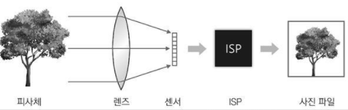
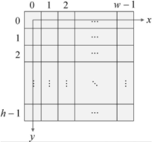
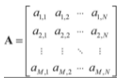
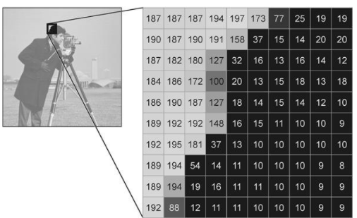
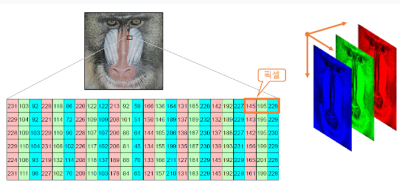

## 영상의 획득과 표현 방법
* 디지털 카메라에서 영상 획득 과정
> *  
> 1. 태양의 가시광선 또는 특정 광원에서 발생한 빛이 피사체에 부딪혀 반사
> 2. 반사된 빛이 카메라 렌즈(lens)를 통해 카메라 내부로 진입
> 3. 렌즈는 카메라 외부로부터 들어온 빛을 굴절시켜 이미지 센서(image sensor)로 모아줌
> * 이미지 센서: 빛을 전기적 신호로 변환하는 포토 다이오드(photodiode)가 2차원 평면상에 배열되어 있는 장치
> 4. 빛을 많이 받은 다이오드는 큰신호를 생성하고, 빛을 적게 받은 다이오드는 작은 신호를 생성
> 5. 생선된 전기적 신호는 아날로그-디지털 변환기를 거쳐 디지털 신호로 바뀌고 이 디지털 신호는 ISP(Image Signal Processor) 장치로 전달
> 6. ISP 장치는 화이트밸런스 조정, 색 보정, 잡음 제거 등의 기본적인 처리를 수행한 후 2차원 디지털 영상을 생성
> 7. 디지털 영상은 컴퓨터로 전송되거나 영상 파일 형식으로 변환되어 저장
* 픽셀
> * 픽셀(Pixel) : 영상을 구성하는 최소 단위 (= 요소(element) = 화소) 
> * 픽셀은 하나의 밝기 또는 색상을 표현하며, 이러한 픽셀이 모여서 2차원 영상을 구성 
> *    영상을 f라고 표기한다면 (x, y) 좌표에서의 픽셀값은 f(x, y)로 표현
> *    영상은 2차원 평면 위에 픽셀 값이 나열된 형태이기 때문에 영상을 2차원 행렬로 표현 가능, a₁₃ 행렬 원소는 영상의 (3, 1)좌표에 위치한 픽셀을 나타냄

## 그레이스케일 영상과 컬러 영상
* 그레이스케일 영상 
> *    한 픽셀은 1채널을 가지며 채널당 0~255 사이의 정수값을 가짐
> *    한 픽셀은 3채널을 가지며 채널당 0~255 사이의 정수값을 가짐

## 영상 파일 형식
* BMP
> * 픽셀 데이터를 압축하지 않고 그대로 저장 → 파일 용량이 큰 편
> * 파일 구조가 단순해서 별도의 라이브러리 도움 없이 파일 입출력 프로그래밍 가능
* JPG
> * 주로 사진과 같은 컬러 영상을 저장
> * 손실 압축 (lossy compression)
> * 압축률이 좋아서 파일 용량이 크게 감소 → 디지털 카메라 사진 포맷으로 주로 사용
* GIF
> * 256 색상 이하의 영상을 저장 → 일반 사진을 저장시 화질 열화가 심함
> * 무손실 압축(lossless compression)
> * 움직이는 GIF 지원
* PNG
> * Portable Network Graphics
> * 무손실 압축(컬러 영상도 무손실 압축)
> * 알파 채널(투명도)를 지원
