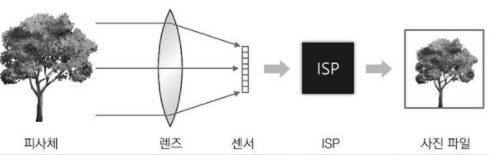
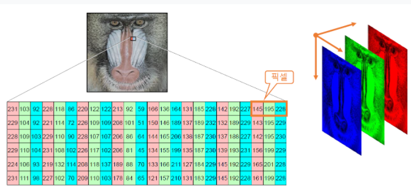

# Section 1. 컴퓨터 비전 개요

### 1. 컴퓨터 비전 
* 컴퓨터를 이용하여 정지 영상 또는 동영상으로부터 의미 있는 정보를 추출하는 방법을 연구하는 학문

### 2. 컴퓨터 비전 ⊂ 영상처리 관점
* 영상을 다루는 모든 것은 모두 영상처리이고 그 중에서 고차원적인 영상처리 부분만을 컴퓨터 비전이라고 여기는 관점

### 3. 컴퓨터 비전 ⊃ 영상처리 관점
* 영상처리를 컴퓨터 비전에게 입력을 주기 위한 전처리 작업(노이즈 제거, 자르기 등)으로 여기는 관점

# Section 2. 영상의 획득과 표현 방법

### 1. 디지털 카메라에서 영상 획득 과정
  
1. 태양의 가시광선 또는 특정 광원에서 발생한 빛이 피사체에 부딪혀 반사
2. 반사된 빛이 카메라 렌즈(lens)를 통해 카메라 내부로 진입
3. 렌즈는 카메라 외부로부터 들어온 빛을 굴절시켜 이미지 센서(image sensor)로 모아줌
* 이미지 센서: 빛을 전기적 신호로 변환하는 포토 다이오드(photodiode)가 2차원 평면상에 배열되어 있는 장치
4. 빛을 많이 받은 다이오드는 큰신호를 생성하고, 빛을 적게 받은 다이오드는 작은 신호를 생성
5. 생선된 전기적 신호는 아날로그-디지털 변환기를 거쳐 디지털 신호로 바뀌고 이 디지털 신호는 ISP(Image Signal Processor) 장치로 전달
6. ISP 장치는 화이트밸런스 조정, 색 보정, 잡음 제거 등의 기본적인 처리를 수행한 후 2차원 디지털 영상을 생성
7. 디지털 영상은 컴퓨터로 전송되거나 영상 파일 형식으로 변환되어 저장

### 2. 픽셀
* 영상을 구성하는 최소 단위 (= 요소(element) = 화소) 
* 픽셀은 하나의 밝기 또는 색상을 표현하며, 이러한 픽셀이 모여서 2차원 영상을 구성
    
* 영상은 2차원 평면 위에 픽셀 값이 나열된 형태이기 때문에 영상을 2차원 행렬로 표현 가능
    

### 3.그레이스케일 영상컬러 영상
* 밝기 성분을 0~255 범위의 정수로 표현
* 각 픽셀당 1채널을 가지며 채널당 0~255 사이의 정수값을 가짐
     

  
### 4. 트루컬러 영상
* 색상 성분을 0~255 범위의 R(Red), G(Green), B(Blue)의 색상으로 조합
* 각 픽셀당 3채널을 가지며 채널당 0~255 사이의 정수값을 가짐
     

### 5. 영상 파일 형식
1. BMP - 압축을 하지 않아 파일구조가 단순, 압축을 하지 않기 때문에 용량이 큼
2. JPG - 압축률이 좋아서 피일 용량이 크게감소, 손실압축 (압축할 때 픽셀값이 조금씩 바뀜)
3. GIF - 움짤, 256 색상 이하의 영상을 저장, 영상처리에서 사용 x
4. PNG - 무손실압축, 투명도(알파채널)지원

