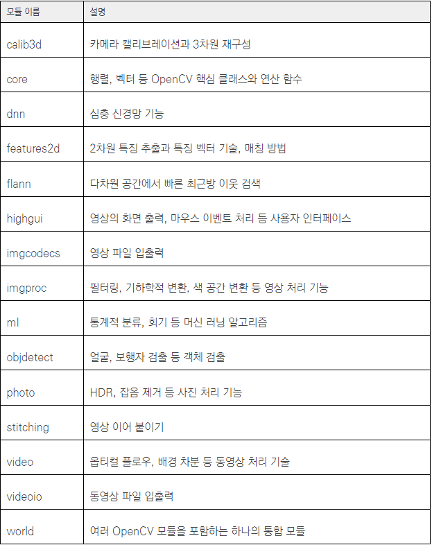
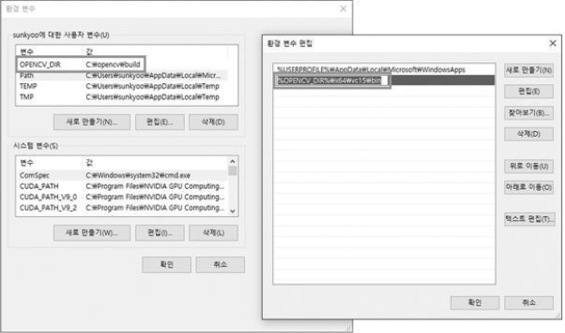

## OpenCV 개요
* OpenCV : 오픈 소스로 개발되고 있는 컴퓨터 비전 및 머신 러닝 라이브러리
* 다양한 컴퓨터 비전 알고리즘과 머신 러닝 알고리즘을 포함
* 실시간 처리를 고려하여 만들어졌기 때문에 다양한 하드웨어 플랫폼에서 매우 빠르게 동작 
* BSD 라이선스를 따르고 있어 학계 연구용이나 상업적인 용도로 자유롭게 사용할 수 있음
* OpenCV 주요 모듈 
> *    OpenCV 모듈은 각각 ~.lib 파일과 ~.dll 파일로 만들어짐, 4.0.0 버전의 경우 core 모듈은 opencv_core400.lib 파일과 opencv_core400.dll 파일로 만들어짐

## OpenCV 설치하기 
* OpenCV를 설치한다는 것은 OpenCV와 관련된 헤더파일, LIB파일, DLL파일을 로컬에 생성하는 작업 
* Windows 운영 체제를 사용하는 경우 두 가지 방법으로 OpenCV를 설치
> * 하나는 OpenCV 웹 사이트에서 설치 실행 파일을 내려받아 설치하는 방법
> * 다른 하나는 OpenCV 소스 코드를 내려받은 후 직접 빌드하여 설치하는 방법
* OpenCV 웹 사이트에서 설치 실행 파일을 내려받아 설치하는 방법
> 1. [OpenCV 웹 사이트 주소](https://www.opencv.org/)에서 Releases 탭에서 원하는 OpenCV버전 실행파일 다운로드
> 2. 실행파일을 실행하고 원하는 폴더에 실행파일 설치 (본인은 C:\ 에 설치함)
> *    OpenCV 폴더 구조
> * OpenCV 관련 헤더 파일(~.hpp)은 모두 C:\opencv\build\include 폴더 아래에 위치
> * 미리 빌드된 OpenCV 라이브러리 파일은 C:\opencv\build\x64 폴더 아래에 위치
> * vc14 폴더에는 Visual Studio 2015를 이용하여 빌드된 라이브러리 파일이 있고, vc15 폴더에는 Visual Studio 2017 버전으로 빌드된 라이브러리 파일이 있음
> * bin 폴더에는 OpenCV 프로그램 실행 시 필요한 동적 연결 라이브러리(DLL, Dynamic Linking Library) 파일과 OpenCV 유틸리티 프로그램이 생성
> * lib 폴더에는 OpenCV DLL 파일이 생성될 때 함께 만들어지는 라이브러리(import library) 파일이 생성
> 3. OpenCV DLL 파일은 여러 OpenCV 응용 프로그램에서 공통으로 사용하므로 OpenCV DLL 파일이 있는 폴더를 시스템 환경 변수 PATH에 추가하여 사용하는 것이 편리
> * 
