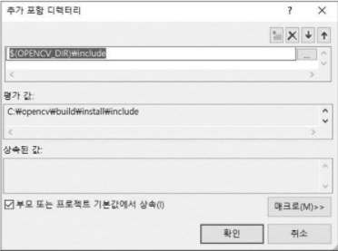
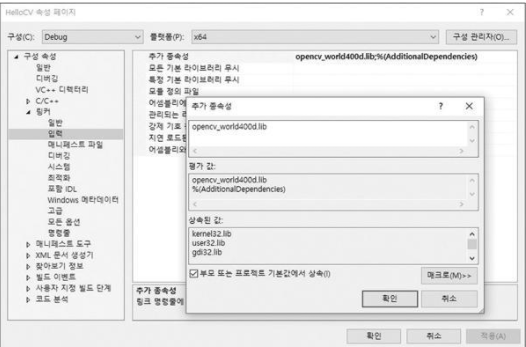

## OpenCV 프로젝트 만들기
1. Visual Studio 실행 
2. 파일 ＞ 새로 만들기 ＞ 프로젝트 항목을 선택
3. Windows 데스크톱 마법사 항목을 선택
4. 프로젝트 이름과 저장 폴더 위치 선택
5. 프로젝트가 정상적으로 생성되면 프로젝트 ＞ 새 항목 추가…를 선택
6. C++ 파일(.cpp) 항목을 선택하고 파일 이름을 작성 
7. 프로젝트에 OpenCV 라이브러리 적용
> 1. 프로젝트 ＞ ... 속성 항목을 선택
> 2.  <br/>  <br/> OpenCV 포함 디렉터리 추가하기
> 3.  <br/> 추가 라이브러리 디렉터리 설정하기
> 4.  <br/> 추가 종속성 설정
> *  <br/> Visual Studio IDE 의 OpenCV 예제 프로그램 속성 페이지에서 OpenCV 관련 설정하기

## 영상을 화면에 출력하기
```cpp
#include "opencv2/opencv.hpp"
// opencv.hpp에는 OpenCV에서 사용하는 다양한 클래스와 함수가 선언
#include <iostream>
 
using namespace cv;
using namespace std;

int main(void)
{
	cout << "Hello OpenCV " << CV_VERSION << endl;

	Mat img;
  	// Mat은 OpenCV에서 행렬을 표현하는 객체
  	// Mat 객체에 저장된 영상이 uchar 자료형을 사용하는 3채널 컬러 영상이라면 색상 채널이 파란색(Blue), 녹색(Green), 빨간색(Red) 순서로 되어 있다고 간주하여 색상을 표현
	img = imread("lenna.bmp");
  	// 함수 원형 : Mat imread(const String& filename, int flags = IMREAD_COLOR);
	if (img.empty()) {
  	// empty() 함수는 행렬의 rows 또는 cols 멤버 변수가 0이거나, 또는 data 멤버 변수가 NULL이면 true를 반환
		cerr << "Image load failed!" << endl;
		return -1;
	}

	namedWindow("image");
  	// Mat 클래스 객체에 저장되어 있는 영상 데이터를 화면에 나타내기 위해서는 먼저 영상 출력을 위한 빈 창을 생성
	imshow("image", img);
  	// mat 객체에 저장된 영상이 1채널 8비트 uchar 자료형으로 구성된 그레이스케일 영상이라면 픽셀 값을 그대로 표현
  	// mat 객체에 저장된 영상이 uchar 자료형을 사용하는 3채널 컬러 영상이라면 색상 채널이 파란색(Blue), 녹색(Green), 빨간색(Red) 순서로 되어 있다고 간주하여 색상을 표현
  	// mat 객체가 부호 없는 16비트 또는 32비트 정수형이라면 행렬 원소 값을 256으로 나눈 값을 영상의 밝기 값으로 사용
 	 // mat 객체가 32비트 또는 64비트 실수형 행렬이라면 행렬 원소에 255를 곱한 값을 밝기 값으로 사용
	waitKey();
  	// 함수 원형 : int waitKey(int delay = 0);
  	// 키 입력을 기다릴 시간(밀리초 단위). delay ≤ 0이면 무한히 기다림
  	// 눌린 키값을 반환, 지정한 시간 동안 키가 눌리지 않았으면 -1을 반환
	return 0;
}
```
