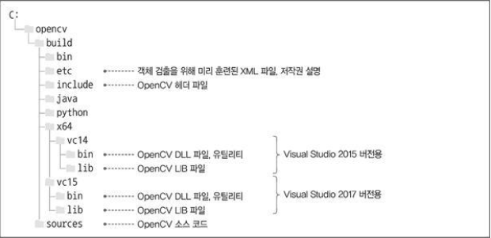
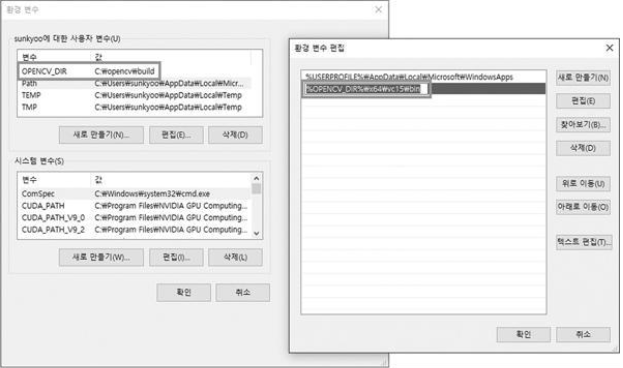
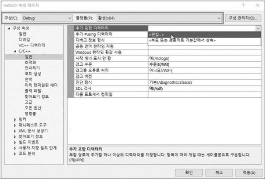
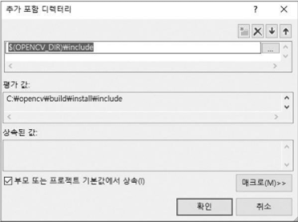
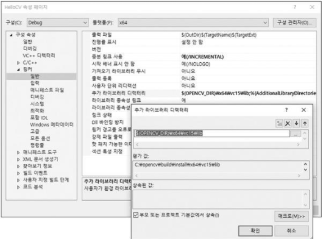
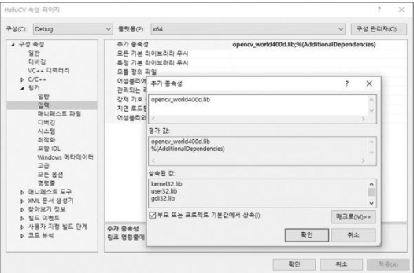
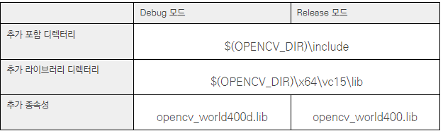

# Section 1. OpenCV 개요와 설치

### 1. OpenCV 개요
* 오픈 소스로 개발되고 있는 컴퓨터 비전 및 머신 러닝 라이브러리
* 다양한 컴퓨터 비전 알고리즘과 머신 러닝 알고리즘을 포함
* 실시간 처리를 고려하여 만들어졌기 때문에 다양한 하드웨어 플랫폼에서 매우 빠르게 동작 
* BSD 라이선스를 따르고 있어 학계 연구용이나 상업적인 용도로 자유롭게 사용할 수 있음

### 2. OpenCV 주요 모듈
* OpenCV 모듈은 각각 ~.lib 파일과 ~.dll 파일로 만들어짐, 4.0.0 버전의 경우 core 모듈은 opencv_core400.lib 파일과 opencv_core400.dll 파일로 만들어짐
<br/>  <br/>

### 3. OpenCV 설치하기 
* OpenCV를 설치한다는 것은 OpenCV와 관련된 헤더파일, LIB파일, DLL파일을 로컬에 생성하는 작업 
* Windows 운영 체제를 사용하는 경우 두 가지 방법으로 OpenCV를 설치
> * 하나는 OpenCV 웹 사이트에서 설치 실행 파일을 내려받아 설치하는 방법
> * 다른 하나는 OpenCV 소스 코드를 내려받은 후 직접 빌드하여 설치하는 방법
* OpenCV 웹 사이트에서 설치 실행 파일을 내려받아 설치하는 방법
> 1. [OpenCV 웹 사이트 주소](https://www.opencv.org/)에서 Releases 탭에서 원하는 OpenCV버전 실행파일 다운로드
> 2. 실행파일을 실행하고 원하는 폴더에 실행파일 설치 (본인은 C:\ 에 설치함)
> * OpenCV 폴더 구조 <br/> 
> > * OpenCV 관련 헤더 파일(~.hpp)은 모두 C:\opencv\build\include 폴더 아래에 위치
> > * 미리 빌드된 OpenCV 라이브러리 파일은 C:\opencv\build\x64 폴더 아래에 위치
> > * vc14 폴더에는 Visual Studio 2015를 이용하여 빌드된 라이브러리 파일이 있고, vc15 폴더에는 Visual Studio 2017 버전으로 빌드된 라이브러리 파일이 있음
> > * bin 폴더에는 OpenCV 프로그램 실행 시 필요한 동적 연결 라이브러리(DLL, Dynamic Linking Library) 파일과 OpenCV 유틸리티 프로그램이 생성
> > * lib 폴더에는 OpenCV DLL 파일이 생성될 때 함께 만들어지는 라이브러리(import library) 파일이 생성
> 3. OpenCV DLL 파일은 여러 OpenCV 응용 프로그램에서 공통으로 사용하므로 OpenCV DLL 파일이 있는 폴더를 시스템 환경 변수 PATH에 추가하여 사용하는 것이 편리
> <br/> 

# Section 2. OpenCV 사용하기
### 1. OpenCV 프로젝트 만들기
1. Visual Studio 실행 
2. 파일 ＞ 새로 만들기 ＞ 프로젝트 항목을 선택
3. Windows 데스크톱 마법사 항목을 선택
4. 프로젝트 이름과 저장 폴더 위치 선택
5. 프로젝트가 정상적으로 생성되면 프로젝트 ＞ 새 항목 추가…를 선택
6. C++ 파일(.cpp) 항목을 선택하고 파일 이름을 작성 
7. 프로젝트에 OpenCV 라이브러리 적용
> 1. 프로젝트 ＞ ... 속성 항목을 선택
> 2. OpenCV 포함 디렉터리 추가하기 <br/>  <br/>  
> 3. 추가 라이브러리 디렉터리 설정하기 <br/>  
> 4. 추가 종속성 설정 <br/>   
> *  Visual Studio IDE 의 OpenCV 예제 프로그램 속성 페이지에서 OpenCV 관련 설정하기 <br/>  

### 2. 영상을 화면에 출력하기
```cpp
// opencv.hpp에는 OpenCV에서 사용하는 다양한 클래스와 함수가 선언
#include "opencv2/opencv.hpp"
#include <iostream>
 
using namespace cv;
using namespace std;

int main(void)
{
	cout << "Hello OpenCV " << CV_VERSION << endl;

    	// Mat은 OpenCV에서 행렬을 표현하는 객체
  	// Mat 객체에 저장된 영상이 uchar 자료형을 사용하는 3채널 컬러 영상이라면 색상 채널이 파란색(Blue), 녹색(Green), 빨간색(Red) 순서로 되어 있다고 간주하여 색상을 표현
	Mat img;
  	
    	// 함수 원형 : Mat imread(const String& filename, int flags = IMREAD_COLOR);
	img = imread("lenna.bmp");
  	
    	// empty() 함수는 행렬의 rows 또는 cols 멤버 변수가 0이거나, 또는 data 멤버 변수가 NULL이면 true를 반환
	if (img.empty()) 
    	{
		cerr << "Image load failed!" << endl;
		return -1;
	}

    	// Mat 클래스 객체에 저장되어 있는 영상 데이터를 화면에 나타내기 위해서는 먼저 영상 출력을 위한 빈 창을 생성
	namedWindow("image");
  	
    	// mat 객체에 저장된 영상이 1채널 8비트 uchar 자료형으로 구성된 그레이스케일 영상이라면 픽셀 값을 그대로 표현
  	// mat 객체에 저장된 영상이 uchar 자료형을 사용하는 3채널 컬러 영상이라면 색상 채널이 파란색(Blue), 녹색(Green), 빨간색(Red) 순서로 되어 있다고 간주하여 색상을 표현
  	// mat 객체가 부호 없는 16비트 또는 32비트 정수형이라면 행렬 원소 값을 256으로 나눈 값을 영상의 밝기 값으로 사용
 	// mat 객체가 32비트 또는 64비트 실수형 행렬이라면 행렬 원소에 255를 곱한 값을 밝기 값으로 사용
	imshow("image", img);
  	
    	// 함수 원형 : int waitKey(int delay = 0);
  	// 키 입력을 기다릴 시간(밀리초 단위). delay ≤ 0이면 무한히 기다림
  	// 눌린 키값을 반환, 지정한 시간 동안 키가 눌리지 않았으면 -1을 반환
	waitKey();
  	
	return 0;
}
```

  
