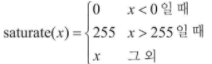
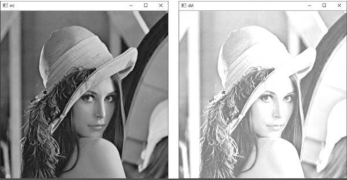

# 영상의 밝기 조절

### 그레이스케일 영상 다루기 
* 과거에 개발되었던 많은 영상 처리 알고리즘이 주로 그레이스케일 영상을 대상으로 개발되어 대부분의 영상 처리 알고리즘은 컬러 영상이 아니라 그레이스케일 영상을 대상으로 한다
* 컬러 영상은 그레이스케일 영상을 다루는 것보다 3배 많은 메모리와 연산 시간을 필요로 하기 때문에 특별히 컬러 정보가 필요 없는 영상 처리일 경우 그레이스케일 영상을 대상으로 한다 
```cpp
// 그레이스케일 형태의 Mat 객체를 생성하는 세가지 방법

// 첫번째
Mat img1 = imread("이미지.bmp", IMREAD_GRAYSCALE);
// 처음 불러올 때 그레이스케일 영상으로 이미지를 불러온다

// 두번째
Mat img2(480, 640, CV_8UC1, Scalar(0));
// 모든 픽셀 값이 0으로 초기화 된 640x480 그레이스케일 영상을 생성한다
// 새로운 그레이스케일 Mat 객체를 생성하려면 CV_8UC1 타입을 가져야 한다

// 세번째
Mat img3 = imread("이미지.bmp", IMREAD_COLOR);
Mat img4;
cvtColor(img3, img4, COLOR_BGR2GRAY);
// img3의 이미지인 BGR 3채널 컬러 영상을 1채널 그레이스케일 영상으로 변환하여 img4에 저장한다
```
* OpenCV 함수 중에는 그레이스케일 영상만을 입력으로 받는 함수도 있고, 반대로 BGR 3채널 컬러 영상만을 입력으로 받는 함수가 있다
```cpp
// 전달된 영상이 그레이스케일 영상인지 확인하는 방법
void func(Mat& img)
{
  CV_Assert(img.type() == CV_8UC1); // 조건식이 거짓이면 에러가 발생하며 프로그램이 종료
  
  // 그레이스케일 영상 처리 수행
}
```

### 영상의 밝기 조절하기 
* 영상의 밝기 조절이란 영상의 전체적인 밝기를 조절하여 좀 더 밝거나 어두운 영상을 만드는 작업이다 
* 영상의 밝기 조절을 수식으로 표현 
> *  
> * 행렬의 원소 값을 설정할 때, 원소 자료형이 가질 수 있는 값의 범위를 벗어나는 경우 해당 자료형의 최솟값 또는 최댓값으로 원소 값을 설정하는 연산을 OpenCV에서는 포화(saturate) 연산이라고 한다
> * dst(x, y) = saturate(src(x, y) + n) 
> * src는 입력 영상, dst는 출력 영상, n은 조절할 밝기 값 (n이 양수이면 밝기 증가, n이 음수이면 밝기 감소) 
```cpp
void brightness1()
{
	Mat src = imread("lenna.bmp", IMREAD_GRAYSCALE);

	if (src.empty())
	{
		cerr << "Image load failed!" << endl;
		return;
	}

	// OpenCV에서는 덧셈, 뺄셈 연산자에 대하여 연산자 재정의가 되어 있어서 Mat 객체와 C/C++ 기본 자료형과의 덧셈 및 뺄셈 연산이 가능
	Mat dst = src + 100;
	// src 행렬의 모든 원소에 각각 100을 더하고, 포화 연산까지 수행한 결과를 dst 행렬에 저장

	imshow("src", src);
	imshow("dst", dst);
	waitKey();

	destroyAllWindows();
}
```
> * 코드 결과 <br/>  

### 영상의 밝기 조절 직접 구현하기 
```cpp
void brightness2()
{
	Mat src = imread("lenna.bmp", IMREAD_GRAYSCALE);

	if (src.empty())
	{
		cerr << "Image load failed!" << endl;
		return;
	}

	Mat dst(src.rows, src.cols, src.type());

	for (int j = 0; j < src.rows; j++)
		for (int i = 0; i < src.cols; i++)
			dst.at<uchar>(j, i) = saturate_cast<uchar>(src.at<uchar>(j, i) + 100); // uchar 자료형에 대해 포화연산을 수행

	imshow("src", src);
	imshow("dst", dst);
	waitKey();

	destroyAllWindows();
}
```
