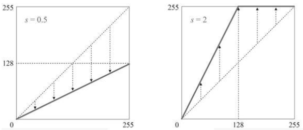
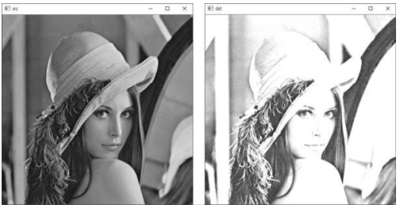

# 영상의 명암비 조절

### 기본적인 명암비 조절 방법
* 명암비란 영상에서 밝은 영역과 어두운 영역 사이에 드러나는 밝기 차이의 강도를 의미한다 
* 밝은 영역과 어두운 영역이 골고루 섞여 있는 영상은 명암비가 높다고 하고 명암비가 높으면 사물의 구분이 잘 되고 영상이 선명해진다 
* 기본적인 명암비 조절 수식
> * dst(x, y) = saturate(s * src(x, y)) 
> * src는 입력영상, dst는 출력 영상, 상수 s는 0보다 큰 양의 실수 
> * 영상 픽셀값에 상수 s를 곱한 결과가 255보다 커지는 경우가 발생할 수 있으므로 포화 연산도 함께 사용 
> * 
> * s = 0.5인 경우 영상 픽셀이 가질 수 있는 값의 범위가 0부터 128사이로 제한되고, s=2인 경우 0부터 128사이의 값을 갖는 픽셀은 0부터 255사이의 값으로 변하고 128이상의 픽셀값은 모두 포화되어 255값을 가지게 된다  
```cpp
void contrast1()
{
	Mat src = imread("lenna.bmp", IMREAD_GRAYSCALE);

	if (src.empty())
	{
		cerr << "Image load failed!" << endl;
		return;
	}

	float s = 2.f;
	Mat dst = s * src;

	imshow("src", src);
	imshow("dst", dst);

	waitKey();
	destroyAllWindows();
}
```
* 코드 결과 <br/>  <br/> 전체적으로 픽셀 값이 포화되어 흰색으로 나타나는 영역이 너무 많으며, 이로 인해 사물의 윤곽 구분이 더 어려워졌다

### 효과적인 명암비 조절 방법 

