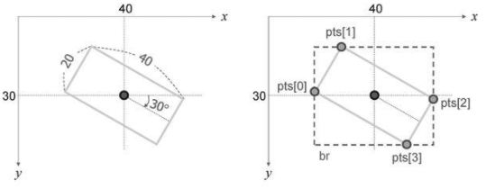

## 1. Point_ 클래스
* 2차원 평면 위에 있는 점의 좌표를 표현하는 템플릿 클래스
* 2차원 좌표를 나타내는 x와 y라는 이름의 멤버 변수를 가지고 있음
```cpp
// 간략화한 Point 클래스 정의
template<typename Tp> class Point
{
public:
  Point();
  Point(_Tp _x, _Tp y);
  Point(const Point& pt);

  Point& operator = (const Point_& pt);

  // dot() 멤버 함수는 두 점 사이의 내적(dot product)을 계산하여 반환
  Tp dot(const Point& pt) const;
  // ddot() 멤버 함수는 두 점 사이의 내적을 실수형으로 계산하여 double 자료형으로 반환
  double ddot(const Point& pt) const;
  // cross() 멤버 함수는 두 점 사이의 외적(cross product)을 반환
  double cross(const Point& pt) const;
  // inside() 멤버 함수는 점의 좌표가 사각형 r 영역 안에 있으면 true를 반환
  bool inside(const Rect_<_Tp>& r) const;
  
  // ...(생략)

  Tp x, y;
};

// Point_ 클래스는 템플릿 클래스이기 때문에 실제로 사용할 때에는 어떤 자료형으로 좌표를 표현할 것인지를 명시
// 예를 들어 정수 좌표를 표현하려면 Point_<int> 클래스를 사용
// Point_ 클래스를 사용할 때마다 자료형을 명시하는 것이 다소 번거로울 수 있어서 OpenCV는 자주 사용하는 자료형에 대하여 Point_ 클래스 이름을 재정의하여 제공
typedef Point<int>    Point2i;
typedef Point<int64>  Point2l;
typedef Point<float>  Point2f;
typedef Point_<double> Point2d;
typedef Point2i        Point;
```

## 2. Size_ 클래스
* 영상 또는 사각형 영역의 크기를 표현할 때에 사용
* 사각형 영역의 가로와 세로 크기를 나타내는 width와 height 멤버 변수를 가지고 있음
```cpp
// 간략화한 Size 클래스 정의
 template<typename Tp> class Size
{
public:
  Size();
  Size(_Tp _width, _Tp height);
  Size(const Size& sz);
  
  Size& operator = (const Size_& sz);

  // area() 멤버 함수는 사각형 크기에 해당하는 면적(width×height)을 반환
  _Tp area() const;
  // empty() 멤버 함수는 유효하지 않은 크기이면 true를 반환
  bool empty() const;
  
  Tp width, height;
};

// Point 클래스와 마찬가지로 Size 클래스도 템플릿으로 정의되어 있으며, 다양한 자료형에 대해 이름이 재정의
typedef Size<int>    Size2i;
typedef Size<int64>  Size2l;
typedef Size<float>  Size2f;
typedef Size_<double> Size2d;
typedef Size2i        Size;
```

## 3. Rect_ 클래스 
* 사각형의 위치와 크기 정보를 표현할 때에 사용
* 사각형의 좌측 상단 점의 좌표를 나타내는 x, y 멤버 변수와 사각형의 가로 및 세로 크기를 나타내는 width, height 멤버 변수를 가지고 있음
```cpp
// 간략화한 Rect_ 클래스  정의
template<typename Tp> class Rect
{
public:
  Rect();
  Rect(_Tp _x, _Tp _y, _Tp _width, _Tp height);
  Rect(const Rect& r);
  Rect(const Point_<Tp>& org, const Size<Tp>& sz);
  Rect(const Point_<Tp>& pt1, const Point<Tp>& pt2);

  Rect& operator = ( const Rect& r );

  // tl() 멤버 함수는 사각형의 좌측 상단 점의 좌표를 반환
  Point<Tp> tl() const;
  // br() 멤버 함수는 사각형의 우측 하단 점의 좌표를 반환
  Point<Tp> br() const;
  // size() 멤버 함수는 사각형의 크기 정보를 반환
  Size<_Tp> size() const;
  // area() 멤버 함수는 사각형의 면적(width×height)을 반환
  Tp area() const;
  // empty() 멤버 함수는 유효하지 않은 사각형이면 true를 반환
  bool empty() const;
  // contains() 멤버 함수는 인자로 전달된 pt 점이 사각형 내부에 있으면 true를 반환
  bool contains(const Point<_Tp>& pt) const;

  Tp x, y, width, height;
};

// Rect_ 클래스도 템플릿으로 정의되어 있으며, 다양한 자료형에 대해 이름이 재정의
typedef Rect<int>    Rect2i;
typedef Rect<float>  Rect2f;
typedef Rect<double> Rect2d;
typedef Rect2i        Rect;
```

## 4. RotatedRect 클래스
* 회전된 사각형을 표현하는 클래스
* 회전된 사각형의 중심 좌표를 나타내는 center, 사각형의 가로 및 세로 크기를 나타내는 size, 회전 각도 정보를 나타내는 angle을 멤버 변수로 가지고 있음
* RotatedRect 클래스는 앞서 살펴본 Point_, Size_, Rect_ 클래스와 달리 템플릿 클래스가 아니며, 모든 정보를 float 자료형을 사용하여 표현
```cpp
// 간략화한 RotatedRect 클래스  정의
class RotatedRect
{
public:
  RotatedRect();
  RotatedRect(const Point2f& _center, const Size2f& _size, float angle);
  RotatedRect(const Point2f& point1, const Point2f& point2, const Point2f& point3);
  
  // points() 멤버 함수는 회전된 사각형의 네 꼭지점 좌표를 pts 인자에 저장
  void points(Point2f pts[]) const;
  // boundingRect() 멤버 함수는 회전된 사각형을 포함하는 최소 크기의 사각형(bounding box) 정보를 반환(정수 단위)
  Rect boundingRect() const;
  // boundingRect2f() 멤버 함수는 회전된 사각형을 포함하는 최소 크기의 사각형 정보를 반환(실수 단위)
  Rect<float> boundingRect2f() const;
  

  Point2f center;
  Size2f size;
  float angle;
};
```
```cpp
// 중심 좌표가 (40, 30), 크기는 40×20, 시계 방향으로 30°만큼 회전된 사각형 객체 생성
RotatedRect rr1(Point2f(40, 30), Size2f(40, 20), 30.f);
```
* 점선 박스 (bounding box) <br/> 

## 5. Range 클래스
* 범위 또는 구간을 표현하는 클래스
* 범위의 시작과 끝을 나타내는 start와 end 멤버 변수를 가지고 있음
```cpp
// 간략화한 Range 클래스 정의
class Range
{
public:
  Range();
  Range(int _start, int _end);
  
  // size() 멤버 함수는 범위 크기(end - start)를 반환
  int size() const;
  // empty() 멤버 함수는 start와 end가 같으면 true를 반환
  bool empty() const;
  // all() 멤버 함수는 start = INT_MIN, end = INT_MAX로 설정한 Range 객체를 반환
  static Range all();
  
  int start, end;
};
```

## 6. String 클래스
* OpenCV에서는 cv::String 클래스를 사용하여 문자열을 저장하고 처리
* 원래 OpenCV 라이브러리에서는 자체적인 String 클래스를 정의하여 사용하다가 4버전 이상부터 typedef std::string String; 으로 대체되면서 std::string 클래스와 String 클래스는 완전히 같은 클래스
* 코드 호환성을 위하여 여전히 OpenCV 코드에서는 std::string 대신 String 클래스 이름을 사용
