## 1. Mat 클래스 개요
* 행렬을 표현하는 클래스 
* OpenCV 라이브러리에서 가장 많이 사용하는 클래스
* 일반적인 2차원 행렬뿐만 아니라 고차원 행렬을 표현할 수 있으며, 한 개 이상의 채널(channel)을 가질 수 있음
* C:\opencv\sources\modules\core\include\opencv2\core\mat.hpp 파일에 정의
* Mat 클래스에서 행렬이 어떤 자료형을 사용하는지에 대한 정보를 깊이(depth)라고 부름 <br/> OpenCV에서 Mat행렬의 깊이는 매크로 상수를 이용하여 표현 CV_(bit-depth){U|S|F}C(number_of_channels) <br/> 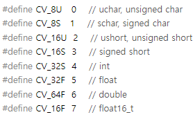  
```cpp
// 간략화한 Mat 클래스 정의
class Mat
{
public:
  // Mat img1;
  Mat();
  // Mat img2(480, 640, CV_8UC1);    // unsigned char, 1-channel
  // Mat img3(480, 640, CV_8UC3);    // unsigned char, 3-channels
  Mat(int rows, int cols, int type);
  // Mat img4(Size(640, 480), CV_8UC3);     // Size(width, height)
  Mat(Size size, int type);
  // Mat img5(480, 640, CV_8UC1, Scalar(128));          // initial values, 128
  // Mat img6(480, 640, CV_8UC3, Scalar(0, 0, 255));    // initial values, red
  Mat(int rows, int cols, int type, const Scalar& s);
  Mat(Size size, int type, const Scalar& s);
  Mat(const Mat& m);
  ~Mat();
     
  // mat4.create(256, 256, CV_8UC3);    // 256x256, uchar, 3-channels
  // mat5.create(4, 4, CV_32FC1);       // 4x4, float, 1-channel 
  // 이미 행렬 데이터가 할당되어 있는 Mat 객체에서 Mat::create() 함수를 호출할 경우, 만약 Mat::create() 함수의 인자로 지정한 행렬 크기와 타입이 기존 행렬과 모두 같으면 Mat::create() 함수는 별다른 동작을 하지 않고 그대로 함수를 종료
  void create(int rows, int cols, int type);
  bool empty() const;
  
  // clone() 함수는 자기 자신과 동일한 Mat 객체를 완전히 새로 만들어서 반환
  // Mat img4 = img1.clone();        // 깊은 복사 img1 -> img4
  // 메모리 공간을 새로 할당하여 픽셀 값을 복사하는 형태의 복사를 깊은 복사(deep copy)라고 합
  Mat clone() const;
  // copyTo() 함수는 인자로 전달된 m 행렬에 자기 자신을 복사
  // copyTo() 함수를 호출한 행렬과 인자로 전달된 행렬 m이 서로 크기와 타입이 같으면 원소 값 복사만 수행
  // Mat img5; img1.copyTo(img5);              // 깊은 복사 img1 -> img5
  void copyTo(OutputArray m) const;
  // 행렬의 모든 원소 값을 일괄적으로 설정
  // mask 인자를 생략하거나 mask 인자에 noArray() 또는 Mat()을 지정하면 행렬 전체 원소를 value 값으로 설정
  // mat5.setTo(1.f);
  Mat& setTo(InputArray value, InputArray mask=noArray());
  
  // Mat mat1 = Mat::zeros(3, 3, CV_32SC1);    // 0‘s matrix
  static MatExpr zeros(int rows, int cols, int type);
  // Mat mat2 = Mat::ones(3, 3, CV_32FC1);    // 1‘s matrix
  // Mat mat3 = Mat::eye(3, 3, CV_32FC1);     // 단위 행렬 identity matrix
  static MatExpr ones(int rows, int cols, int type);
  
  // 행렬의 모든 원소 값을 일괄적으로 설정
  // Mat 행렬의 전체 원소 값 설정을 위한 = 연산자 재정의
  // mat4 = Scalar(255, 0, 0);
  Mat& operator = (const Mat& m);
  
  // Mat 클래스에 정의된 괄호 연산자 재정의를 사용
  // Mat 클래스에 저장된 영상에서 사각형 모양의 부분 영상을 추출
  // Mat img1 = imread(“cat.bmp”); Mat img2 = img1(Rect(220, 120, 340, 240));
  // Mat 클래스의 괄호 연산자를 이용하여 얻은 부분 영상이 독립된 메모리 공간을 확보하여 복사하는 깊은 복사가 아니라, 픽셀 데이터를 공유하는 얕은 복사 형식
  // 부분 영상을 추출한 후 부분 영상의 픽셀 값을 변경하면 추출한 부분 영상뿐만 아니라 원본 영상의 픽셀 값도 함께 변경
  // Mat img3 = img1(Rect(220, 120, 340, 240)).clone();
  // 독립된 메모리 영역을 확보하여 부분 영상을 추출하고자 한다면 괄호 연산자 뒤에 clone() 함수를 함께 사용
  Mat operator()( const Rect& roi ) const;
 
  // OpenCV에서 제공하는 가장 직관적인 행렬 원소 접근 방법은 Mat::at() 멤버 함수를 사용하는 방법
  // at() 함수는 템플릿 함수로 정의되어 있기 때문에 Mat::at() 함수를 사용할 때에는 행렬 원소 자료형을 명시적으로 지정
  // at() 함수의 첫 번째 인자는 참조할 원소의 행 번호이고, 이는 (x, y) 좌표계에서 y 좌표에 해당, 두 번째 인자에는 참조하려는 원소의 열 번호를 전달
  // mat1.at<uchar>(0, 3)++; // mat1 행렬의 0번행 3번열에 있는 원소를 참조해서 값을 1증가 
  template<typename _Tp> _Tp& at(int row, int col);
  // 두 번째로 살펴볼 행렬 원소 접근 방법은 Mat::ptr() 멤버 함수를 이용하는 방법
  // ptr() 함수는 Mat 행렬에서 특정 행의 첫 번째 원소 주소를 반환
  // uchar * p = mat1.ptr<uchar>(0); // 0번행의 첫번째 주소 반환
  template<typename _Tp> _Tp* ptr(int i0 = 0);
  
  // 행렬의 차원
  int dims;
  // 2차원 행렬의 크기, 3차원 이상의 행렬일 경우 -1이 저장
  int rows, cols;
  // 행렬의 원소 데이터가 저장되어 있는 메모리 공간을 가리키는 포인터형 멤버 변수
  uchar* data;
  // 3차원 이상의 행렬의 크기 정보
  MatSize size;
  
  // ...(생략)
};
```

## 2. MatIterator_ 반복자
* MatIterator_ 반복자를 사용하여 행렬의 모든 원소에 접근
* Mat::ptr() 보다 속도가 느린 편이고, Mat::at() 함수처럼 임의의 위치에 자유롭게 접근할 수 없어서 사용성이 높지 않은 편
```cpp
//MatIterator_ 반복자를 사용하여 mat1 행렬의 모든 원소 값을 1씩 증가시키는 예제 코드
// Mat::begin() 함수를 이용하여 행렬의 첫 번째 원소 위치를 얻을 수 있고, Mat::end() 함수를 이용하여 마지막 원소 바로 다음 위치를 얻을 수 있음
for (MatIterator_<uchar> it = mat1.begin<uchar>(); it != mat1.end<uchar>(); ++it) 
{
  // MatIterator_ 반복자를 사용하면 행렬의 가로 또는 세로 크기에 상관없이 행렬의 모든 원소를 안전하게 방문
  (*it)++;
}

```


## 3. 행렬 정보 참조하기
* Mat 객체에서 가장 자주 참조하는 정보는 행렬 또는 영상의 크기 정보
```cpp
Mat img1 = imread(“lenna.bmp”);
// Mat::cols 멤버 변수는 열 개수
cout << “Width: “ << img1.cols << endl;
// Mat::rows 멤버 변수는 행렬의 행 개수
cout << “Height: “ << img1.rows << endl;
```
* Mat 클래스 정보 참조를 위한 멤버 함수
> 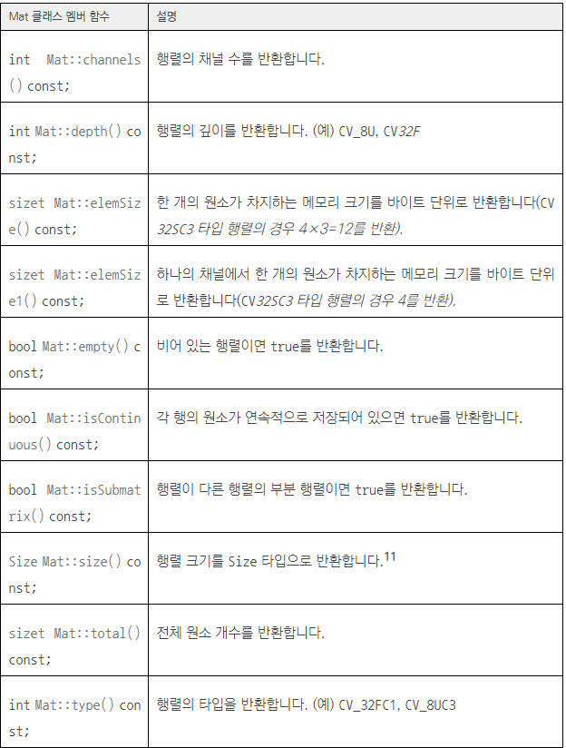

## 4. Mat 행렬 연산 
* Mat 클래스가 표현하는 행렬을 마치 수학 수식을 쓰듯이 사용할 수 있도록 다양한 연산자 재정의 함수를 제공
* 연산자를 사용하는 곱셈 연산은 행렬의 수학적 곱셈 연산을 의미
<br/> 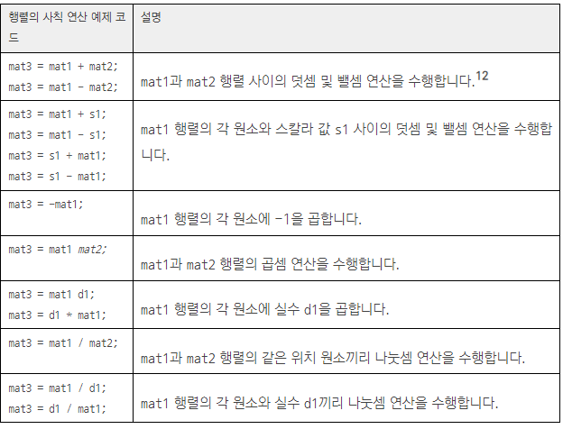
* 두 행렬에서 같은 위치에 있는 원소끼리 곱셈 연산을 수행하려면 Mat::mul() 멤버 함수를 사용
<br/> 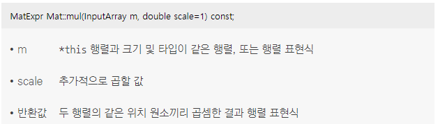 
* 행렬의 역행렬(inverse matrix)을 구할 때에는 Mat::inv() 멤버 함수를 사용
* 행렬이 존재하는 일반적인 행렬이라면 가우스 소거법을 사용하는 DECOMP_LU를 사용 
* 역행렬이 존재하지 않는 경우 DECOMP_SVD를 지정하면 특잇값 분해(singular value decomposition) 방법을 이용하여 의사 역행렬(pseudo-inverse matrix)을 구할 수 있음
* DECOMP_EIG와 DECOMP_CHOLESKY는 각각 고윳값 분해와 촐레스키(Cholesky) 분해에 의한 역행렬 계산
<br/> 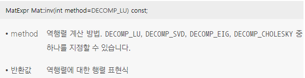   
* 행렬의 행과 열을 서로 교환해서 만드는 전치 행렬(transpose matrix)은 Mat::t() 멤버 함수를 이용하여 구할 수 있음
<br/> 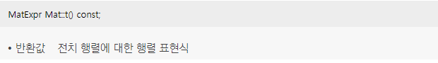 

## 5. 크기 및 타입 변환 함수
* 행렬의 타입을 변경할 때에는 Mat::convertTo() 함수를 사용
* Mat::convertTo() 함수는 행렬 원소의 타입을 다른 타입으로 변경하고, 추가적으로 모든 원소에 일정한 값을 더하거나 곱할 수 있음
<br/> 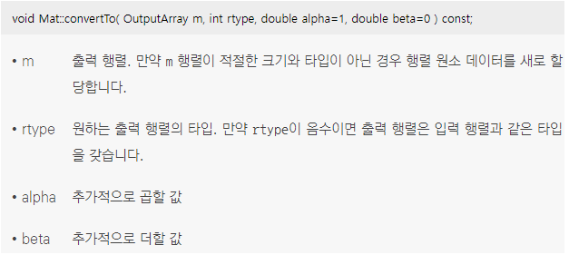 
```cpp
// lenna.bmp 파일을 그레이스케일 영상 img1로 불러온 후, uchar 자료형 대신 float 자료형을 사용하는 행렬 img1f를 생성하는 예제 코드
Mat img1 = imread(“lenna.bmp”, IMREAD_GRAYSCALE);

Mat img1f;
img1.convertTo(img1f, CV_32FC1);
```
* 주어진 행렬의 크기 또는 채널 수를 변경할 때에는 Mat::reshape() 함수 사용
* Mat::reshape() 함수는 행렬 원소 데이터를 복사하여 새로운 행렬을 만드는 것이 아니라 하나의 행렬 원소 데이터를 같이 참조하는 행렬을 반환
<br/> 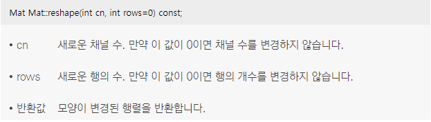   
```cpp
// Mat::reshape() 함수를 이용하여 3×4 크기의 행렬을 1×12 크기의 행렬로 변환하는 예제 코드
uchar data1[] = { 1, 2, 3, 4, 5, 6, 7, 8, 9, 10, 11, 12 };
Mat mat1(3, 4, CV_8UC1, data1);
Mat mat2 = mat1.reshape(0, 1);
```
* Mat::reshape() 멤버 함수처럼 행렬의 모양을 변경시키는 것이 아니라 단순히 행렬의 행 크기를 변경하고 싶을 때에는 Mat::resize() 함수를 사용
* Mat::resize() 함수는 행렬의 행 개수를 sz개로 변경
* sz가 기존 행렬의 행 개수보다 작으면 아래쪽 행을 제거하고, 기존 행렬의 행 개수보다 크면 아래쪽에 행을 추가
* 추가하는 행 원소의 초깃값으로 s를 지정
<br/> 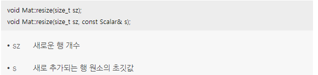  
```cpp
// mat1 행렬의 행을 5로 증가
uchar data1[] = { 1, 2, 3, 4, 5, 6, 7, 8, 9, 10, 11, 12 };
/*
mat1:
[  1,   2,   3,   4;
 5,   6,   7,   8;
 9,  10,  11,  12]
 */
Mat mat1(3, 4, CV_8UC1, data1);
/*
mat1_resize: 
 [  1,   2,   3,   4;
 5,   6,   7,   8;
 9,  10,  11,  12;
 100, 100, 100, 100;
 100, 100, 100, 100]
*/
mat1.resize(5, 100);
```
* 이미 존재하는 행렬에 원소 데이터를 추가하고 싶을 때에는 Mat::push_back() 멤버 함수를 사용
<br/> 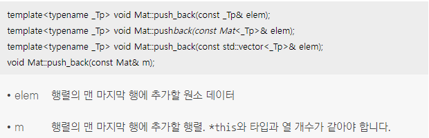   
* 행을 제거할 때에는 Mat::pop_back() 멤버 함수를 사용
<br/> 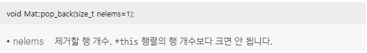 
