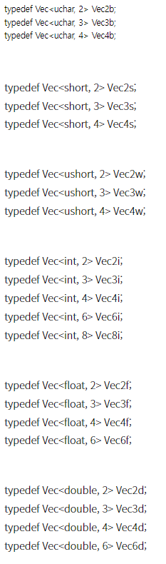

## Vec 클래스 
* 하나의 행으로만 이루어진 행렬은 행 벡터라고 부르고, 하나의 열로만 구성된 행렬은 열 벡터라고 부르고, 행 벡터와 열 벡터를 합쳐서 벡터 또는 벡터 행렬이라고 부름
* 벡터는 같은 자료형을 가진 원소 몇 개로 구성된 데이터 형식
```cpp
// 간략화한 Matx와 Vec 클래스 정의
template<typename _Tp, int m, int n> class Matx
{
public:
  // ... (생략)
  _Tp val[mn]; //< matrix elements
};
   
template<typename _Tp, int cn> class Vec : public Matx<_Tp, cn, 1>
{
public:
  // ... (생략)
  /* element access */
  _Tp& operator[](int i);
};

template<typename _Tp, int n> static inline
std::ostream& operator << (std::ostream& out, const Vec<_Tp, n>& vec);
```
* Vec 클래스는 Matx 클래스를 상속받아 만들어지며, 열 개수가 1개로 특화된 벡터 표현 클래스
* Vec 클래스도 템플릿을 사용하기 때문에 실제 코드에서 사용할 때에는 <> 괄호 사이에 데이터 자료형과 데이터 개수를 명시
* 매번 Vec<uchar, 3> 형태로 입력하는 것은 꽤 번거롭고 불편하기 때문에 자주 사용되는 자료형과 개수에 대한 Vec 클래스 템플릿의 이름 재정의를 제공
> *  <br/>  Vec<uchar, 3> p1, p2(0, 0, 255); ----> Vec3b p1, p2(0, 0, 255); <br/> p1과 p2는 각각 내부에 uchar val[3]; 형식의 멤버 변수를 가지고 있음 <br/> p1의 경우 p1.val 배열 원소가 모두 0으로 초기화 <br/> p2의 경우는 p2.val[0]은 0, p2.val[1]은 0, p2.val[2]는 255로 초기화

## Scalar 클래스 
* Scalar 클래스는 4채널 이하의 영상에서 픽셀 값을 표현하는 용도로 자주 사용
```cpp 
// 간략화한 Scalar_와 Scalar 클래스 정의

 template<typename Tp> class Scalar : public Vec<Tp, 4>
 // Scalar_ 클래스는 Vec 클래스를 상속받았으며, 네 개의 원소를 가지고 있는 템플릿 클래스
{
public:
  Scalar();
  Scalar_(Tp v0);
  Scalar(_Tp v0, _Tp v1, _Tp v2=0, Tp v3=0);

  static Scalar<_Tp> all(Tp v0);
  // all() 멤버 함수는 네 개의 val 배열 값을 모두 v0으로 설정한 Scalar 객체를 반환
  // ... (생략)
};

typedef Scalar<double> Scalar;
// double 자료형을 사용하는 Scalar 클래스에 대해 Scalar라는 이름으로 재정의
```
* Scalar(밝기), Scalar(파란색, 녹색, 빨간색), Scalar(파란색, 녹색, 빨간색, 투명도)
```cpp
// Scalar 클래스 사용법
void ScalarOp()
{
  Scalar gray = 128;
  // gray 객체의 val 멤버 변수에는 [128, 0, 0, 0] 값이 저장
  
  Scalar yellow(0, 255, 255);
  // yellow 객체에는 노란색을 표현하는 [0, 255, 255, 0] 값이 저장
  
  Mat img1(256, 256, CV_8UC3, yellow);
  // yellow 변수를 Mat 클래스 생성자의 네 번째 인자로 전달하여, 노란색으로 초기화된 256×256 크기의 컬러 영상 img1을 생성
}
```
