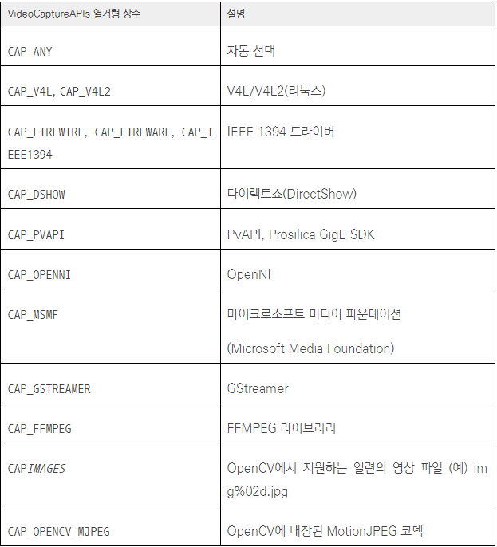
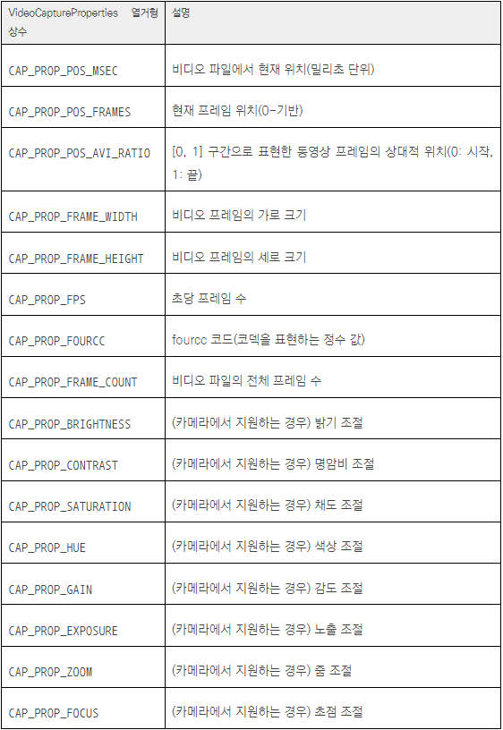
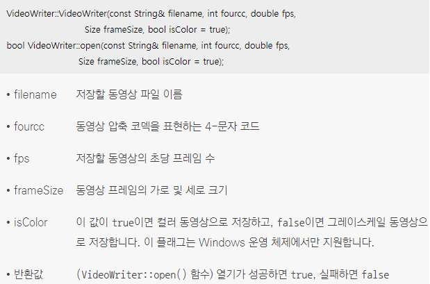
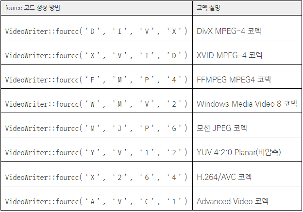

## 1. VideoCapture 클래스
* 카메라 또는 동영상 파일로부터 정지 영상 프레임을 받아 올 수 있는 클래스
* 동영상이란 일련의 정지 영상(frame)을 압축하여 파일로 저장한 형태
* 동영상을 처리하는 작업은 동영상에서 프레임을 추출한 후, 각각의 프레임에 영상 처리 기법을 적용하는 형태로 이루어짐
* 카메라 장치를 사용하는 작업도 카메라로부터 일정 시간 간격으로 정지 영상 프레임을 받아 와서 처리하는 형태
```cpp
// 간략화한 VideoCapture 클래스 정의
// VideoCapture 클래스의 멤버 변수는 모두 protected: 모드로 선언되어 있어서 사용자가 직접 접근할 수 없으며 여기서는 생략
class VideoCapture
{
public:
  // VideoCapture 기본생성자
  VideoCapture();
  // VideoCapture 클래스에서 동영상 파일 이름을 지정해서 동영상 파일을 불러오는 생성자
  // apiPreference 인자에는 동영상 파일을 불러오는 방법을 지정
  VideoCapture(const String& filename, int apiPreference = CAP_ANY);
  // VideoCapture 클래스에서 연결된 카메라를 불러오는 생성자
  // index 인자에는 카메라와 장치 사용 방식 지정 번호를 지정
  VideoCapture(int index, int apiPreference = CAP_ANY);
  virtual ~VideoCapture();

  // 동영상 파일을 열 떄 사용
  virtual bool open(const String& filename, int apiPreference = CAP_ANY);
  // 카메라 장치를 열 때 사용
  virtual bool open(int index, int apiPreference = CAP_ANY);
  // VideoCapture::isOpened() 멤버 함수를 이용하여 열기 작업이 성공적으로 수행되었는지 확인
  virtual bool isOpened() const;
  // 카메라 장치 또는 동영상 파일의 사용이 끝나면 VideoCapture::release() 함수를 호출하여 사용하던 자원을 해제
  virtual void release();
  
  // grab() 함수는 카메라 장치에 다음 프레임을 획득하라는 명령을 내리는 함수
  virtual bool grab();
  // retrieve()는 획득한 프레임을 실제로 받아 오는 함수
  virtual bool retrieve(OutputArray image, int flag = 0);
  
 
  // VideoCapture 클래스를 이용하여 카메라 또는 동영상 파일을 정상적으로 열었다면, 그 후에는 공통의 멤버 함수를 사용하여 프레임을 받아 올 수 있음
  // VideoCapture::read() 또는 VideoCapture::operator >>() 연산자 함수는 VideoCapture::grab()과 VideoCapture::retrieve() 함수를 합쳐 놓은 것
  virtual VideoCapture& operator >> (Mat& image);
  virtual bool read(OutputArray image);
 
  // 현재 열려 있는 카메라 또는 비디오 파일 재생과 관련된 속성 값을 설정할 때에는 VideoCapture::set() 함수를 사용
  virtual bool set(int propId, double value);
  // 현재 열려 있는 카메라 장치 또는 동영상 파일로부터 여러 가지 정보를 받아 오기 위해서는 VideoCapture::get() 함수를 사용
  virtual double get(int propId) const;
};
```
* apiPreference 인자에는 VideoCaptureAPIs 열거형 상수 중 하나를 지정
* 대부분의 경우 apiPreference 인자를 생략하거나 기본값인 CAP_ANY를 지정하며, 이 경우 시스템이 알아서 적절한 방법을 선택하여 사용
<br/>  
```cpp
// 예를 들어 컴퓨터에 연결된 기본 카메라로부터 한 프레임의 정지 영상을 받아 오려면 다음과 같은 형태로 코드를 작성
VideoCapture cap(0);

Mat frame1, frame2;
// frame1은 VideoCapture::operator >>() 연산자 재정의 함수를 사용하여 프레임을 받음
cap >> frame1; 
// frame2는 VideoCapture::read() 함수를 사용하여 프레임을 받음
cap.read(frame2);    
```
* propId 인수는 속성 ID. VideoCaptureProperties 열거형 중 하나를 지정
<br/>  
```cpp
// 예를 들어 시스템 기본 카메라를 열고, 카메라의 기본 프레임 크기를 확인하려면 다음과 같이 코드를 작성
VideoCapture cap(0);
 
int w = cvRound(cap.get(CAP_PROP_FRAME_WIDTH));
int h = cvRound(cap.get(CAP_PROP_FRAME_HEIGHT));
```
```cpp
// 만약 video.mp4 파일을 열어서 100번째 프레임으로 이동하려면 다음과 같이 코드를 작성
VideoCapture cap("video.mp4");
cap.set(CAP_PROP_POS_FRAMES, 100);
```

## 2. 카메라 입력 처리하기 
```cpp
// 카메라를 입력 받아 반전된 프레임을 보여주는 예제
void camera_in()
{
  // VideoCapture 객체를 생성하고, 컴퓨터에 연결된 기본 카메라를 사용하도록 설정
  VideoCapture cap(0);
  
  // 카메라 장치가 성공적으로 열리지 않았다면 에러 메시지를 출력하고 함수를 종료
  if (!cap.isOpened()) 
  {
    cerr << “Camera open failed!” << endl;  
    return;
  }

  cout << “Frame width: “ << cvRound(cap.get(CAP_PROP_FRAME_WIDTH)) << endl;
  cout << “Frame height: “ << cvRound(cap.get(CAP_PROP_FRAME_HEIGHT)) << endl;

  Mat frame, inversed;
  while (true) {
    cap >> frame;
    if (frame.empty())
      break;

    inversed = ~frame;

    imshow(“frame”, frame);
    imshow(“inversed”, inversed);

    if (waitKey(10) == 27) // ESC key
      break;
  }
  
  // 	camera_in() 함수가 종료될 때 cap 변수가 소멸되면서 자동으로 카메라 장치를 닫기 때문에 명시적인 cap.release(); 함수 호출은 생략
  destroyAllWindows();
}
```

## 3. 동영상 파일 처리하기
* 대부분의 동영상 파일은 고유의 코덱(codec)을 이용하여 압축된 형태로 저장
* 코덱은 복잡한 알고리즘을 이용하여 대용량 동영상 데이터를 압축하거나, 반대로 압축을 해제하여 프레임을 받아 오는 기능을 제공
```cpp
// 동영상을 입력 받아 반전된 프레임을 보여주는 예제
void video_in()
{
  // stopwatch.avi 파일을 불러와서 cap 객체를 생성
  VideoCapture cap(“stopwatch.avi”);
  
  if (!cap.isOpened()) {
    cerr << “Video open failed!” << endl;
    return;
  }

  cout << “Frame width: “ << cvRound(cap.get(CAP_PROP_FRAME_WIDTH)) << endl;
  cout << “Frame height: “ << cvRound(cap.get(CAP_PROP_FRAME_HEIGHT)) << endl;
  cout << “Frame count: “ << cvRound(cap.get(CAP_PROP_FRAME_COUNT)) << endl;

  double fps = cap.get(CAP_PROP_FPS);
  cout << “FPS: “ << fps << endl;

  int delay = cvRound(1000 / fps);

  Mat frame, inversed;
  while (true) {
    cap >> frame;
    if (frame.empty())
      break;

    inversed = ~frame;

    imshow(“frame”, frame);
    imshow(“inversed”, inversed);

    if (waitKey(delay) = = 27) // ESC key
      break;
  }

  destroyAllWindows();
}
```

## 4. 동영상 파일 저장하기
* OpenCV는 카메라 및 동영상 파일의 프레임을 받아 오는 기능뿐만 아니라 일련의 프레임을 동영상 파일로 저장하는 기능도 제공
* OpenCV에서 동영상 파일을 생성하고 프레임을 저장하기 위해서는 VideoWriter 클래스를 사용
```cpp
// 간략화한 VideoWriter 클래스 정의
class VideoWriter
{
public:
  // 생성자와 소멸자
  VideoWriter();
  VideoWriter(const String& filename, int fourcc, double fps, Size frameSize, bool isColor = true);
  virtual ~VideoWriter();


  virtual bool open(const String& filename, int fourcc, double fps, Size frameSize, bool isColor = true);
  virtual bool isOpened() const;
  virtual void release();

  // 열려 있는 동영상 파일에 새로운 프레임을 추가하기 위해서는 << 연산자 재정의 또는 VideoWriter:: write() 함수를 사용
  virtual VideoWriter& operator << (const Mat& image);
  virtual void write(const Mat& image);
  
  virtual bool set(int propId, double value);
  virtual double get(int propId) const;

  // fourcc는 4-문자 코드(four character code)의 약자이며, 말 그대로 네 개의 문자로 구성된 코드
  // fourcc는 동영상 파일의 코덱, 압축 방식, 색상 혹은 픽셀 포맷 등을 정의하는 정수 값이며, 코덱을 표현하는 네 개의 문자를 묶어서 fourcc를 생성
  static int fourcc(char c1, char c2, char c3, char c4);
  
  // …(생략)
};
```
* 새로운 동영상 파일을 저장하는 VideoWriter 클래스 객체 생성자와 저장할 동영상 파일을 여는 VideoWriter::open() 멤버 함수
<br/>   
* fourcc 코드와 관련 코덱 정보
<br/>   
```cpp
// 카메라 입력을 반전하여 동영상 파일로 저장하기
void camera_in_video_out()
{
  VideoCapture cap(0);

  if (!cap.isOpened()) {
    cerr << “Camera open failed!” << endl;
    return;
  }
  
  // 카메라 프레임의 가로, 세로 크기, 카메라의 FPS 값을 받아 옴
  int w = cvRound(cap.get(CAP_PROP_FRAME_WIDTH));
  int h = cvRound(cap.get(CAP_PROP_FRAME_HEIGHT));
  double fps = cap.get(CAP_PROP_FPS);
 
  // DivX MPEG-4 코덱에 해당하는 fourcc 코드를 생성
  int fourcc = VideoWriter::fourcc(‘D‘, ‘I‘, ‘V‘, ‘X‘);
  
  // FPS 값으로부터 매 프레임 사이의 시간 간격을 밀리초 단위로 계산
  int delay = cvRound(1000 / fps);
  
  // VideoWriter 객체를 생성
  VideoWriter outputVideo(“output.avi”, fourcc, fps, Size(w, h));

  if (!outputVideo.isOpened()) {
    cout << “File open failed!” << endl;
    return;
  }

  Mat frame, inversed;
  while (true) {
    // 카메라로부터 한 프레임을 받아 와 frame에 저장
    cap >> frame;
    
    if (frame.empty())
      break;
      
    // 반전된 카메라 프레임 영상 inversed를 출력 동영상에 추가
    inversed = ~frame;
    outputVideo << inversed;
  
    imshow(“frame”, frame);
    imshow(“inversed”, inversed);

    if (waitKey(delay) = = 27)
      break;
  }

  destroyAllWindows();
}
```
