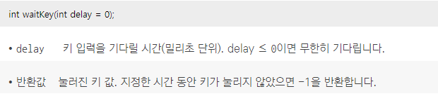
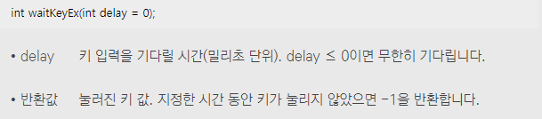
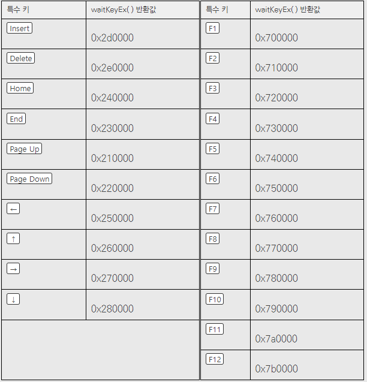
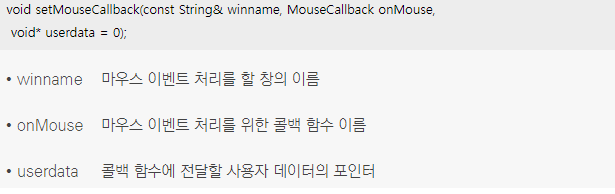
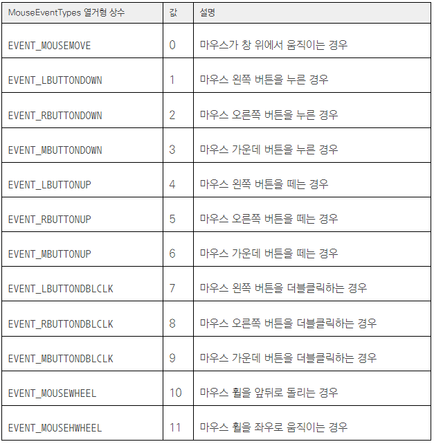
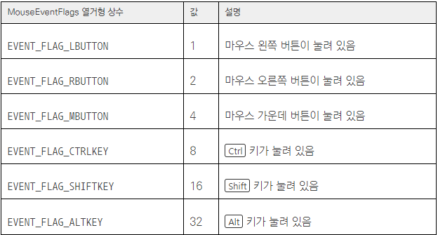
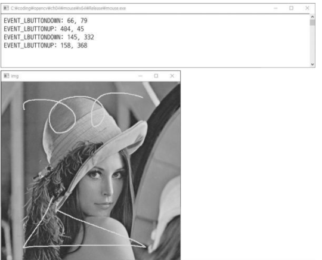
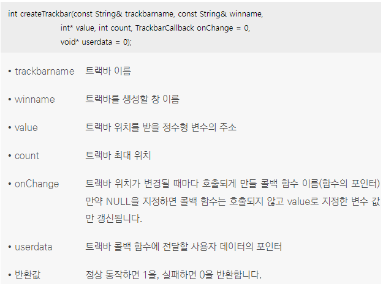
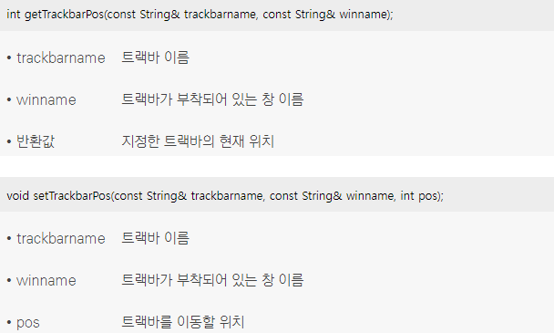

## 1. 키보드 이벤트 처리
*  <br/> waitKey() 함수는 delay에 해당하는 밀리초 시간 동안 키 입력을 기다리다가 키 입력이 있으면 해당 키의 아스키 코드(ASCII code) 값을 반환 <br/> waitKey() 함수를 이용하여 일반적인 키보드 입력은 처리할 수 있지만 함수키 F1~F12 또는 방향키등 특수키는 처리하지 못 함
*  <br/> 키보드의 특수 키에 대한 처리하고 싶다면 waitKey() 함수 대신 waitKeyEx() 함수를 사용
*  <br/> 주요 특수 키에 해당하는 waitKeyEx( ) 함수 반환값

## 2. 마우스 이벤트 처리
*  <br/> OpenCV 응용 프로그램에서 마우스 이벤트를 처리하려면 먼저 마우스 콜백 함수를 등록하고, 이후 마우스 콜백 함수에 마우스 이벤트를 처리하는 코드를 추가 <br/> 특정 창에 마우스 콜백 함수를 등록할 때에는 setMouseCallback() 함수를 사용 <br/> setMouseCallback() 함수는 winname 창에서 마우스 이벤트가 발생하면 onMouse로 등록된 콜백 함수가 자동으로 호출되도록 설정
```cpp
// setMouseCallback() 함수의 두 번째 인자 onMouse에 지정하는 마우스 콜백 함수의 형식 MouseCallback은 다음과 같이 정의
typedef void (*MouseCallback)(int event, int x, int y, int flags, void* userdata); 
// 마우스 콜백 함수는 네 개의 정수형과 하나의 void* 타입을 인자로 가지며, void를 반환형으로 사용
// 마우스 콜백 함수 이름을 반드시 onMouse로 설정해야 하는 것은 아니며, 원하는 다른 이름 사용 가능
// 첫 번째 인자 event에는 MouseEventTypes로 정의된 열거형 상수 중 하나가 전달
// 마우스 콜백 함수의 두 번째와 세 번째 인자에는 마우스 이벤트가 발생한 위치의 x 좌표와 y 좌표가 전달
// 네 번째 인자 flags는 마우스 이벤트가 발생할 때의 마우스 또는 키보드의 상태 정보
// void* 타입의 다섯 번째 인자에는 setMouseCallback() 함수에서 설정한 사용자 데이터의 포인터가 전달
// setMouseCallback() 함수에서 세 번째 인자 userdata를 설정하지 않았다면 마우스 콜백 함수의 userdata 인자에는 항상 0(NULL)이 전달

```
*  <br/> MouseEventTypes 열거형 상수
*  <br/> MouseEventFlags 열거형 상수
```cpp
#include "opencv2/opencv.hpp"
#include <iostream>

// 이 예제 프로그램은 마우스 왼쪽 버튼이 눌리거나 떼어진 좌표를 콘솔 창에 출력하고, 마우스 왼쪽 버튼을 누른 상태로 마우스를 움직이면 마우스 움직임 궤적을 영상 위에 노란색으로 표시

using namespace cv;
using namespace std;

Point pt;
Mat img;

void on_mouse(int event, int x, int y, int flags, void* userdata)
{
	switch (event)
	{
	case EVENT_LBUTTONDOWN:
		pt = Point(x, y);
		cout << "EVENT_LEBUTTON: " << x << ", " << y << endl;
		break;
	case EVENT_LBUTTONUP:
		cout << "EVENT_LBUTTONUP : " << x << ", " << y << endl;
		break;
	case EVENT_MOUSEMOVE:
		if (flags & EVENT_FLAG_LBUTTON)
		// &를 써도 작동하는 이유는 flags의 상수 값이 1, 2, 4, 8 ... 단위로 증가하기 때문
		{
			line(img, pt, Point(x, y), Scalar(0, 255, 255));
			imshow("img", img);
			pt = Point(x, y);
		}
		break;
	default:
		break;
	}
}

int main()
{
	img = imread("lenna.bmp");

	if (img.empty())
	{
		cerr << "Image load failed!" << endl;
		return -1;
	}

	namedWindow("img");
	setMouseCallback("img", on_mouse);

	imshow("img", img);
	waitKey(0);

	return 0;
}
```
*  <br/> 코드 결과 

## 3. 트랙바 사용하기 
*  OpenCV는 다양한 운영 체제에서 동작하는 라이브러리이기 때문에 범용적인 GUI 기능을 제공하기가 쉽지 않음 
*  그럼에도 OpenCV는 Windows, Linux, Mac OS 운영 체제에서 공통으로 사용할 수 있는 트랙바(trackbar) 인터페이스를 제공
*  트랙바는 슬라이더 컨트롤(slider control)이라고도 부르며, 영상 출력 창에 부착되어 프로그램 동작 중에 사용자가 지정된 범위 안의 값을 선택
*   <br/> 트랙바를 생성하려면 createTrackbar() 함수를 사용하며 winname 이름의 창에 trackbarname 이름의 트랙바를 부착하고, 트랙바가 움직일 때마다 onChange에 해당하는 트랙바 콜백 함수가 호출되도록 설정 <br/> 최소 위치는 항상 0으로 고정 <br/> 사용자가 트랙바 콜백 함수에 전달하고 싶은 데이터가 있다면 userdata 인자를 통해 void* 형식으로 전달 <br/> 콜백 함수에 전달할 사용자 데이터가 없다면 userdata 인자는 지정하지 않아도 됨
```cpp
// createTrackbar() 함수의 다섯 번째 인자 onChange에 지정하는 트랙바 콜백 함수
typedef void (*TrackbarCallback)(int pos, void* userdata);
// 트랙바 콜백 함수 첫 번째 인자에는 현재 트랙바의 위치 정보가 전달
// 두 번째 인자에는 createTrackbar() 함수에서 지정한 사용자 데이터 포인터 값이 전달
```
```cpp
#include "opencv2/opencv.hpp"
#include <iostream>

// 트랙바를 이용하여 그레이스케일 레벨 표현

using namespace cv;
using namespace std;

void on_level_change(int pos, void* userdata)
{
	Mat img = *(Mat*)userdata;

	img.setTo(pos * 16);
	imshow("image", img);
}

int main(void)
{
	Mat img = Mat::zeros(400, 400, CV_8UC1);

	namedWindow("image");
	createTrackbar("level", "image", 0, 16, on_level_change, (void*)&img);

	imshow("image", img);
	waitKey(0);

	return 0;
}
```
*  <br/> 트랙바를 생성한 후, 트랙바의 현재 위치를 알고 싶다면 getTrackbarPos() 함수를 사용 또한 프로그램 동작 중 트랙바 위치를 강제로 특정 위치로 옮기고 싶다면 setTrackbarPos() 함수를 사용
