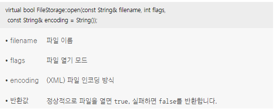
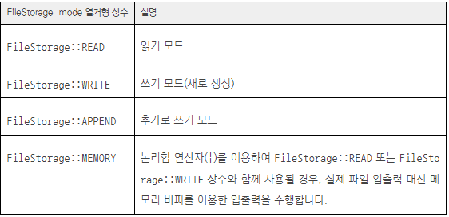
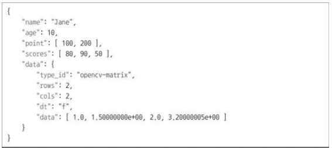

## 1. FileStorage 클래스
* OpenCV에서의 데이터 파일 입출력을 담당하는 클래스
* Mat 클래스 객체뿐만 아니라 일반적인 C/C++ 자료형 데이터를 XML, YAML, JSON 등 파일 형식으로 저장하는 기능을 제공
* 사용할 파일 형식은 filename의 확장자에 의해 자동으로 결정
```cpp
// 간략화한 FileStorage 클래스 정의
class FileStorage
{
public:

  // FileStorage 클래스 생성자
  FileStorage();
  FileStorage(const String& filename, int flags, const String& encoding=String());

  // 파일을 열고 닫을 때 사용하는 멤버 함수
  virtual bool open(const String& filename, int flags, const String& encoding=String());
  // 해당 파일이 정상적으로 열렸는지 확인하는 함수
  virtual bool isOpened() const;
  virtual void release();

  // 	[] 연산자 재정의는 파일에서 데이터를 읽어서 FileNode 객체를 반환
  FileNode operator[](const char* nodename) const;
  
  // … (생략)
};
  
  // 	<< 연산자 재정의는 파일에 데이터를 저장할 때 사용
  template<typename _Tp> static
  FileStorage& operator << (FileStorage& fs, const _Tp& value);
  static FileStorage& operator << (FileStorage& fs, const String& str);
  static FileStorage& operator << (FileStorage& fs, const char* str);

  // >> 연산자 재정의는 파일에서 데이터를 읽어 올 때 사용
  template<typename _Tp> static
  void operator >> (const FileNode& n, _Tp& value)
  template<typename _Tp> static
  void operator >> (const FileNode& n, std::vector<_Tp>& vec)
```
* FileStorage 객체 생성자와 FileStorage::open() 멤버 함수
<br/>  
* FileStorage::mode 열거형 상수 (파일 열기 모드)
<br/>  

## 2. 데이터 파일 저장하기
```cpp
// 파일에 데이터 저장하기
// String filename = “mydata.xml“;
// String filename = “mydata.yml“;
String filename = “mydata.json”;

void writeData()
{
  String name = “Jane”;
  int age = 10;
  Point pt1(100, 200);
  vector<int> scores = { 80, 90, 50 };
  Mat mat1 = (Mat_<float>(2, 2) << 1.0f, 1.5f, 2.0f, 3.2f);

  // FileStorage 생성자 쓰기모드로 생성
  FileStorage fs(filename, FileStorage::WRITE);

  if (!fs.isOpened()) {
    cerr << “File open failed!” << endl;
    return;
  }

  // 	<< 연산자 재정의는 파일에 데이터를 저장할 때 사용
  fs << “name” << name;
  fs << “age” << age;
  fs << “point” << pt1;
  fs << “scores” << scores;
  fs << “data” << mat1;

  fs.release();
 }
```
* 코드 결과
<br/>  

## 3. 데이터 파일 불러오기
```cpp
//  파일로부터 데이터 불러오기 
void readData()
{
  String name;
  int age;
  Point pt1;
  vector<int> scores;
  Mat mat1;

  // FileStorage 생성자 읽기모드로 생성
  FileStorage fs(filename, FileStorage::READ);

  if (!fs.isOpened()) {
    cerr << “File open failed!” << endl;
    return;
  }

  // [] 연산자 재정의는 파일에서 데이터를 읽어서 FileNode 객체를 반환
  // >> 연산자 재정의는 파일에서 데이터를 읽어 올 때 사용
  fs[”name”] >> name;
  fs[”age”] >> age;
  fs[”point”] >> pt1;
  fs[”scores”] >> scores;
  fs[”data”] >> mat1;
  
  fs.release();
}
```
