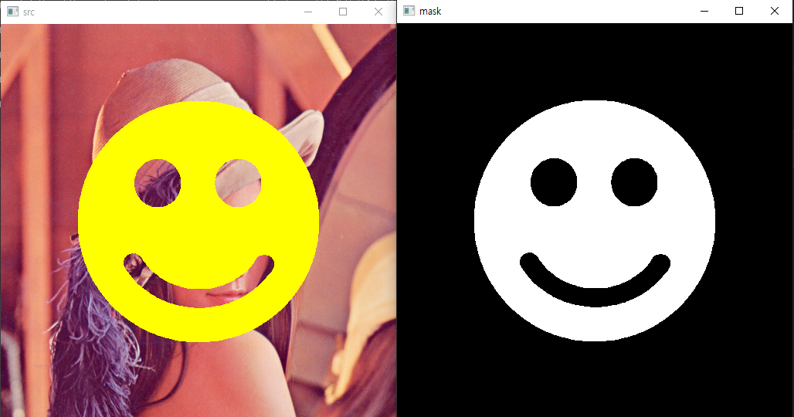
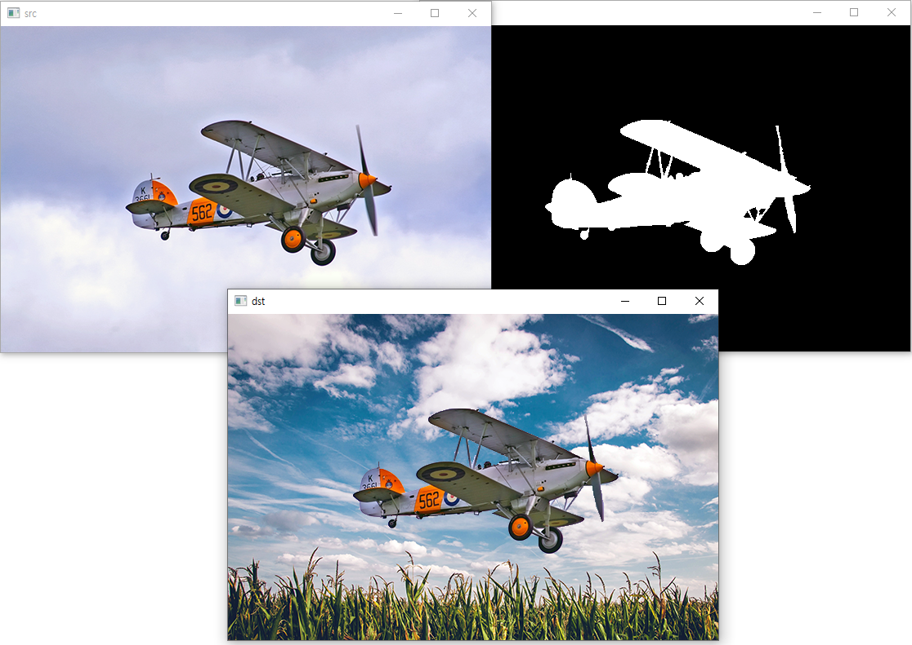
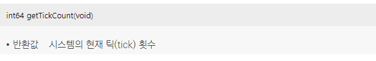
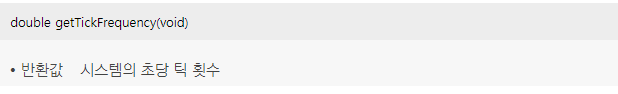
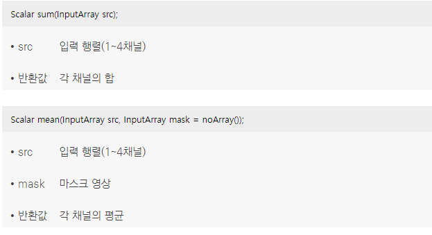
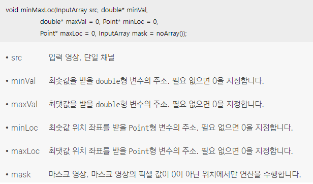
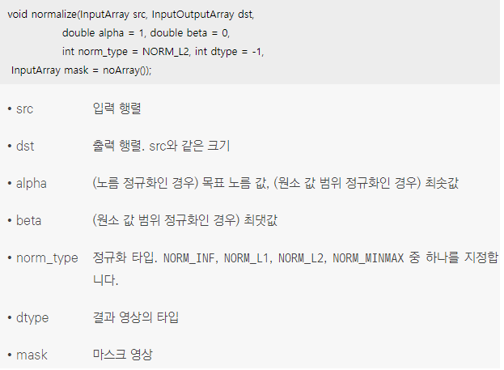
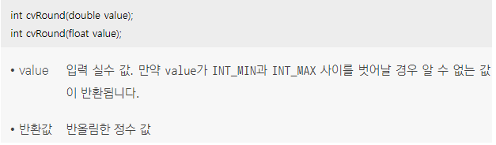

## 마스크 연산
* OpenCV에서는 임의의 모양을 갖는 ROI 설정을 위하여 일부 행렬 연산 함수에 대하여 마스크(mask) 연산을 지원
```cpp
// 마스크 영상을 이용한 픽셀 값 설정
void mask_setTo()
{
  Mat src = imread("lenna.bmp", IMREAD_COLOR);
  Mat mask = imread("mask_smile.bmp", IMREAD_GRAYSCALE);
     
  if (src.empty() || mask.empty()) {
    cerr << "Image load failed!" << endl;
    return;
  }

  // Mat::setTo() 함수는 마스크 연산을 지원
  // mask 영상에서 픽셀 값이 0이 아닌 위치에서만 src 영상 픽셀을 노란색으로 설정
  src.setTo(Scalar(0, 255, 255), mask);
  
  imshow("src", src);
  imshow("mask", mask);
  
  waitKey(0);
  destroyAllWindows();
}
```
* 코드 결과 <br/>  
```cpp
// 마스크 영상을 이용하여 픽셀 값의 일부분만 복사하기
 void mask_copyTo()
{
  Mat src = imread("airplane.bmp", IMREAD_COLOR);
  Mat mask = imread("mask_plane.bmp", IMREAD_GRAYSCALE);
  Mat dst = imread("field.bmp", IMREAD_COLOR);
  
  if (src.empty() || mask.empty() || dst.empty()) {
    cerr << "Image load failed!" << endl;
    return;
  }
  
  // Mat::copyTo() 함수는 마스크 연산을 지원 
  // 마스크 연산을 지원하는 Mat::copyTo() 함수는 mask 영상의 픽셀 값이 0이 아닌 위치에서만 *this 행렬 원소 값을 행렬 m으로 복사
  // mask 영상에서 흰색 영역 위치에서만 src 영상 픽셀 값을 dst로 복사
  src.copyTo(dst, mask);
   
  imshow("dst", dst);
    
  waitKey(0);
  destroyAllWindows();
}
```
* 코드 결과 <br/>  

## 연산 시간 측정
* 영상 처리 시스템은 대용량 영상 데이터를 다루고 복잡한 알고리즘 연산을 수행합니다. 여러 단계로 구성된 영상 처리 시스템을 개발하는 경우, 각 단계에서 소요되는 연산 시간을 측정하고 시간이 오래 걸리는 부분을 찾아 개선하는 시스템 최적화 작업이 필수
* 컴퓨터 비전 분야의 특성을 충족시키기 위해 OpenCV 라이브러리는 정밀한 시간 측정 방법을 제공
* OpenCV에서는 getTickCount() 함수와 getTickFrequency() 함수를 사용하여 특정 연산의 수행 시간을 측정
*  <br/> getTickCount() 함수는 컴퓨터 시스템의 특정 시점(예를 들어 컴퓨터 부팅 시점)부터 현재까지 발생한 틱(tick) 횟수를 반환
*  <br/> OpenCV에서는 getTickFrequency() 함수를 이용하여 시스템 틱 주파수를 구할 수 있음
```cpp
// 보통 특정 연산에 걸리는 시간을 측정하기 위해서는 특정 연산 수행 전에 getTickCount() 함수 반환값을 저장해 놓고, 연산 후에 다시 getTickCount() 함수 반환값을 구하여 그 차이를 계산
// 이렇게 계산되는 틱 횟수 차이 값은 사용하고 있는 컴퓨터 시스템의 성능에 따라 다르게 측정
nt64 t1 = getTickCount();
 
my_func(); // do something
 
int64 t2 = getTickCount();
// 실제 연산 시간을 알아내기 위해서는 틱 횟수 차이를 시스템의 틱 주파수(tick frequency)로 나누는 작업이 동반되어야 함
// 대부분의 연산이 보통 1초 이내에 수행되는 경우가 많기 때문에, 앞 소스 코드에서는 연산 시간에 1000을 곱하여 밀리초 단위의 연산 시간을 변수 ms에 저장
double ms = (t2 - t1) * 1000 / getTickFrequency();
```
* getTickCount()와 getTickFrequency() 함수를 조합하여 사용하면 특정 연산 시간을 정확하게 측정할 수 있지만, 두 함수의 사용법이 다소 생소하게 느껴질 수 있어 연산 시간 측정을 위한 TickMeter라는 이름의 클래스를 새롭게 제공
```cpp
// 간략화한 TickMeter 클래스 정의
class TickMeter
{
public:
  TickMeter();
  
  // TickMeter::start() 함수는 시간 측정을 시작할 때 사용
  void start();
  // TickMeter::stop() 함수는 시간 측정을 멈출 때 사용
  void stop();
  // TickMeter::reset() 함수는 새롭게 연산 시간을 측정하고자 할 때 사용하며, 모든 멤버 변수 값을 0으로 초기화
  void reset();

  // 	TickMeter::getTimeMicro() 함수는 연산 시간을 마이크로 초 단위로 반환
  double getTimeMicro() const;
  // TickMeter::getTimeMilli() 함수는 연산 시간을 밀리초 단위로 반환
  double getTimeMilli() const;
  // TickMeter::getTimeSec() 함수는 연산 시간을 초 단위로 반환
  double getTimeSec() const;
  // TickMeter::getCounter() 함수는 시간 측정을 수행한 횟수를 반환
  int64 getCounter() const
  //...(생략)
  };
```
```cpp
TickMeter tm;
tm.start();
 
my_func(); // do something
 
tm.stop();
double ms = tm.getTimeMilli();
```

## 유용한 OpenCV 함수 사용법
*  <br/> 주어진 행렬의 전체 원소 합 또는 평균을 구하는 일은 종종 필요하고, OpenCV에서 Mat 행렬의 원소 합을 구하고 싶을 때에는 sum() 함수를 사용하고, 평균을 구하고 싶을 때에는 mean() 함수를 사용 
*  <br/> 주어진 행렬의 최솟값, 최댓값을 찾는 minMaxLoc() 함수 <br/> 이 함수는 최솟값, 최댓값이 있는 좌표 정보도 함께 알아낼 수 있음
*  <br/> 행렬의 노름(norm) 값을 정규화하거나 또는 원소 값 범위를 특정 범위로 정규화할 때 사용할 수 있는 normalize() 함수 <br/> 많은 OpenCV 예제 코드에서 NORMMINMAX 타입으로 normalize() 함수를 사용 <br/> norm_type 인자가 NORM_MINMAX인 경우에는 src 행렬의 최솟값이 alpha, 최댓값이 beta가 되도록 모든 원소 값 크기를 조절 <br/> 실수로 구성된 행렬을 그레이스케일 영상 형태로 변환하고자 할 때 normalize() 함수를 사용하면 유용
```cpp
Mat src = Mat<float>({ 1, 5 }, { -1.f, -0.5f, 0.f, 0.5f, 1.f });

Mat dst;
// 주어진 행렬의 최솟값은 0, 최댓값은 255가 되도록 크기를 조정하고, 결과 행렬의 타입이 CV_8UC1이 되도록 변경
normalize(src, dst, 0, 255, NORM_MINMAX, CV_8UC1);

cout << “src: “ << src << endl;
// src : [-1, -0.5, 0, 0.5, 1]
// src 행렬의 최솟값이 -1이고, 최댓값이 1이므로 -1부터 1까지의 범위가 0부터 255까지의 범위가 되도록 src 원소 값을 선형 변환
// 0~1사이로 정규화 하는 식 ---> normalize(src) =  [(src(i) - min(src)) / (max(src) - min(src))]
// 원하는 값의 범위 alpha ~ beta 로 정규화 하는 식 ---> dst(i) = normalize(src) * (beta - alpha) + alpha 
// dst : [0, 63.75, 127.5, 191.25, 255] -> 정수표현(반올림)
cout << “dst: “ << dst << endl;
// dst : [0, 64, 128, 191, 255]
```
*  <br/> 영상 처리를 수행하다 보면 내부 연산은 실수를 사용하고, 최종적인 결과는 정수로 변환하는 경우가 많음 <br/> 실수 값을 정수로 변환할 때는 주로 반올림을 사용하며, OpenCV에서는 실수 값의 반올림 연산을 위해 cvRound() 함수를 제공
