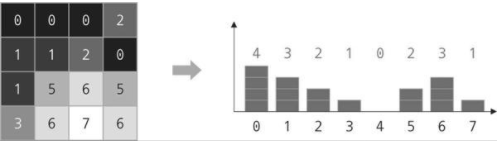
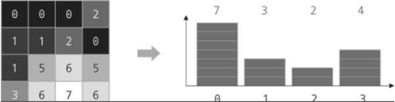
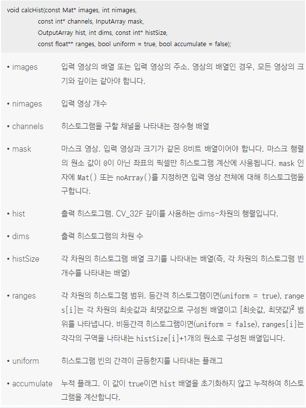
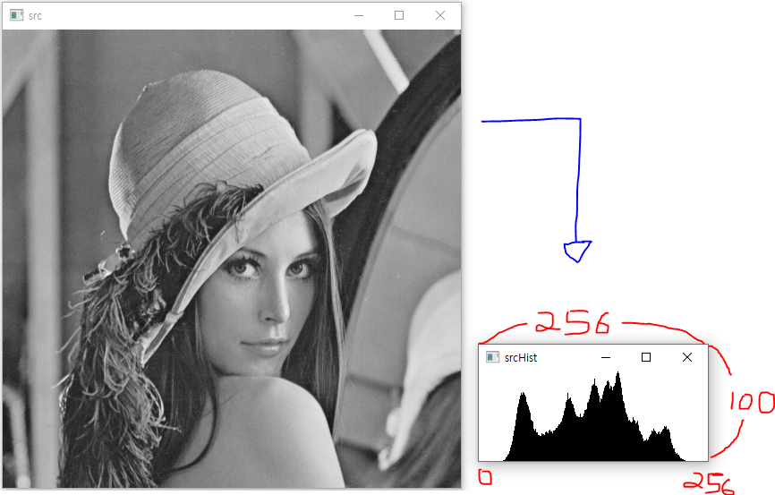
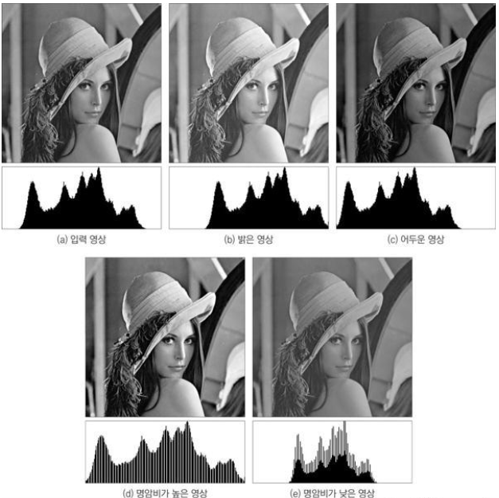

## 히스토그램 구하기
* 영상의 히스토그램(histogram)이란 영상의 픽셀 값 분포를 그래프 형태로 표현한 것을 의미
* 그레이스케일 영상의 경우, 각 그레이스케일 값에 해당하는 픽셀의 개수를 구하고 이를 막대 그래프 형태로 표현함으로써 히스토그램을 구할 수 있고, 컬러 영상에 대해서도 세 개의 색상 성분 조합에 따른 픽셀 개수를 계산하여 히스토그램을 구할 수 있음
*  <br/> 각 픽셀이 0부터 7 사이의 밝기를 가질 수 있는 단순한 형태의 영상인 4×4 입력 영상을 히스토그램으로 표현한 그림 <br/> 히스토그램 그래프에서 가로축을 히스토그램의 빈(bin)이라고 하고 여기서는 8개의 빈이 있음
*  <br/> 여덟 개의 밝기 값을 가질 수 있는 영상에서 히스토그램 빈 개수를 4로 설정한 그림 <br/> 일반적으로 히스토그램의 빈 개수가 줄어들면 히스토그램이 표현하는 영상의 픽셀 값 분포 모양이 좀 더 대략적인 형태로 바뀌고 반대로 빈 개수가 많으면 세밀한 픽셀 값 분포 표현이 가능
*  <br/> OpenCV에서 영상의 히스토그램을 구하려면 calcHist() 함수를 사용 <br/> 등간격 히스토그램이란 빈이 표현하는 밝기 값 간격이 균일하다는 의미
```cpp
#include "opencv2/opencv.hpp"
#include <iostream>

using namespace cv;
using namespace std;

// 그레이스케일 영상의 히스토그램 구하기
Mat calcGrayHist(const Mat& img)
{
	// CV_Assert() 매크로 함수를 이용하여 calcGrayHist() 함수로 전달된 img 영상이 그레이스케일 영상인지를 검사
	CV_Assert(img.type() == CV_8UC1);

	// 히스토그램 정보를 저장할 Mat 타입의 변수 hist를 선언
	Mat hist;
	// 히스토그램을 구할 채널 번호를 담은 channels 배열을 생성
	// 그레이스케일 영상은 한 개의 채널을 가지고 있고, 채널 번호는 0부터 시작하므로 channels 배열은 0 하나만 원소로 가짐
	int channels[] = { 0 };
	// dims 변수에 1을 대입한 것은 하나의 채널에 대해서만 히스토그램을 구하기 때문이며, 결과로 구해지는 hist 행렬이 1차원 행렬임을 표현
	int dims = 1;
	// histSize 배열 원소에 256을 하나 지정한다는 것은 입력 영상의 첫 번째 채널 값의 범위를 256개 빈으로 나누어 히스토그램을 구하겠다는 의미
	const int histSize[] = { 256 };
	// graylevel 배열의 원소에는 그레이스케일 값의 최솟값과 최댓값인 0과 256을 차례대로 지정
	float graylevel[] = { 0, 256 };
	// ranges 배열은 graylevel 배열 이름을 원소로 갖는 배열
	const float* ranges[] = { graylevel };

	//calcHist() 함수를 이용하여 img 영상의 히스토그램을 구하고, 그 결과를 hist 변수에 저장
	calcHist(&img, 1, channels, noArray(), hist, dims, histSize, ranges);
	
	// 구해진 히스토그램 hist를 반환
	// 반환되는 hist는 CV_32FC1 타입을 갖는 256×1 크기의 행렬
	return hist;
}

// getGrayHistImage() 함수는 히스토그램 그래프에서 최대 빈도수를 표현하는 막대그래프 길이가 100픽셀이 되도록 그래프를 그리는 코드
Mat getGrayHistImage(const Mat& hist)
{
	CV_Assert(hist.type() == CV_32FC1);
	CV_Assert(hist.size() == Size(1, 256));

	double histMax;
	// hist 행렬 원소의 최댓값을 histMax 변수에 저장
	minMaxLoc(hist, 0, &histMax);

	// 흰색으로 초기화된 256×100 크기의 새 영상 imgHist를 생성
	Mat imgHist(100, 256, CV_8UC1, Scalar(255));
	//	for 반복문과 line() 함수를 이용하여 각각의 빈에 대한 히스토그램 그래프를 그림
	for (int i = 0; i < 256; i++)
		line(imgHist, Point(i, 100), Point(i, 100 - cvRound(hist.at<float>(i, 0) * 100 / histMax)), Scalar(0));

	return imgHist;
}

int main()
{
	Mat src = imread("lenna.bmp", IMREAD_GRAYSCALE);
	Mat hist = calcGrayHist(src);
	Mat hist_img = getGrayHistImage(hist);


	imshow("src", src);
	imshow("srcHist", hist_img);

	waitKey(0);

	return 0;
}
```
* 코드 결과 <br/> 
* 히스토그램 분석 비교 a.원본 영상, b. 밝기를 증가시킨 영상,  c. 밝기를 감소시킨 영상, d. 명암비를 증가시킨 영상, e. 명암비를 감소시킨 영상 <br/> 
