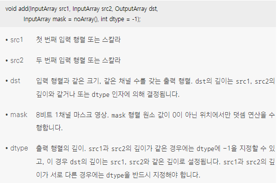
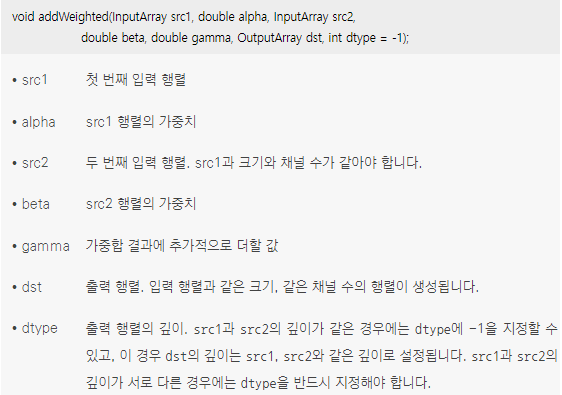
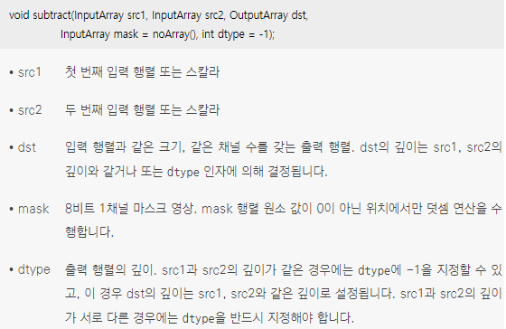
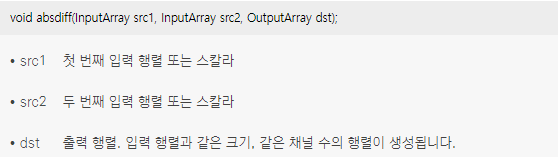
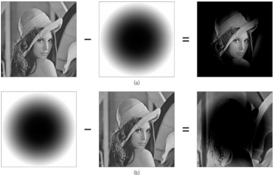
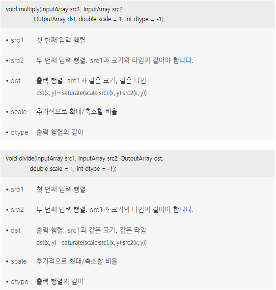
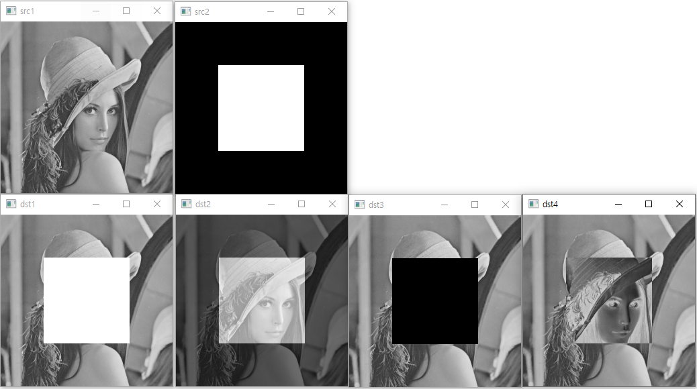

* 영상은 일종의 2차원 행렬이기 때문에 행렬의 산술 연산(arithmetic operation)을 그대로 적용할 수 있음
*  <br/> OpenCV에서는 add() 함수를 사용하여 영상의 덧셈을 수행 <br/> dst(x, y) = saturate(src1(x, y) + src2(x, y))
* 덧셈 연산의 두 입력 영상 타입이 같다면 add() 함수 대신 + 연산자 재정의를 사용할 수 있음
*  <br/> 두 영상의 가중치 합을 구하려면 addWeighted() 함수를 사용 <br/> dst(x, y) = saturate(src1(x, y) * alpha + src2(x, y) * beta + gamma)
*  <br/> OpenCV에서는 subtract() 함수를 통해 두 영상의 뺄셈 연산을 수행 <br/> dst(x, y) = saturate(src1(x, y) - src2(x, y))
*  뺄셈 연산의 두 입력 영상 타입이 같다면 subtract() 함수 대신 - 연산자 재정의를 사용할 수 있음
*  <br/> OpenCV에서는 absdiff() 함수를 이용하여 차영상을 구할 수 있음 <br/> 차이 연산은 뺄셈 연산 결과에 절댓값을 취하는 연산이며, 차이 연산으로 구한 결과 영상을 차영상(difference image)이라고 합 <br/> dst(x, y) = | src1(x, y) - src2(x, y) | <br/> 
*  <br/> 차영상의 예 <br/> (b)에서 결과 이미지를 보면 주위 레나 영상 배경이 색이 반전되어 있다 
*  <br/> 두 영상에서 같은 위치에 있는 픽셀 값끼리 서로 곱하거나 나누는 연산을 수행할 수 있으며, 이를 위해 OpenCV에서는 multiply() 함수와 divide() 함수를 제공하지만 영상을 이용하여 행렬의 곱셈이나 나눗셈을 수행하는 경우는 거의 없음
```cpp
#include "opencv2/opencv.hpp"
#include <iostream>

using namespace cv;
using namespace std;

int main(void)
{
	Mat src1 = imread("lenna256.bmp", IMREAD_GRAYSCALE);
	Mat src2 = imread("square.bmp", IMREAD_GRAYSCALE);
	Mat dst1, dst2, dst3, dst4;

	if (src1.empty() || src2.empty())
	{
		cerr << "Image load failed!!" << endl;
		return -1;
	}

	imshow("src1", src1);
	imshow("src2", src2);

	add(src1, src2, dst1);
	addWeighted(src1, 0.5, src2, 0.5, 0, dst2);
	subtract(src1, src2, dst3);
	absdiff(src1, src2, dst4);

	imshow("dst1", dst1);
	imshow("dst2", dst2);
	imshow("dst3", dst3);
	imshow("dst4", dst4);

	waitKey();

	return 0;
}
```
* 코드 결과 <br/> 
