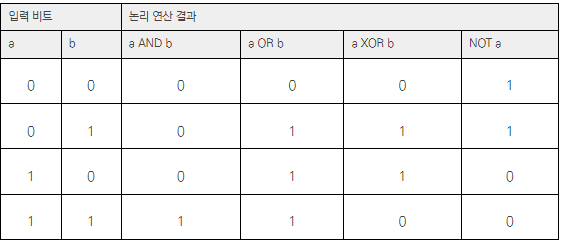
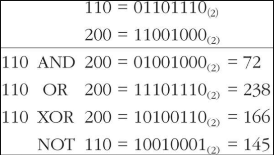
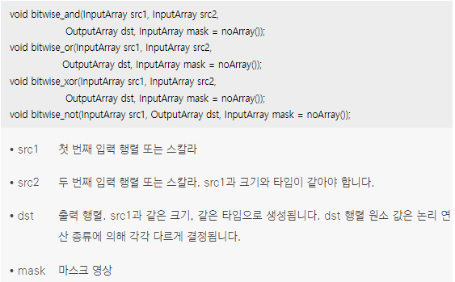
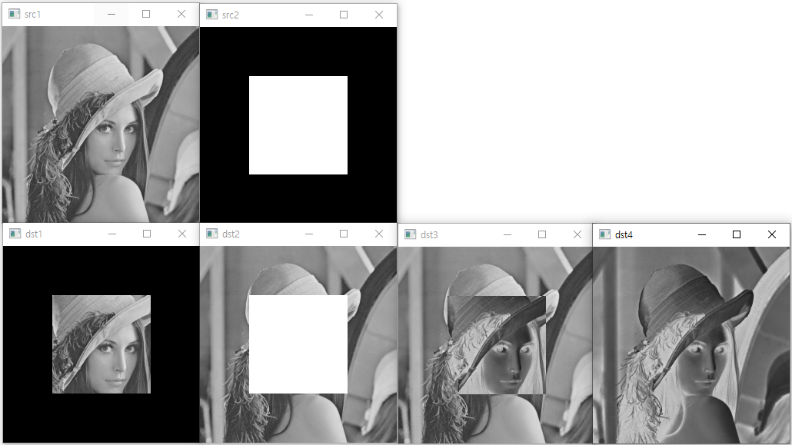

* 영상의 논리 연산(logical operation)은 픽셀 값을 이진수로 표현하여 각 비트(bit) 단위 논리 연산을 수행하는 것을 의미
* OpenCV에서는 다양한 논리 연산 중에서 논리곱(AND), 논리합(OR), 배타적 논리합(XOR), 부정(NOT) 연산을 지원
*  <br/> 논리 연산 진리표 
*  <br/> 두 개의 입력 영상에서 특정 좌표에 있는 픽셀의 그레이스케일 값이 각각 110과 200인 경우, 이 두 값에 대하여 논리곱(AND), 논리합(OR), 배타적 논리합(XOR), 부정(NOT) 연산을 수행하면 다음과 같이 계산
*  <br/> OpenCV에서는 영상의 비트 단위 논리 연산을 수행하는 bitwise_and(), bitwise_or(), bitwise_xor(), bitwise_not() 함수를 제공
```cpp
#include "opencv2/opencv.hpp"
#include <iostream>

using namespace cv;
using namespace std;

int main(void)
{
	Mat src1 = imread("lenna256.bmp", IMREAD_GRAYSCALE);
	Mat src2 = imread("square.bmp", IMREAD_GRAYSCALE);
	Mat dst1, dst2, dst3, dst4;

	if (src1.empty() || src2.empty())
	{
		cerr << "Image load failed!!" << endl;
		return -1;
	}

	imshow("src1", src1);
	imshow("src2", src2);


	bitwise_and(src1, src2, dst1);
	bitwise_or(src1, src2, dst2);
	bitwise_xor(src1, src2, dst3);
	bitwise_not(src1, dst4);

	imshow("dst1", dst1);
	imshow("dst2", dst2);
	imshow("dst3", dst3);
	imshow("dst4", dst4);

	waitKey(0);

	return 0;
}
```
* 코드 결과 <br/>  
```cpp
// bitwise_and(), bitwise_or(), bitwise_xor(), bitwise_not() 함수를 사용하는 것 대신 아래와 같이 코드를 작성해도 동일하게 동작
dst1 = src1 & src2; // bitwise_and(src1, src2, dst1);
dst2 = src1 | src2; // bitwise_or(src1, src2, dst2);
dst3 = src1 ^ src2; // bitwise_xor(src1, src2, dst3);
dst4 = ~src1;       // bitwise_not(src1, dst4);
```
