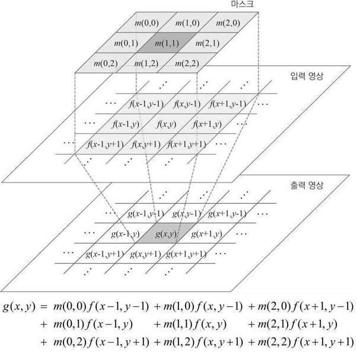
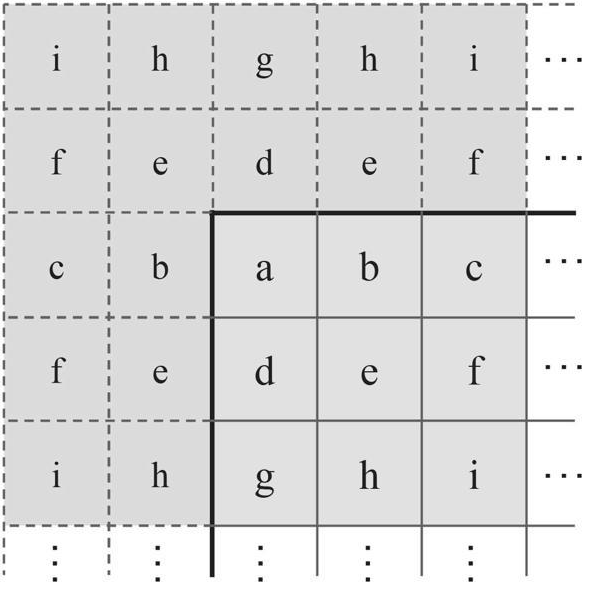

## 필터링 연산 방법
* 영상 처리에서 필터링(filtering)이란 영상에서 원하는 정보만 통과시키고 원치 않는 정보는 걸러 내는 작업
* 영상의 필터링은 보통 마스크(mask)라고 부르는 작은 크기의 행렬을 이용
* 마스크는 필터링의 성격을 정의하는 행렬이며 커널(kernel), 윈도우(window)라고도 부르며, 경우에 따라서는 마스크 자체를 필터라고 부르기도 함
* 영상 처리에서 사용되는 다양한 모양의 필터 마스크 예 <br/> 여러 가지 모양의 필터 마스크 중에서 3×3 정방형 행렬이 다양한 필터링 연산에서 가장 널리 사용되고 있음 <br/> 마스크에서 진한 색으로 표시한 위치는 고정점(anchor point)을 나타내고, 고정점은 현재 필터링 작업을 수행하고 있는 기준 픽셀 위치를 나타냄 <br/> 필터링 연산의 결과는 마스크 행렬의 모양과 원소 값에 의해 결정
<br/>   
* 마스크 연산 
> * m : 마스크 행렬, f : 입력 영상, g : 출력 영상 <br/> 마스크 연산이란 마스크 행렬의 모든 원소에 대하여 마스크 행렬 원소 값과 같은 위치에 있는 입력 영상 픽셀 값을 서로 곱한 후, 그 결과를 모두 더하는 연산 <br/> (x, y) 좌표에서 마스크 연산을 통해 결과 영상의 픽셀 값 g(x, y)를 구했으면, 다음에는 마스크를 한 픽셀 옆으로 이동하여 (x+1, y) 좌표에 다시 마스크 연산을 수행하고 그 결과를 g(x+1, y)에 저장
> <br/>   
> * 영상의 가장자리 픽셀에 대해 필터링을 수행할 때에는 영상의 가장자리 픽셀을 확장하여 영상 바깥쪽에 가상의 픽셀을 만들어 처리 <br/> 이 그림에서는 5×5 크기의 필터 마스크를 사용하는 필터링을 고려하여 영상 바깥쪽에 두 개씩의 가상 픽셀을 표현 <br/> 각의 픽셀에 쓰여진 영문자는 픽셀 값을 나타내며, 가상의 픽셀 위치에는 실제 영상의 픽셀 값이 대칭 형태로 나타나도록 설정 <br/> OpenCV 필터링 함수는 기본적으로 그림과 같은 방식으로 가장자리 픽셀을 확장
> <br/>  
* OpenCV에서 필터 마스크를 사용하는 일반적인 필터링은 filter2D() 함수를 이용하여 수행 <br/> 만약 ddepth에 -1을 지정하면 출력 영상의 깊이는 입력 영상과 같게 설정 <br/> Point(-1, -1)가 왜 고정점이 센터이냐면 수식에서 x - 1, y - 1 좌표부터 시작해야 고정점이 센터가 되기 떄문
<br/>    
* 필터링에서 가장자리 픽셀 처리 방법
<br/>  
* filter2D() 함수가 수행하는 수식
<br/>   

## 엠보싱 필터링 
* 엠보싱이란 직물이나 종이, 금속판 등에 올록볼록한 형태로 만든 객체의 윤곽 또는 무늬를 뜻하며, 엠보싱 필터는 입력 영상을 엠보싱 느낌이 나도록 변환하는 필터
* 보통 입력 영상에서 픽셀 값 변화가 적은 평탄한 영역은 회색으로 설정하고, 객체의 경계 부분은 좀 더 밝거나 어둡게 설정하면 엠보싱 느낌을 표현 가능 
* 엠보싱 필터 마스크는 대각선 방향으로 +1 또는 -1의 값이 지정되어 있는 3×3 행렬
<br/> 이 필터 마스크를 사용하여 필터링을 수행하면 대각선 방향으로 픽셀 값이 급격하게 변하는 부분에서 결과 영상 픽셀 값이 0보다 훨씬 크거나 또는 0보다 훨씬 작은 값을 가지게 되고, 입력 영상에서 픽셀 값이 크게 바뀌지 않는 평탄한 영역에서는 결과 영상의 픽셀 값이 0에 가까운 값을 가지게 됨
<br/> 이렇게 구한 결과 영상을 그대로 화면에 나타내면 음수 값은 모두 포화 연산에 의해 0이 되어 버리기 때문에 입체감이 크게 줄어들게 되어 엠보싱 필터를 구현할 때에는 결과 영상에 128을 더하는 것이 보기에 좋음
<br/>    
```cpp
// filter2D() 함수를 사용하여 영상에 엠보싱(embossing) 필터링을 적용하는 예제 프로그램
void filter_embossing()
{
	Mat src = imread("rose.bmp", IMREAD_GRAYSCALE);
	Mat dst;

	if (src.empty())
	{
		cerr << "Image load failed" << endl;
		return;
	}

	float data[] = { -1, -1, 0, -1, 0, 1, 0, 1, 1 };
	Mat emboss(3, 3, CV_32FC1, data);

	filter2D(src, dst, -1, emboss, Point(-1, -1), 128);

	imshow("src", src);
	imshow("dst", dst);

	waitKey(0);
	destroyAllWindows();
}
```
* 코드 결과 <br/> 
