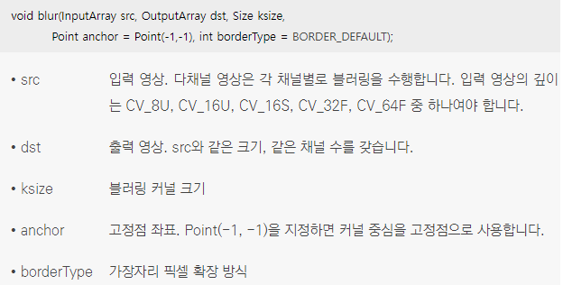
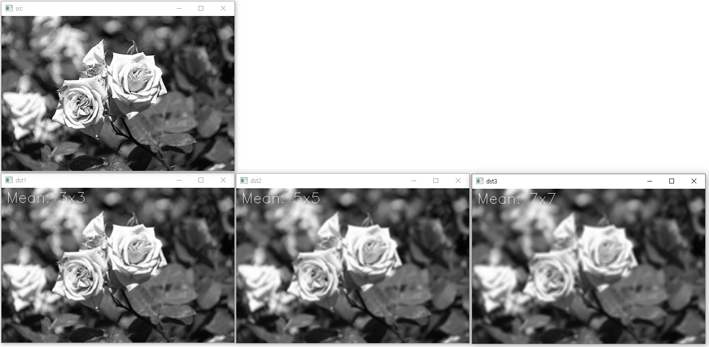
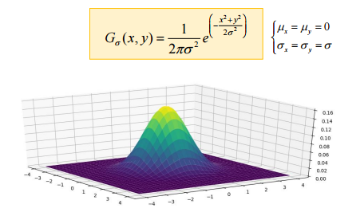

## 평균값 필터
* 블러링(blurring)은 마치 초점이 맞지 않은 사진처럼 영상을 부드럽게 만드는 필터링 기법이며 스무딩(smoothing)이라고도 함
* 영상에서 인접한 픽셀 간의 픽셀 값 변화가 크지 않은 경우 부드러운 느낌을 표현 가능
* 블러링은 거친 느낌의 입력 영상을 부드럽게 만드는 용도로 사용되기도 하고, 혹은 입력 영상에 존재하는 잡음의 영향을 제거하는 전처리 과정으로도 사용됨
* 평균값 필터(mean filter)는 영상을 부드럽게 만드는 블러링 필터 중에서 단순하고 구현하기 쉬운 필터
*  <br/> 3×3 평균값 필터 마스크는 모든 원소가 1/9로 설정된 행렬이고, 5×5 평균값 필터 마스크는 모든 원소가 1/25로 구성된 행렬 <br/> 평균값 필터는 마스크의 크기가 커지면 커질수록 더욱 부드러운 느낌의 결과 영상을 생성하며, 그 대신 연산량이 크게 증가할 수 있음
*  <br/> blur() 함수를 이용하여 평균값 필터링을 수행
*  <br/> blur() 함수에서 사용하는 커널 수식
```cpp
// 평균값 필터를 이용한 블러링
void blurring_mean()
{
	Mat src = imread("rose.bmp", IMREAD_GRAYSCALE);
	Mat dst;

	if (src.empty())
	{
		cerr << "Image load failed!" << endl;
		return;
	}

	imshow("src", src);

	// 3x3, 5x5, 7x7 평균값 필터 확인
	for (int ksize = 3; ksize <= 7; ksize += 2)
	{
		blur(src, dst, Size(ksize, ksize));

		String desc = format("Mean: %dx%d", ksize, ksize);
		putText(dst, desc, Point(10, 30), FONT_HERSHEY_SIMPLEX, 1.0, Scalar(255));

		String title = format("dst%d", (ksize-1) / 2);
		imshow(title, dst);
	}

	waitKey(0);

	destroyAllWindows();
}
```
* 코드 결과 <br/> 
* 필터 마스크에 대한 부가 설명 <br/> 

## 가우시안 필터
* 가우시안 필터(Gaussian filter)는 평균값 필터보다 좀 더 자연스러운 블러링 효과를 내는 필터
* 가우시안 분포는 평균을 중심으로 좌우 대칭의 종 모양(bell shape)을 갖는 확률 분포이며, 정규 분포(normal distribution)라고도 부름 
* 자연계에서 발생하는 대부분의 사건은 가우시안 분포를 따르는 것으로 알려져 있고, 예를 들어 사람들의 키, 몸무게, 시험 점수 등이 있음 
* 평균값 필터 블러링의 단점은 필터링 대상 위치에서 가까이 있는 픽셀과 멀리 있는 픽셀이 모두 같은 가중치를 사용하여 평균을 계산하기 때문에 멀리 있는 픽셀의 영향을 많이 받아 필터 결과의 퀄리티가 낮아지게 되는데 이러한 단점을 보완하기 위해 가우시안 필터를 많이 사용
*   <br/> 1차원 가우시안 분포의 수식과 그래프 <br/> 가우시안 분포는 표준편차가 작을수록 평균값 주변에 데이터들이 몰려 있고, 표준편차가 클수록 평균값 멀리 데이터들이 퍼져 있음
*  <br/> 2차원 가우시안 분포의 수식과 그래프 
* 가우시안 필터는 2차원 가우시안 분포 함수로부터 구한 마스크 행렬을 사용
* 평균이 0이고 표준 편차가 σ인 가우시안 분포는 x가 -4σ부터 4σ 사이인 구간에서 그 값의 대부분이 존재하기 때문에 가우시안 필터 마스크의 크기는 보통 (8σ+1)로 결정
* σx=σy=1.0인 가우시안 함수를 사용할 경우, x={-4, -3, -2, -1, 0, 1, 2, 3, 4}, y={-4, -3, -2, -1, 0, 1, 2, 3, 4}인 경우에만 가우시안 분포 함수 값을 추출하여 필터 마스크를 생성
*  <br/> 2차원 가우시안 분포의 수식으로 추출한 9×9 가우시안 필터 마스크를 그림 <br/> 가우시안 필터 마스크 행렬은 중앙부에서 비교적 큰 값을 가지고, 주변부로 갈수록 행렬 원소 값이 0에 가까운 작은 값을 가짐
* 가우시안 필터 마스크를 이용하여 마스크 연산을 수행한다는 것은 필터링 대상 픽셀 근처에는 가중치를 크게 주고, 필터링 대상 픽셀과 멀리 떨어져 있는 주변부에는 가중치를 조금만 주어서 가중 평균(weighted average)을 구하는 것과 같음
* 마스크 연산에 의한 영상 필터링은 마스크 크기가 커짐에 따라 연산량도 함께 증가하는데 큰 표준 편차 값을 사용하면 마스크 크기도 함께 커지므로 연산 속도 측면에서 부담이 될 수 있음
*  <br/> 다행히도 2차원 가우시안 분포 함수는 1차원 가우시안 분포 함수의 곱으로 분리할 수 있으며, 이러한 특성을 이용하면 가우시안 필터 연산량을 크게 줄일 수 있음 
*  <br/> 2차원 가우시안 분포 함수로 구한 (8σ+1) 마스크 행렬 크기는 9×9이기 때문에 픽셀 하나에 대한 마스크 연산 시 81번의 곱셈 연산이 필요하지만 위처럼 σ=1.0인 1차원 가우시안 함수로부터 1×9 가우시안 마스크 행렬 g를 이용해 필터링을 한 번 수행하고, 그 결과를 다시 g의 전치 행렬인 gT를 이용하여 필터링하는 것은 픽셀 하나에 대해 필요한 곱셈 연산 횟수가 18번으로 감소
*  <br/> 가우시안 필터링을 수행하려면 GaussianBlur() 함수를 사용 <br/> x축과 y축 방향으로의 표준 편차 sigmaX와 sigmaY는 서로 다른 값을 지정해도 되지만, 특별한 이유가 없다면 sigmaX와 sigmaY는 같은 값을 사용 <br/> 가우시안 필터의 크기를 지정하는 ksize 인자에도 특별한 이유가 없다면 Size()를 전달하여 적절한 필터 크기를 자동으로 결정
```cpp
// 가우시안 필터링
void blurring_gaussian()
{
	Mat src = imread("rose.bmp", IMREAD_GRAYSCALE);
	Mat dst;

	if (src.empty())
	{
		cerr << "Image load failed!" << endl;
		return;
	}

	imshow("src", src);

	// sigma 1 ~ 3 가우시안 필터 확인
	for (int sigma = 1; sigma <= 3; sigma++)
	{
		GaussianBlur(src, dst, Size(), (double)sigma);

		String desc = format("sigma = %d", sigma);
		putText(dst, desc, Point(10, 30), FONT_HERSHEY_SIMPLEX, 1.0, Scalar(255));

		String title = format("dst%d", sigma);
		imshow(title, dst);
	}

	waitKey(0);

	destroyAllWindows();
}
```
* 코드 결과 <br/>  <br/> 표준편차가 작을수록 가운데 있는 pixel에 큰 가중치가 적용되고 원래의 값과 비슷하게 나오고, 표준편차가 클수록 더 많은 영역이 가중평균되고 더 흐리고 뿌연 결과가 나오게 됨
*  <br/> getGaussianKernel() 함수는 표준 편차가 sigma인 1차원 가우시안 분포 함수로부터 ksize×1 크기의 필터 마스크 행렬을 생성하여 반환 <br/> 보통 ksize는 (8sigma + 1)보다 같거나 크게 지정
*  <br/> getGaussianKernel() 함수에서 행렬을 만드는 수식 <br/> i의 범위는 i=0,…,ksize-1 와 같음 
*  <br/> getGaussianKernel() 함수에서의 ksize 값이 7보다 같거나 작고 sigma 값이 0 또는 음수인 경우에는 다음과 같이 미리 정해 놓은 배열 값을 이용하여 커널 행렬을 생성
