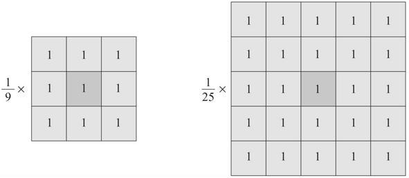

## 평균값 필터
* 블러링(blurring)은 마치 초점이 맞지 않은 사진처럼 영상을 부드럽게 만드는 필터링 기법이며 스무딩(smoothing)이라고도 함
* 영상에서 인접한 픽셀 간의 픽셀 값 변화가 크지 않은 경우 부드러운 느낌을 표현 가능
* 블러링은 거친 느낌의 입력 영상을 부드럽게 만드는 용도로 사용되기도 하고, 혹은 입력 영상에 존재하는 잡음의 영향을 제거하는 전처리 과정으로도 사용됨
* 평균값 필터(mean filter)는 영상을 부드럽게 만드는 블러링 필터 중에서 단순하고 구현하기 쉬운 필터
*  <br/> 3×3 평균값 필터 마스크는 모든 원소가 1/9로 설정된 행렬이고, 5×5 평균값 필터 마스크는 모든 원소가 1/25로 구성된 행렬 <br/> 평균값 필터는 마스크의 크기가 커지면 커질수록 더욱 부드러운 느낌의 결과 영상을 생성하며, 그 대신 연산량이 크게 증가할 수 있음
*  <br/> blur() 함수를 이용하여 평균값 필터링을 수행
*  <br/> blur() 함수에서 사용하는 커널 수식
```cpp
// 평균값 필터를 이용한 블러링
void blurring_mean()
{
	Mat src = imread("rose.bmp", IMREAD_GRAYSCALE);
	Mat dst;

	if (src.empty())
	{
		cerr << "Image load failed!" << endl;
		return;
	}

	imshow("src", src);

	// 3x3, 5x5, 7x7 평균값 필터 확인
	for (int ksize = 3; ksize <= 7; ksize += 2)
	{
		blur(src, dst, Size(ksize, ksize));

		String desc = format("Mean: %dx%d", ksize, ksize);
		putText(dst, desc, Point(10, 30), FONT_HERSHEY_SIMPLEX, 1.0, Scalar(255));

		String title = format("dst%d", (ksize-1) / 2);
		imshow(title, dst);
	}

	waitKey(0);

	destroyAllWindows();
}
```
* 코드 결과 <br/> 
