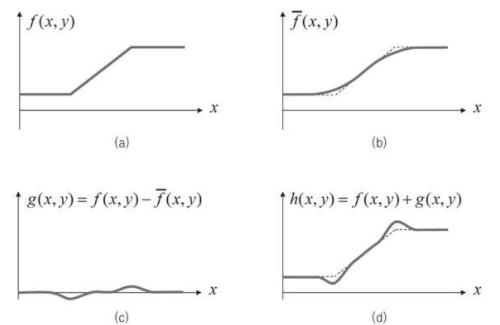
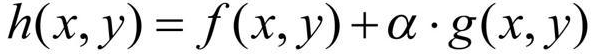
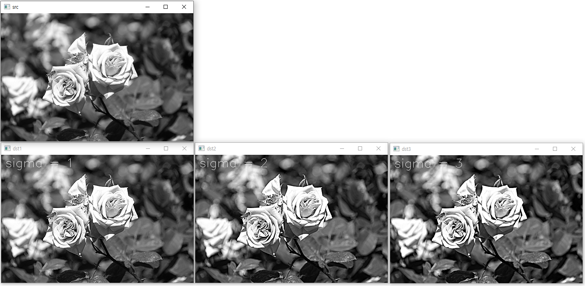

## 1. 언샤프 마스크 필터
* 샤프닝은 초점이 잘 맞은 사진처럼 사물의 윤곽이 뚜렷하고 선명한 느낌이 나도록 영상을 변경하는 필터링 기법
* 사진을 초점이 잘 맞은 사진처럼 보이게끔 변경하려면 영상 에지 근방에서 픽셀 값의 명암비가 커지도록 수정
* 샤프닝을 구현하기 위해 블러링된 영상을 활용하여 반대로 날카로운 영상을 생성
* 날카롭지 않은 영상을 언샤프(unsharp)하다고 말하고 언샤프한 영상을 이용하여 역으로 날카로운 영상을 생성하는 필터를 언샤프 마스크 필터(unsharp mask filter)라고 함
* 언샤프 마스크 필터 수행 과정
<br/> (a):영상의 에지 부근에서 픽셀 값이 증가하는 모양, (b):f(x, y)에 블러링을 적용한 결과, (c):입력 영상 f(x, y)에서 블러링된 영상을 뺀 결과, (d):입력 함수 f(x, y)에 g(x, y)를 더하면 에지가 강조된 함수가 생성
<br/>  
* 언샤프 마스크 필터 수식
<br/> f(x, y)에 g(x, y)를 단순하게 더하는 것이 아니라 실수 가중치 α를 곱한 후 더하면 날카로운 정도를 사용자가 조절할 수 있음
<br/>  
```cpp
// 언샤프 마스크 필터링 
// OpenCV는 언샤프 마스크 필터 함수를 따로 제공하지 않고 위 수식을 바탕으로 직접 코드 형태로 작성
void unsharp_mask()
{
	Mat src = imread("rose.bmp", IMREAD_GRAYSCALE);

	if (src.empty())
	{
		cerr << "Image load failed!" << endl;
		return;
	}

	imshow("src", src);

	for (int sigma = 1; sigma <= 3; sigma++)
	{
		Mat blurred;
		GaussianBlur(src, blurred, Size(), sigma);

		// dst = src + alpha * (src - blurred);
		float alpha = 1.f;
		Mat dst = (1 + alpha) * src - alpha * blurred; 

		String desc = format("sigma = %d", sigma);
		putText(dst, desc, Point(10, 30), FONT_HERSHEY_SIMPLEX, 1.0, Scalar(255));

		String title = format("dst%d", sigma);
		imshow(title, dst);
	}

	waitKey(0);

	destroyAllWindows();
}
```
* 코드 결과 <br/> sigma 값이 높을 수록 블러링의 정도가 높아지므로 입력영상과 블러링된영상 간의 차이가 더 커져 샤프닝의 정도가 높아짐 <br/> 
