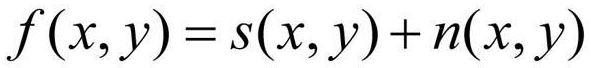
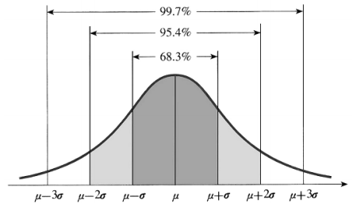
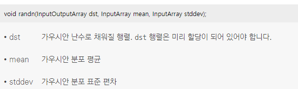
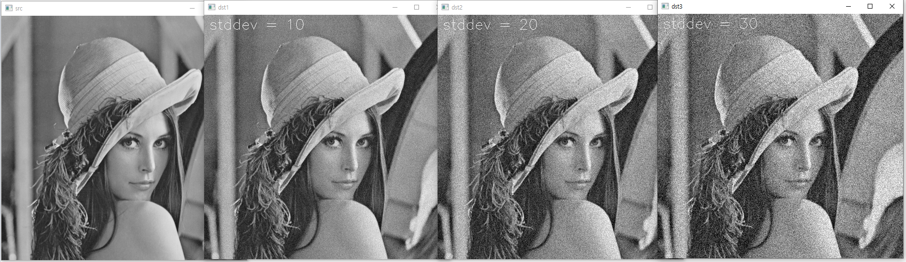
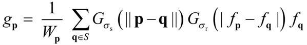
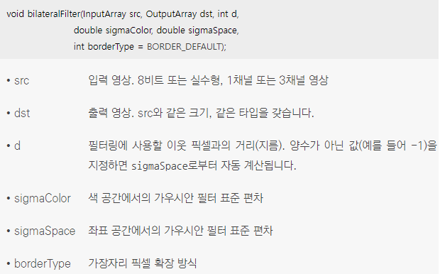
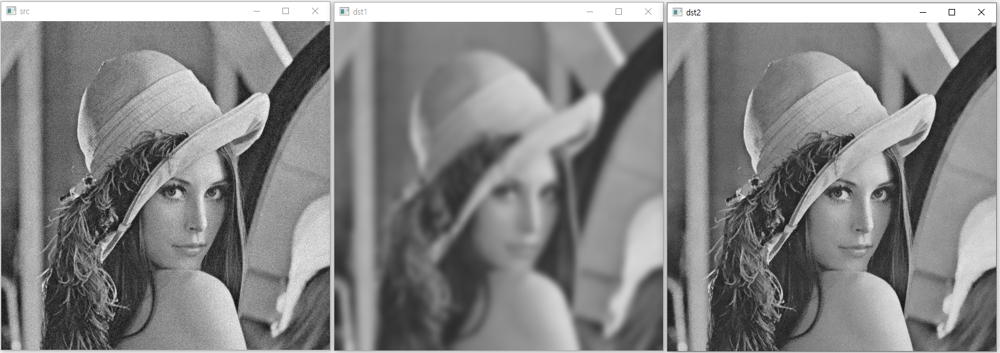
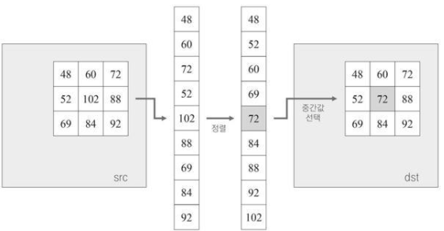
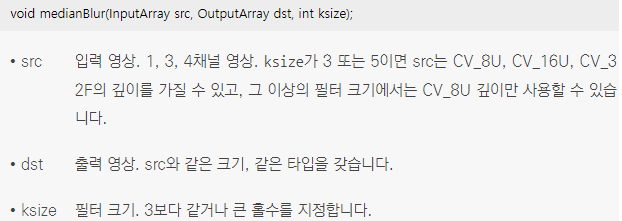
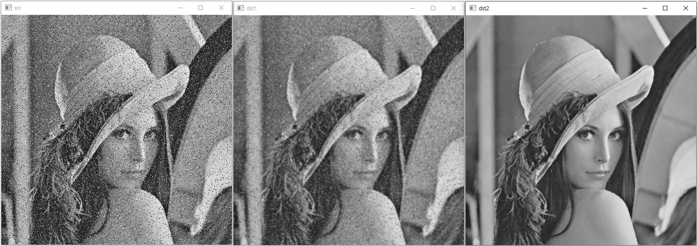

## 영상과 잡음 모델
* 신호 처리 관점에서 잡음(noise)이란 원본 신호에 추가된 원치 않은 신호를 의미
* 영상에서 잡음은 주로 영상을 획득하는 과정에서 발생하며, 디지털 카메라에서 사진을 촬영하는 경우에는 광학적 신호를 전기적 신호로 변환하는 센서(sensor)에서 주로 잡음이 추가
*  <br/> 디지털 카메라에서 카메라 렌즈가 바라보는 장면을 원본 신호 s(x, y)라고 하고, 여기에 추가되는 잡음을 n(x, y)라고 표현한다면 실제로 카메라에서 획득되는 영상 신호 f(x, y)는 그림과 같은 수식으로 표현
* 잡음이 생성되는 방식을 잡음 모델(noise model)이라고 하며, 다양한 잡음 모델 중에서 가장 대표적인 잡음 모델은 가우시안 잡음 모델(Gaussian noise model)
* 가우시안 잡음 모델은 보통 평균이 0인 가우시안 분포를 따르는 잡음을 의미
*  <br/> 가우시안 분포 그래프는 다음과 같음 <br/> 평균이 0이고 표준 편차가 σ인 가우시안 분포는 x 값이 -σ≤x≤σ 구간에서 전체 데이터의 68%가 존재하고, -2σ≤x≤2σ 구간에는 95%, -3σ≤x≤3σ 구간에는 99.7%가 존재
<br/> 평균이 0이고 표준 편차가 10인 가우시안 분포를 따르는 잡음 모델은 68%의 확률로 -10에서 10 사이의 값이 잡음으로 추가되고, 잡음 값이 -20부터 20 사이일 확률은 95%이며, 그 밖의 값이 잡음으로 추가될 확률은 5%
*  <br/> randn() 함수를 이용하여 영상에 가우시안 모델을 따르는 잡음을 인위적으로 추가 <br/> randn() 함수는 가우시안 잡음으로 구성된 행렬을 생성하여 반환 <randn() 함수는 dst 행렬을 가우시안 분포를 따르는 난수로 채움
```cpp
// 가우시안 잡음 추가 코드
void noise_gaussian()
{
	Mat src = imread("lenna.bmp", IMREAD_GRAYSCALE);

	if (src.empty())
	{
		cerr << "Image load failed!" << endl;
		return;
	}

	imshow("src", src);

	// 표준 편차 stddev 값이 10, 20, 30이 되도록 for 반복문을 수행
	for (int stddev = 10; stddev <= 30; stddev += 10)
	{
		Mat noise(src.size(), CV_32SC1);
		randn(noise, 0, stddev);

		Mat dst;
		add(src, noise, dst, Mat(), CV_8U);

		String desc = format("stddev = %d", stddev);
		putText(dst, desc, Point(10, 30), FONT_HERSHEY_SIMPLEX, 1.0, Scalar(255));

		String title = format("dst%d", stddev/10);
		imshow(title, dst);
	}

	waitKey(0);

	destroyAllWindows();
}
```
* 코드 결과 <br/>  <br/> 표준 편차 stddev 값이 증가함에 따라 잡음의 영향이 커지므로 결과 영상이 더욱 지저분해 짐

## 양방향 필터 
* 대부분의 영상에는 가우시안 잡음이 포함되어 있으며 많은 컴퓨터 비전 시스템이 가우시안 잡음을 제거하기 위해 가우시안 필터를 사용
* 입력 영상에서 픽셀 값이 크게 변하지 않는 평탄한 영역에 가우시안 필터가 적용될 경우, 주변 픽셀 값이 부드럽게 블러링되면서 잡음의 영향도 크게 줄어들지만, 픽셀 값이 급격하게 변경되는 에지 근방에 동일한 가우시안 필터가 적용되면 잡음뿐만 아니라 에지 성분까지 함께 감소
* 잡음이 줄어들면서 함께 에지도 무뎌지기 때문에 객체의 윤곽이 흐릿하게 바뀌는 단점을 보완하기 위해 많은 사람들이 에지 정보는 그대로 유지하면서 잡음만 제거하는 에지 보전 잡음 제거 필터(edge-preserving noise removal filter)에 대해 연구하다가 1998년 토마시(C. Tomasi)가 에지 성분은 그대로 유지하면서 가우시안 잡음을 효과적으로 제거하는 양방향 필터(bilateral filter) 알고리즘 제안
* 양방향 필터는 평탄한 부분은 가우시안 필터를 이용하고, 엣지 부분이면 가우시안의 일부분만 가져와 필터링 즉, 에지가 아닌 부분에서만 블러링
*  <br/> f:입력 영상, g:출력 영상, p|q: 픽셀의 좌표, fp|fq:각각 p점과 q점에서의 입력 영상 픽셀 값, gp:p점에서의 출력 영상 픽셀 값, Gσs|Gσr:각각 표준 편차가 σs와 σr인 가우시안 분포 함수, S:필터 크기, Wp:양방향 필터 마스크 합이 1이 되도록 만드는 정규화 상수 <br/> 양방향 필터 수식은 두 개의 가우시안 함수 곱으로 구성된 필터 <br/> Gσs(||p-q||) 함수는 두 점 사이의 거리에 대한 가우시안 함수로서 기존 가우시안 필터와 완전히 같은 의미로 대상 픽셀에 인접한 픽셀의 가중평균을 구함 <br/> Gσr(|fp-fq|) 함수는 두 점의 픽셀 값 차이에 의한 가우시안 함수로 두 점의 픽셀 밝기 값의 차이가 적은 평탄한 영역에서는 큰 가중치를 갖게 만들고, 에지를 사이에 두고 있는 두 픽셀에 대해서는 |fp-fq| 값이 크게 나타나므로 상대적으로 거의 0에 가까운 값이 되어 에지 근방에서는 가우시안 블러링 효과가 거의 나타나지 않고 에지가 보존
* 양방항 필터 수식이 픽셀 값의 차이에 의존적이기 때문에 양방향 필터 마스크는 영상의 모든 픽셀에서 서로 다른 형태를 갖게 되고, 모든 픽셀 위치에서 주변 픽셀과의 밝기 차이에 의한 고유의 필터 마스크 행렬을 만들어서 마스크 연산을 수행하기 때문에 양방향 필터는 가우시안 블러링보다 훨씬 많은 연산량이 필요
*  <br/> bilateralFilter() 함수를 이용하여 양방향 필터를 수행 <br/> sigmaSpace 값은 일반적인 가우시안 필터링에서 사용하는 표준 편차와 같은 개념 <br/> sigmaColor 값은 주변 픽셀과의 밝기 차이에 관한 표준 편차로 sigmaColor 값을 작게 지정할 경우, 픽셀 값 차이가 큰 주변 픽셀과는 블러링이 적용되지 않고, sigmaColor 값을 크게 지정하면 픽셀 값 차이가 조금 크더라도 블러링이 적용 즉, sigmaColor 값을 이용하여 어느 정도 밝기 차를 갖는 에지를 보존할 것인지를 조정
```cpp
// 양방향 필터링
void filter_bilateral()
{
	Mat src = imread("lenna.bmp", IMREAD_GRAYSCALE);

	if (src.empty()) {
		cerr << "Image load failed!" << endl;
		return;
	}

	// 입력 영상에 잡음을 의도적으로 추가
	Mat noise(src.size(), CV_32SC1);
	randn(noise, 0, 10);
	add(src, noise, src, Mat(), CV_8U);

	// 가우시안 필터 적용
	Mat dst1;
	GaussianBlur(src, dst1, Size(), 5);

	// 양방향 필터 적용
	Mat dst2;
	bilateralFilter(src, dst2, -1, 10, 5);

	imshow("src", src);
	imshow("dst1", dst1);
	imshow("dst2", dst2);

	waitKey();
	destroyAllWindows();
}
```
* 코드 결과 <br/> 

## 미디언 필터 
* 미디언 필터(median filter)는 입력 영상에서 자기 자신 픽셀과 주변 픽셀 값 중에서 중간값(median)을 선택하여 결과 영상 픽셀 값으로 설정하는 필터링 기법
*  <br/> 3×3 정방형 마스크를 사용하는 미디언 필터 동작 과정 <br/> 영역의 픽셀 값을 일렬로 늘여 세운 후 픽셀 값 크기 순으로 정렬한 후에 정렬된 데이터에서 중앙에 있는 픽셀 값인 72를 선택하여, 결과 영상의 픽셀 값으로 설정
* 영상에 추가되는 잡음 중에 소금&후추 잡음(salt & pepper noise)은 픽셀 값이 일정 확률로 0 또는 255로 변경되는 형태의 잡음이 있는데 ‘소금&후추’라는 이름이 붙은 이유는 잡음이 마치 소금과 후추처럼 흰색 또는 검은색으로 구성되기 때문
* 소금&후추 잡음이 추가된 영상에 미디언 필터를 적용하면 대부분 소금&후추 잡음이 아닌 원본 영상에 존재하는 픽셀 값이 중간값으로 선택되기 때문에 잡음은 효과적으로 제거
*  <br/> medianBlur() 함수를 이용하여 미디언 필터링을 수행 <br/> medianBlur() 함수는 내부적으로 BORDER_REPLICATE 방식으로 가장자리 외곽 픽셀 값을 설정하여 필터링을 수행
```cpp
// 미디언 필터링
void filter_median()
{
	Mat src = imread("lenna.bmp", IMREAD_GRAYSCALE);

	if (src.empty()) {
		cerr << "Image load failed!" << endl;
		return;

	}

	// src.total() : 행렬 내의 원소 수
	// rand() % 100 : 0~99 사이의 난수 생성
	// 0 또는 255의 난수를 잡음으로 행렬 내의 원소 개수의 10퍼센트 만큼 생성
	int num = (int)(src.total() * 0.1);
	for (int i = 0; i < num; i++) {
		int x = rand() % src.cols;
		int y = rand() % src.rows;
		src.at<uchar>(y, x) = (i % 2) * 255;
	}

	// 가우시안 필터 적용
	Mat dst1;
	GaussianBlur(src, dst1, Size(), 1);

	// 미디언 필터 적용
	Mat dst2;
	medianBlur(src, dst2, 3);

	imshow("src", src);
	imshow("dst1", dst1);
	imshow("dst2", dst2);

	waitKey();
	destroyAllWindows();
}
```
* 코드 결과 <br/> 
* 소금&후추 잡음에 대해서는 미디언 필터를 사용하면 잡음에 의해 추가된 흰색 또는 검은색 픽셀이 효과적으로 제거
* 일반적인 노이즈에 대해서는 효과가 미미 
