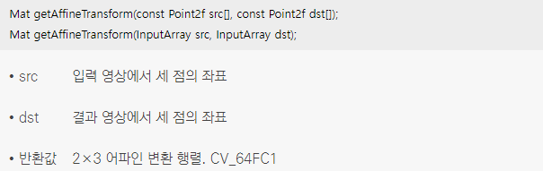

## 1. 어파인 변환
* 영상의 기하학적 변환(geometric transform)은 영상을 구성하는 픽셀의 배치 구조를 변경함으로써 전체 영상의 모양을 바꾸는 작업
* 영상의 밝기 및 명암비 조절, 필터링 등은 픽셀 위치는 고정한 상태에서 픽셀 값을 변경하였지만 기하학적 변환은 픽셀 값은 그대로 유지하면서 위치를 변경하는 작업
* 영상의 기하학적 변환 중에서 어파인 변환(affine transformation)은 영상을 평행 이동시키거나 회전, 크기 변환 등을 통해 만들 수 있는 변환을 통칭
* 영상에 어파인 변환을 적용할 경우 직선 간의 길이 비율과 평행 관계가 그대로 유지
* 어파인 변환은 모두 여섯 개의 파라미터를 이용한 수식으로 정의
<br/> 어파인 변환에 의해 입력 영상의 좌표 (x, y)가 결과 영상의 좌표 (x′, y′)로 이동하는 수식
<br/>  
<br/> 두 개의 수식으로 표현된 어파인 변환은 행렬을 이용하여 하나의 수식으로 표현
<br/>  
<br/> 수학적 편의를 위해 입력 영상의 좌표 (x, y)에 가상의 좌표 1을 하나 추가하여 (x, y, 1) 형태로 바꾸면, 앞 행렬 수식을 다음과 같이 하나의 행렬 곱셈 형태로 바꿀 수 있음
<br/>  
*  어파인 변환 행렬(affine transformation matrix)은 여섯 개의 파라미터로 구성된 2×3 행렬 즉, 어파인 변환은 2×3 실수형 행렬 하나로 표현
*  입력 영상과 어파인 변환 결과 영상으로부터 최소 세점의 이동관계를 알아야 어파인 변환 행렬을 구할 수 있음 
> * 점 하나의 이동 관계로부터 x 좌표와 y 좌표에 대한 변환 수식 두 개를 얻을 수 있으므로, 점 세 개의 이동 관계로부터 총 여섯 개의 방정식을 구할 수 있고, 여섯 개의 원소로 정의되는 어파인 변환 행렬을 구할 수 있음
* 어파인 변환 행렬을 구하는 함수 이름은 getAffineTransform()
<br/> getAffineTransform() 함수는 src에 저장된 세 점을 dst 좌표의 점으로 옮기는 어파인 변환 행렬을 반환
<br/>     
* 2×3 어파인 변환 행렬을 가지고 있을 때, 영상을 어파인 변환한 결과 영상을 생성하려면 warpAffine() 함수를 사용
<br/> 전달되는 어파인 변환 행렬 M은 CV_32FC1 또는 CV_64FC1 타입이어야 하고, 크기는 2×3이어야 함
<br/> 영상의 크기 dsize는 어파인 변환 성격에 따라 사용자가 적절하게 지정해야 하며, dsize 인자에 Size()를 전달하면 입력 영상과 같은 크기의 결과 영상을 생성
<br/>    
```cpp
// 어파인 변환 예제 
void affine_transform()
{
	Mat src = imread("tekapo.bmp");
	Mat dst;

	if (src.empty())
	{
		cerr << "Image load failed!" << endl;
		return;
	}

	Point2f srcPts[3], dstPts[3];
	srcPts[0] = Point2f(0, 0);
	srcPts[1] = Point2f(src.cols - 1, 0);
	srcPts[2] = Point2f(src.cols - 1, src.rows - 1);
	dstPts[0] = Point2f(50, 50);
	dstPts[1] = Point2f(src.cols - 100, 100);
	dstPts[2] = Point2f(src.cols - 50, src.rows - 50);

	Mat M = getAffineTransform(srcPts, dstPts);

	warpAffine(src, dst, M, Size());

	imshow("src", src);
	imshow("dst", dst);

	waitKey();

	return;
}
```
* 코드 결과 <br/> 
* 어파인 변환 행렬을 가지고 있을 때, 영상 전체를 어파인 변환하는 것이 아니라 일부 점들이 어느 위치로 이동하는지를 알고 싶다면 transform() 함수를 사용
<br/>   

## 2. 이동 변환
* 영상의 이동 변환(translation transformation)은 영상을 가로 또는 세로 방향으로 일정 크기만큼 이동시키는 연산을 의미하며 시프트(shift) 연산이라고도 함
* 영상을 x 방향으로 a만큼, y 방향으로 b만큼 이동하는 어파인 변환 행렬 M을 구하는 과정
<br/>   
```cpp
// 영상의 이동 변환
void affine_translation()
{
	Mat src = imread("tekapo.bmp");
	Mat dst;

	if (src.empty())
	{
		cerr << "Image load failed!" << endl;
		return;
	}

	// x축으로 150만큼, y축으로 100만큼 입력영상 이동하는 어파인 변환 행렬
	Mat M = Mat_<double>({ 2, 3 }, {1, 0, 150, 0, 1, 100});

	warpAffine(src, dst, M, Size());

	imshow("src", src);
	imshow("dst", dst);

	waitKey(0);
	destroyAllWindows();
}
```
* 코드 결과 <br/>  

## 3. 전단 변환 
* 전단 변환(shear transformation)은 직사각형 형태의 영상을 한쪽 방향으로 밀어서 평행사변형 모양으로 변형되는 변환이며 층밀림 변환이라고도 함
* 전단 변환 수식
<br/> (a)는 y 좌표가 증가함에 따라 영상이 조금씩 가로 방향으로 이동하는 가로 방향 전단 변환이고, (b)는 x 좌표가 증가함에 따라 영상이 조금씩 세로 방향으로 이동하는 세로 방향 전단 변환
<br/> 두 수식에서 mx와 my는 영상으로 각각 가로 방향과 세로 방향으로 밀림 정도를 나타내는 실수 
<br/>   
```cpp
// 영상의 전단 변환 
void affine_shear()
{
	Mat src = imread("tekapo.bmp");
	Mat dst;

	if (src.empty())
	{
		cerr << "Image load failed!" << endl;
		return;
	}

	// 가로 방향으로 밀림 정도를 0.3으로 설정한 전단 변환 행렬 M을 생성
	double mx = 0.3;
	Mat M = Mat_<double>({ 2, 3 }, { 1, mx, 0, 0, 1, 0 });

	warpAffine(src, dst, M, Size(cvRound(src.cols + src.rows*mx), src.rows));

	imshow("src", src);
	imshow("dst", dst);

	waitKey();
	destroyAllWindows();
}
```
* 코드 결과 <br/>  

## 4. 크기 변환 
* 영상의 크기 변환(scale transformation)은 영상의 전체적인 크기를 확대 또는 축소하는 변환
* 컴퓨터 비전 프로그래밍에서 영상의 크기를 변경하는 작업은 매우 자주 발생하는데 예를 들어 몇몇 영상 인식 시스템은 정해진 크기의 영상만을 입력으로 받기 때문에 영상을 해당 크기에 맞게 변경하여 입력으로 전달해야는 경우와 복잡한 알고리즘을 수행하기에 앞서 연산 시간을 단축하기 위하여 입력 영상의 크기를 줄여서 사용하는 경우가 있음
* 영상의 크기 변환을 나타내는 어파인 변환 행렬 M
<br/>  
* 어파인 변환 행렬을 생성하고 warpAffine() 함수를 이용하면 영상의 크기 변환을 수행할 수 있지만 영상의 크기를 변경하는 작업은 실제 영상 처리 시스템에서 매우 빈번하게 사용되기 때문에 OpenCV는 보다 간단하게 크기를 변경할 수 있는 resize() 함수를 제공
<br/>  
* resize() 함수에서 사용하는 수식
<br/> 
* 보간법 지정 InterpolationFlags 열거형 상수 
<br> 보간법은 결과 영상의 픽셀 값을 결정하기 위해 입력 영상에서 주변 픽셀 값을 이용하는 방식을 의미 
<br/> INTER_NEAREST: 가장 빠르게 동작하지만 결과 영상 화질이 좋지 않음 
<br/> INTER_LINEAR: 연산 속도가 빠르고 화질도 충분히 좋은 편(기본값) 
<br/> INTER_LINEAR 방법보다 더 좋은 화질을 원한다면 INTER_CUBIC 또는 INTER_LANCZOS4 상수를 사용 
<br/> INTER_AREA: 영상을 축소하는 경우 사용하면 무아레(moiré) 현상이 적게 발생하며 화질 면에서 유리
<br/>  
```cpp
// 영상의 크기 변환
void affine_scale()
{
	Mat src = imread("rose.bmp"); // 480x320 사이즈 사진
	Mat dst1, dst2, dst3, dst4;

	if (src.empty())
	{
		cerr << "Image load failed!" << endl;
		return;
	}

	// 여러가지 보간법 별로 이미지 사이즈를 4배로 확대 
	resize(src, dst1, Size(), 4, 4, INTER_NEAREST);
	resize(src, dst2, Size(), 4, 4);
	resize(src, dst3, Size(1920, 1280), 0, 0, INTER_CUBIC);
	resize(src, dst4, Size(1920, 1280), 0, 0, INTER_LANCZOS4);

	// 확대한 이미지의 좌표 (400, 500) 에서 사이즈 (400, 400)만큼 출력
	imshow("src", src);
	imshow("dst1", dst1(Rect(400, 500, 400, 400)));
	imshow("dst2", dst2(Rect(400, 500, 400, 400)));
	imshow("dst3", dst3(Rect(400, 500, 400, 400)));
	imshow("dst4", dst4(Rect(400, 500, 400, 400)));

	waitKey(0);
	destroyAllWindows();
}
```
* 코드 결과 <br/> 갈수록 화질은 좋아지지만 연산량이 많아 느려짐 <br/>  

## 5. 회전 변환
* 영상의 회전 변환(rotation transformation)은 특정 좌표를 기준으로 영상을 원하는 각도만큼 회전하는 변환
* 삼각함수의 덧셈 정리
<br/>   
* 영상의 반시계 회전 변환 수식 유도 과정
<br/> 
* 회전 변환 수식
<br/>  
* cos() 함수와 sin() 함수를 이용하여 앞과 같은 행렬을 생성하고, warpAffine() 함수를 사용하면 영상을 회전시킬 수 있지만, 영상을 회전하는 경우가 실제로 많이 발생하기 때문에 OpenCV는 영상의 회전을 위한 어파인 변환 행렬을 생성하는 getRotationMatrix2D() 함수를 제공
<br/>   
*  getRotationMatrix2D() 함수가 사용하는 행렬식
<br/>  
```cpp
// 영상의 회전 변환
void affine_rotation()
{
	Mat src = imread("tekapo.bmp");
	Mat dst;

	if (src.empty()) 
	{
		cerr << "Image load failed!" << endl;
		return;
	}
	
	// 20도 만큼 반시계 방향으로 회전
	Point2f cp(src.cols / 2.f, src.rows / 2.f);
	Mat M = getRotationMatrix2D(cp, 20, 1);

	cout << M << endl;

	warpAffine(src, dst, M, Size());

	imshow("src", src);
	imshow("dst", dst);

	waitKey();
	destroyAllWindows();
}
```
* 코드 결과 <br/> 
* OpenCV에서 영상을 90° 단위로 회전하고 싶은 경우에는 rotate() 함수를 사용
<br/>   

## 6. 대칭 변환
* 영상의 기하학적 변환 중에 영상을 마치 거울에 비친 것처럼 좌우를 바꾸는 변환, 또는 상하를 뒤집는 형태의 변환
* 영상의 좌우 대칭 변환에 의한 좌표 변환 수식과 상하 대칭 변환에 의한 좌표 변환 수식
<br/>   
* flip() 함수는 영상을 가로 방향, 세로 방향, 또는 가로와 세로 양 방향에 대해 대칭 변환한 영상을 생성
<br/>  
```cpp
// 영상의 대칭 변환
void affine_flip()
{
	Mat src = imread("lenna256.bmp");
	Mat dst;

	if (src.empty()) {
		cerr << "Image load failed!" << endl;
		return;
	}

	imshow("src", src);

	// 좌우반전, 상하반전, 좌우상하반전
	int flipCode[] = { 1, 0, -1 };
	for (int i = 0; i < 3; i++) {
		flip(src, dst, flipCode[i]);

		String desc = format("flipCode: %d", flipCode[i]);
		putText(dst, desc, Point(10, 30), FONT_HERSHEY_SIMPLEX, 1.0, Scalar(255, 0, 0), 1, LINE_AA);

		String title = format("dst%d", flipCode[i]);
		imshow(title, dst);
	}

	waitKey(0);
	destroyAllWindows();
}
```
* 코드 결과 <br/> 
