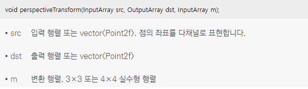

* 영상의 기하학적 변환 중에는 어파인 변환보다 자유도가 높은 투시 변환(perspective transform)이 있음
* 투시(관점) 변환은 투시(관점) 변화와 관련 있는 변환이고, 원본 영상에 있던 직선은 결과 영상에서 그대로 직선성이 유지되지만 직선의 평행 관계가 유지되지 않기 때문에 결과 영상의 형태가 임의의 사각형으로 나타나게 됨
<br/> 직선의 평행성이 유지되지 않기 때문에 점 4개가 어떻게 이동했는지 알고 있어야 
<br/>    
*  투시 변환은 여덟 개의 파라미터로 표현할 수 있지만, 좌표 계산의 편의상 아홉 개의 원소를 갖는 3×3 행렬을 사용
<br/> 여기서 (x', y')는 변환된 점이고 (x, y)는 입력 점 ti는 결과 영상의 좌표를 표현할 때 사용되는 비례 상수
<br/> ti = c1x + c2y + 1, x' = (a1x + a2y + b1) / ti, y' = (a3x + a4y + b2) / ti
<br/> 아핀 변환의 경우 투영 벡터(projection vector)는 0이고 아핀 변환은 원근 변환의 특정 경우로 간주 할 수 있음
<br/>    
* OpenCV는 4쌍의 해당 점을 입력으로 받아 변환 행렬을 출력하는 함수 cv2.getPerspectiveTransform()을 제공
<br/>   
* 변환 행렬(M)이 계산되면 이미지에 원근 변환을 적용하는 cv2.warpPerspective() 함수에 전달
<br/>  <br/> 
* 영상의 투시 변환 예제를 수행할 기본 아이디어를 보여주는 이미지
<br/> 
```cpp
// 영상의 투시 변환 예제
#include "opencv2/opencv.hpp"
#include <iostream>

using namespace cv;
using namespace std;

Mat src;
// 입력좌표 4개와 출력좌표 4개를 담는 배열
Point2f srcQuad[4], dstQuad[4];

// 4점 -> 원점을 기준으로 반시계 방향
// 마우스 이벤트 함수
void on_mouse(int event, int x, int y, int flags, void*)
{
	static int cnt = 0;

	// 마우스 좌클릭 이벤트 발생시 처리
	if (event == EVENT_LBUTTONDOWN)
	{
		if (cnt < 4)
		{
			// cnt 값을 늘려가면서 좌표 저장
			srcQuad[cnt++] = Point2f(x, y);

			// 클릭한 좌표에 빨간색 원 표시
			circle(src, Point(x, y), 5, Scalar(0, 0, 255), -1);
			imshow("src", src);

			// 4개의 좌표를 모두 모았을 경우 처리
			if (cnt == 4)
			{
				int w = 200, h = 300;

				// 원점을 기준으로 반시계 방향으로 4개의 결과 좌표 
				dstQuad[0] = Point2f(0, 0);
				dstQuad[1] = Point2f(0, h - 1);
				dstQuad[2] = Point2f(w - 1, h - 1);
				dstQuad[3] = Point2f(w - 1, 0);

				// 입력 좌표 4개와 출력 좌표 4개에 대한 투시 변환 행렬 생성
				Mat pers = getPerspectiveTransform(srcQuad, dstQuad);

				Mat dst;
				// 생성한 투시 변환 행렬을 기반으로 입력 영상에 대한 투시 변환 된 출력 영상 생성
				warpPerspective(src, dst, pers, Size(w, h));
				imshow("dst", dst);
			}
		}
	}
	
}


int main(void)
{
	src = imread("card.bmp");

	if (src.empty())
	{
		cerr << "Image load failed!" << endl;
		return -1;
	}

	namedWindow("src");
	// 콜백 함수 : main함수가 끝날 때까지 쓰레드로 돌고있음
	setMouseCallback("src", on_mouse);

	imshow("src", src);

	// 키보드 입력을 무한히 기다림
	waitKey(0);

	return 0;
}
```
*  
* 코드 결과 <br/>  
* 3×3 투시 변환 행렬을 가지고 있을 때, 일부 점들이 투시 변환에 의해 어느 위치로 이동할 것인지를 알고 싶다면 perspectiveTransform() 함수를 사용
<br/>   
