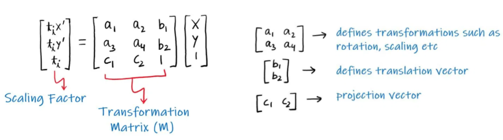
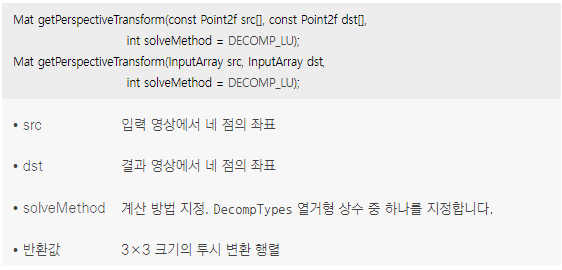
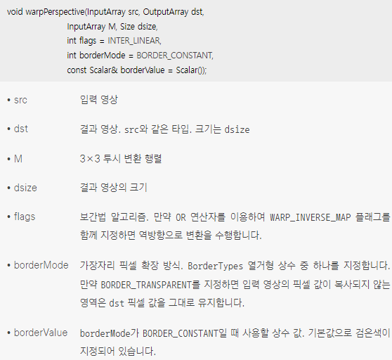
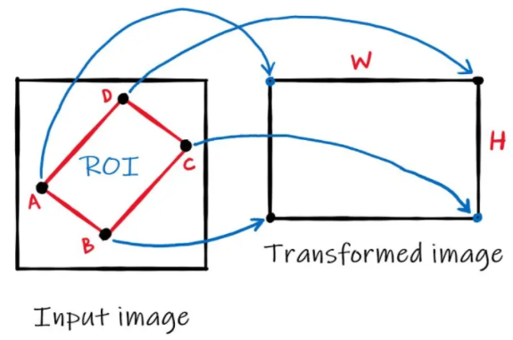
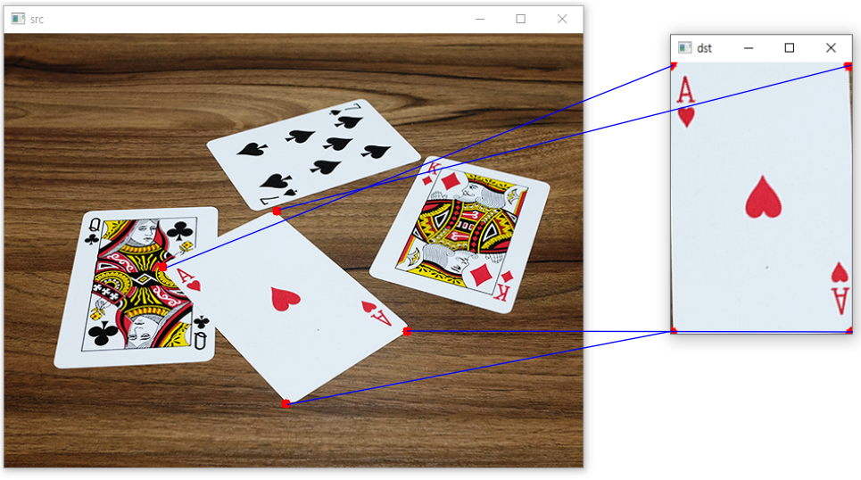

* 영상의 기하학적 변환 중에는 어파인 변환보다 자유도가 높은 투시 변환(perspective transform)이 있음
*  <br/> 투시(관점) 변환은 투시(관점) 변화와 관련 있는 변환이고, 원본 영상에 있던 직선은 결과 영상에서 그대로 직선성이 유지되지만 직선의 평행 관계가 유지되지 않기 때문에 결과 영상의 형태가 임의의 사각형으로 나타나게 됨 <br/> 직선의 평행성이 유지되지 않기 때문에 점 4개가 어떻게 이동했는지 알고 있어야 합
*  <br/> 투시 변환은 여덟 개의 파라미터로 표현할 수 있지만, 좌표 계산의 편의상 아홉 개의 원소를 갖는 3×3 행렬을 사용 <br/> 여기서 (x', y')는 변환된 점이고 (x, y)는 입력 점 ti는 결과 영상의 좌표를 표현할 때 사용되는 비례 상수 <br/> ti = c1x + c2y + 1, x' = (a1x + a2y + b1) / ti, y' = (a3x + a4y + b2) / ti <br/> 아핀 변환의 경우 투영 벡터(projection vector)는 0이고 아핀 변환은 원근 변환의 특정 경우로 간주 할 수 있음
*  <br/> OpenCV는 4쌍의 해당 점을 입력으로 받아 변환 행렬을 출력하는 함수 cv2.getPerspectiveTransform()을 제공
*  <br/> 변환 행렬(M)이 계산되면 이미지에 원근 변환을 적용하는 cv2.warpPerspective() 함수에 전달
```cpp

```
* 코드 결과 <br/>  
*  <br/> 3×3 투시 변환 행렬을 가지고 있을 때, 일부 점들이 투시 변환에 의해 어느 위치로 이동할 것인지를 알고 싶다면 perspectiveTransform() 함수를 사용
