## 1. 미분과 그래디언트 
* 영상에서 에지(edge)는 한쪽 방향으로 픽셀 값이 급격하게 바뀌는 부분 즉, 어두운 영역에서 갑자기 밝아지거나 또는 반대로 밝은 영역에서 급격하게 어두워지는 부분을 에지라고 함
* 기본적으로 영상에서 에지를 찾아내려면 픽셀 값의 변화율을 측정하여 변화율이 큰 픽셀을 선택해야 하는데 수학에서 함수 또는 데이터의 변화율을 미분(derivative)이라고 함
* 1차원 연속 함수 f(x)의 미분
<br/> 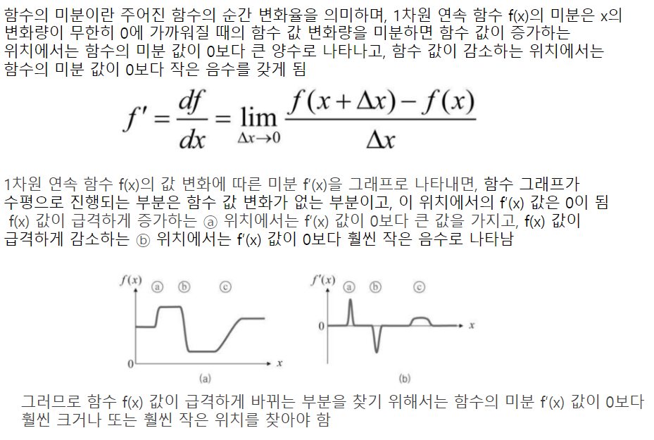 
* 영상이 2차원 평면에서 정의된 함수라는 점이고, 두 번째는 영상이 정수 단위 좌표에 픽셀이 나열되어 있는 이산함수이기 때문에 미분을 할 수 없고 미분을 근사화해서 사용
* 1차원 이산함수에서의 미분
<br/> 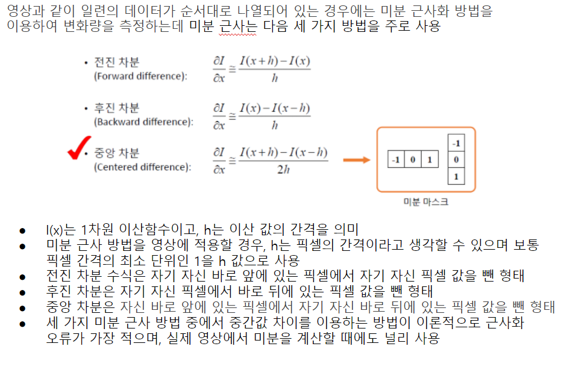 
* 2차원 이산함수에서의 미분 
<br/> 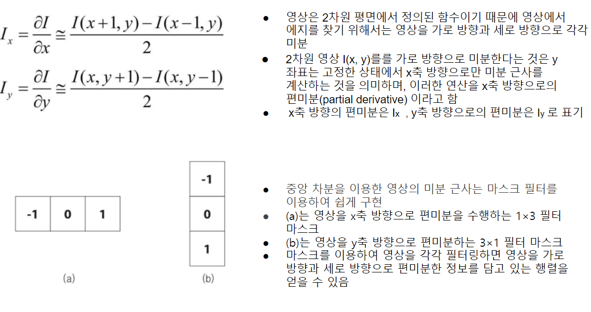
* 그래디언트(gradient)
<br/> 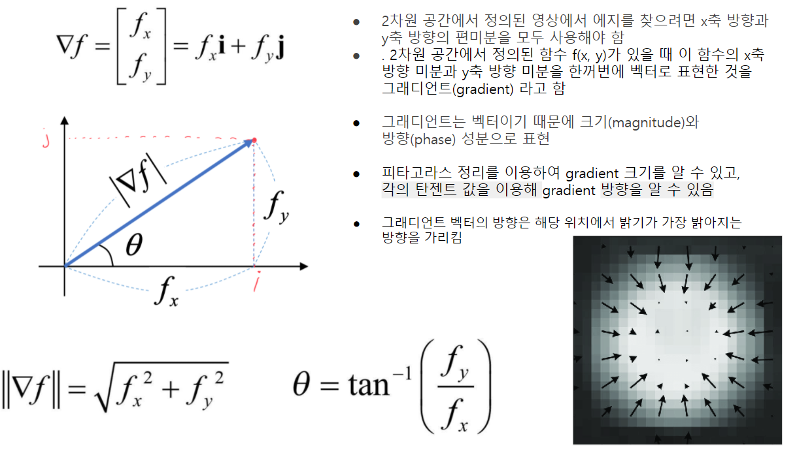 
* 결론적으로 2차원 영상에서 에지를 찾는 기본적인 방법은 그래디언트 크기가 특정 값보다 큰 위치를 찾는 것이고, 에지 여부를 판단하기 위해 기준이 되는 값을 임계값(threshold)이라고 함
* 임계값은 영상의 특성에 따라 다르게 설정해야 하며, 보통 사용자의 경험에 의해 결정하는데 임계값을 높게 설정하면 밝기 차이가 급격하게 변하는 에지 픽셀만 검출되고, 임계값을 낮게 설정하면 약한 에지 성분도 검출

## 2. 마스크 기반 에지 검출
* 앞에서본 1x3, 3x1 마스크를 사용하게 되면 대부분의 영상의 잡음 때문에 다소 부정확한 결과를 얻게 된다. 그래서 잡음의 영향을 줄일 수 있는 좀 더 큰 미분 근사 마스크를 사용
* 중심 픽셀의 차분 비중을 두 배로 준 3×3 크기의 소벨 필터 마스크
<br/> (a)는 x축 방향으로의 편미분을 구하는 소벨 마스크
<br/> (b)는 y축 방향으로의 편미분을 구하는 소벨 마스크
<br/> 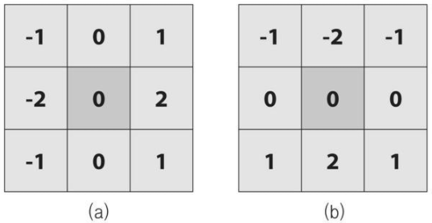 
* OpenCV는 소벨 마스크를 이용해서 영상을 미분하는 Sobel() 함수를 제공
<br/> 결과 영상의 자료형은 ddepth 인자를 통해 명시적으로 지정해야 하고, ddepth에 -1을 지정하면 src와 같은 타입을 사용하는 dst 영상을 생성
<br/> 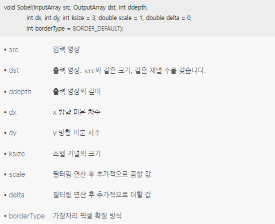
* 소벨 필터의 단점인 커널의 중심에서 멀어질수록 엣지 방향성의 정확도가 떨어지는 것을 개선한 필터가 샤르 필터
<br/> (a)는 x축 방향으로의 편미분을 구하는 샤르 마스크
<br/> (b)는 y축 방향으로의 편미분을 구하는 샤르 마스크
<br/> 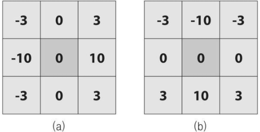
* 샤르 필터 마스크를 이용하여 영상을 미분하려면 Scharr() 함수를 사용
<br/> ksize 인자가 없는 것 빼고는 소벨 함수와 인지가 같다
<br/> 샤르 필터를 이용한 영상의 미분은 앞서 설명한 Sobel() 함수를 이용하여 구할 수도 있는데 Sobel() 함수의 ksize 인자에 FILTER_SCHARR 또는 -1을 지정하면 3×3 샤르 마스크를 사용하여 영상을 미분
<br/> 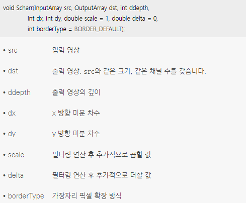
* Sobel() 또는 Scharr() 함수를 이용하여 x 방향으로 미분과 y 방향으로 미분을 각각 계산하여 행렬에 저장한 후, 두 미분 행렬을 이용하여 그래디언트 크기를 계산
* OpenCV는 2차원 벡터의 x 방향 좌표와 y 방향 좌표를 이용하여 벡터의 크기를 계산하는 magnitude() 함수를 제공
<br/> 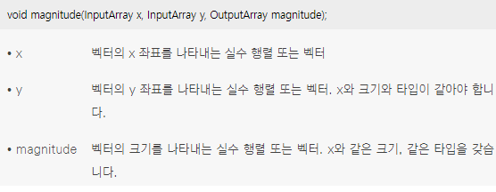
* magnitude() 함수의 수식
<br/> 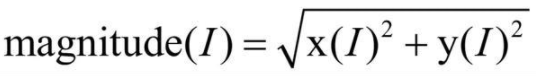
* x 방향으로 미분과 y 방향으로 미분이 저장된 두 개의 행렬이 있을 때, 그래디언트의 방향을 계산하고 싶다면 phase() 함수를 사용
<br/> 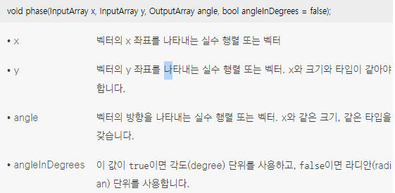
* phase() 함수의 수식
<br/> 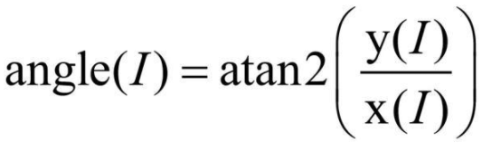
```cpp
// 소벨 마스크 기반 에지 검출 예제

```
