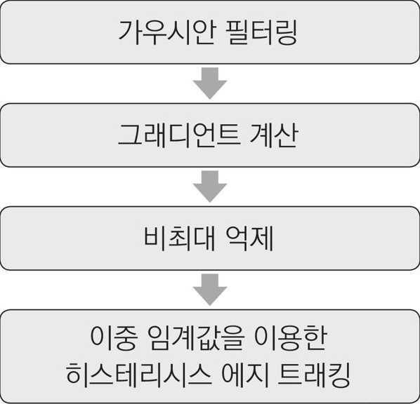

## 1. 미분과 그래디언트 
* 영상에서 에지(edge)는 한쪽 방향으로 픽셀 값이 급격하게 바뀌는 부분 즉, 어두운 영역에서 갑자기 밝아지거나 또는 반대로 밝은 영역에서 급격하게 어두워지는 부분을 에지라고 함
* 기본적으로 영상에서 에지를 찾아내려면 픽셀 값의 변화율을 측정하여 변화율이 큰 픽셀을 선택해야 하는데 수학에서 함수 또는 데이터의 변화율을 미분(derivative)이라고 함
* 1차원 연속 함수 f(x)의 미분
<br/>  
* 영상이 2차원 평면에서 정의된 함수라는 점이고, 두 번째는 영상이 정수 단위 좌표에 픽셀이 나열되어 있는 이산함수이기 때문에 미분을 할 수 없고 미분을 근사화해서 사용
* 1차원 이산함수에서의 미분
<br/>  
* 2차원 이산함수에서의 미분 
<br/> 
* 그래디언트(gradient)
<br/>  
* 결론적으로 2차원 영상에서 에지를 찾는 기본적인 방법은 그래디언트 크기가 특정 값보다 큰 위치를 찾는 것이고, 에지 여부를 판단하기 위해 기준이 되는 값을 임계값(threshold)이라고 함
* 임계값은 영상의 특성에 따라 다르게 설정해야 하며, 보통 사용자의 경험에 의해 결정하는데 임계값을 높게 설정하면 밝기 차이가 급격하게 변하는 에지 픽셀만 검출되고, 임계값을 낮게 설정하면 약한 에지 성분도 검출

## 2. 마스크 기반 에지 검출
* 앞에서본 1x3, 3x1 마스크를 사용하게 되면 대부분의 영상의 잡음 때문에 다소 부정확한 결과를 얻게 된다. 그래서 잡음의 영향을 줄일 수 있는 좀 더 큰 미분 근사 마스크를 사용
* 중심 픽셀의 차분 비중을 두 배로 준 3×3 크기의 소벨 필터 마스크
<br/> (a)는 x축 방향으로의 편미분을 구하는 소벨 마스크
<br/> (b)는 y축 방향으로의 편미분을 구하는 소벨 마스크
<br/>  
* OpenCV는 소벨 마스크를 이용해서 영상을 미분하는 Sobel() 함수를 제공
<br/> 결과 영상의 자료형은 ddepth 인자를 통해 명시적으로 지정해야 하고, ddepth에 -1을 지정하면 src와 같은 타입을 사용하는 dst 영상을 생성
<br/> 
* 소벨 필터의 단점인 커널의 중심에서 멀어질수록 엣지 방향성의 정확도가 떨어지는 것을 개선한 필터가 샤르 필터
<br/> (a)는 x축 방향으로의 편미분을 구하는 샤르 마스크
<br/> (b)는 y축 방향으로의 편미분을 구하는 샤르 마스크
<br/> 
* 샤르 필터 마스크를 이용하여 영상을 미분하려면 Scharr() 함수를 사용
<br/> ksize 인자가 없는 것 빼고는 소벨 함수와 인자가 같다
<br/> 샤르 필터를 이용한 영상의 미분은 앞서 설명한 Sobel() 함수를 이용하여 구할 수도 있는데 Sobel() 함수의 ksize 인자에 FILTER_SCHARR 또는 -1을 지정하면 3×3 샤르 마스크를 사용하여 영상을 미분
<br/> 
* Sobel() 또는 Scharr() 함수를 이용하여 x 방향으로 미분과 y 방향으로 미분을 각각 계산하여 행렬에 저장한 후, 두 미분 행렬을 이용하여 그래디언트 크기를 계산
* OpenCV는 2차원 벡터의 x 방향 좌표와 y 방향 좌표를 이용하여 벡터의 크기를 계산하는 magnitude() 함수를 제공
<br/> 
* magnitude() 함수의 수식
<br/> 
* x 방향으로 미분과 y 방향으로 미분이 저장된 두 개의 행렬이 있을 때, 그래디언트의 방향을 계산하고 싶다면 phase() 함수를 사용
<br/> 
* phase() 함수의 수식
<br/> 
```cpp
// 소벨 마스크 기반 에지 검출 예제
void sobel_edge()
{
	Mat src = imread("ju.jpg", IMREAD_GRAYSCALE);

	if (src.empty())
	{
		cerr << "Image load failed!" << endl;
		return;
	}

	Mat dx, dy;
	Sobel(src, dx, CV_32FC1, 1, 0);
	Sobel(src, dy, CV_32FC1, 0, 1);

	Mat fmag, mag;
	// 그래디언트 크기를 계산하여 fmag에 저장
	magnitude(dx, dy, fmag);
	fmag.convertTo(mag, CV_8UC1);

	// 에지 판별을 위한 그래디언트 크기 임계값을 150으로 설정하여 에지를 판별
	// 행렬 edge의 원소 값은 mag 행렬 원소 값이 150보다 크면 255로, 작으면 0으로 설정
	Mat edge = mag > 150;

	imshow("src", src);
	imshow("mag", mag);
	imshow("edge", edge);

	waitKey();
	destroyAllWindows();
}
```
* 코드 결과 
<br/> 

## 3. 캐니 에지 검출기
* 소벨 마스크 기반 에지 검출 방법은 구현이 간단하고 빠르게 동작하기 때문에 아직도 많이 사용되고 있지만, 그래디언트 크기만을 기준으로 에지 픽셀을 검출하기 때문에 임계값에 민감하고 에지 픽셀이 두껍게 표현되는 문제점이 있음
* 1986년 캐니( J. Canny)는 에지 검출을 최적화 문제 관점으로 접근함으로써 좋은 에지 검출 방법인 세 가지 항목 만족하는 캐니 에지 검출 방법 제시
> 1. 정확한 검출(good detection): 에지를 검출하지 못하거나 또는 에지가 아닌데 에지로 검출하는 확률을 최소화해야 합니다.
> 2. 정확한 위치(good localization): 실제 에지의 중심을 찾아야 합니다.
> 3. 단일 에지(single edge): 하나의 에지는 하나의 점으로 표현되어야 합니다.
* 이는 그래디언트의 크기와 방향을 모두 고려하여 좀 더 정확한 에지 위치를 찾을 수 있음
* 캐니 에지 검출기는 내부적으로 크게 네 개의 연산 과정을 포함
<br/> 
### 가우시안 필터링
* 가우시안 필터를 적용해 영상의 잡음을 제거
* 가우시안 필터링에 의해 영상이 부드러워지면서 에지의 세기도 함께 감소할 수 있기 때문에 적절한 표준 편차를 선택
* 영상에 포함된 잡음이 심하지 않다면 가우시안 필터링은 생략 가능
### 그래디언트 계산 
* 그래디언트 계산은 보통 3×3 소벨 마스크를 사용
* 다만 그래디언트 크기만을 이용하여 에지를 탐색하는 것이 아닌 좀 더 정확한 에지를 찾기 위해 그래디언트 방향도 함께 고려
### 비최대 억제 
* 그래디언트 크기가 특정 임계값보다 큰 픽셀들을 엣지 픽셀로 지정할 경우, 하나의 엣지 위치에 대해 여러 개의 픽셀이 동시에 엣지로 판별되는 현상이 발생
* 비최대 억제(Non-maximum suppression)는 이처럼 여러 개의 픽셀에 의해 하나의 엣지가 표현되는 현상을 없애기 위하여 그래디언트 크기가 국지적 최대(local maximum)인 픽셀만을 엣지 픽셀로 설정하는 기법 즉, 국지적 최대가 아닌 픽셀은 엣지 픽셀에서 제외
* 캐니 엣지 검출기의 비최대 억제 과정에서는 그래디언트의 방향 성분을 고려하여 국지적 최대를 검사
* 일반적인 2차원 영상에서 국지적 최대를 찾으려면 특정 픽셀을 둘러싸고 있는 모든 픽셀 값을 검사하여 국지적 최대인지를 판별해야 하지만 캐니 에지 검출기의 비최대 억제 과정에서는 그래디언트 벡터의 방향과 같은 방향에 있는 인접 픽셀끼리만 국지적 최대 검사를 수행
### 이중 임계값을 이용한 히스테리시스 에지 트래킹
* 하나의 임계값을 사용할 경우 이분법으로 결과가 판단되기 때문에 조명이 조금 바뀌거나 또는 임계값을 조금만 조절해도 에지 픽셀 판단 결과가 크게 달라짐
* 캐니 에지 검출기에서 사용하는 두 개의 임계값을 사용하고 높은 임계값과 낮은 임계값으로 나눔 
* 그래디언트 크기가 높은 임계값 보다 크면 이 픽셀은 최종적으로 에지로 판단
* 그래디언트 크기가 낮은 임계값 보다 작으면 에지 픽셀이 아니라고 판단
* 높은 임계값과 낮은 임계값 사이인 픽셀은 에지일 수도 있고 에지가 아닐 수도 있다고 판단하며, 이런 픽셀에 대해서는 히스테리시스 에지 트래킹(hysteresis edge tracking) 방법을 사용하여 최종적으로 에지로 판별할 픽셀을 선택
* 히스테리시스 에지 트래킹 방법은 에지 픽셀이 대체로 상호 연결되어 있다는 점을 이용하여 에지 픽셀이 강한 에지 픽셀과 서로 연결되어 있다면 이 픽셀은 최종적으로 에지로 판단하고 강한 에지와 연결되어 있지 않은 약한 에지 픽셀은 최종적으로 에지가 아니라고 판단
<br/> (a)는 약한 에지 픽셀이 모두 강한 에지와 연결되어 있으므로 모든 픽셀이 최종적으로 에지로 결정
<br/> (b)에서는 약한 에지 픽셀이 강한 에지와 연결되어 있지 않으므로 최종 에지로 선택되지 않음
<br/> (c)에 나타난 약한 에지는 강한 에지와 연결되어 있으므로 최종적으로 에지로 판별
<br/> 
### Canny() 함수
* OpenCV에서 캐니 에지 검출 알고리즘은 Canny() 함수에 구현
<br/> threshold1 인자에는 낮은 임계값을 지정하고, threshold2 인자에는 높은 임계값을 지정
<br/> 낮은 임계값과 높은 임계값은 보통 1:2 또는 1:3의 비율로 지정
<br/> 
```cpp
// 캐니 에지 검출 예제
void canny_edge()
{
	Mat src = imread("ju.jpg", IMREAD_GRAYSCALE);

	if (src.empty())
	{
		cerr << "Image load failed!" << endl;
		return;
	}

	Mat dst1, dst2;
	// 낮은 임계값을 50, 높은 임계값을 100으로 설정하여 캐니 에지 검출을 수행하고 그 결과를 dst1에 저장
	Canny(src, dst1, 50, 100);
	// 낮은 임계값을 50, 높은 임계값을 150으로 설정하여 캐니 에지 검출을 수행하고 그 결과를 dst2에 저장
	Canny(src, dst2, 50, 150);

	imshow("src", src);
	imshow("dst1", dst1);
	imshow("dst2", dst2);

	waitKey();
	destroyAllWindows();
}
```
* 코드 결과 
<br/> 임계값을 낮출수록 에지로 판별되는 픽셀이 더 많아지므로 dst1 영상에 더 많은 에지 픽셀이 검출된 것을 확인
<br/> 임계값을 낮출수록 잡음에 해당하는 픽셀도 에지로 검출할 가능성이 높아질 수 있으므로 주의
<br/> 

