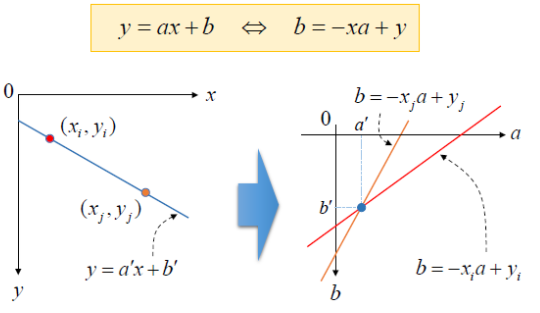
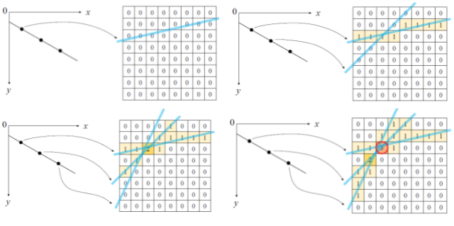
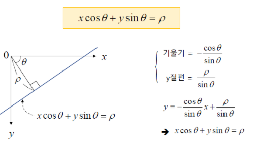
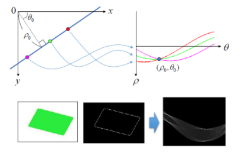
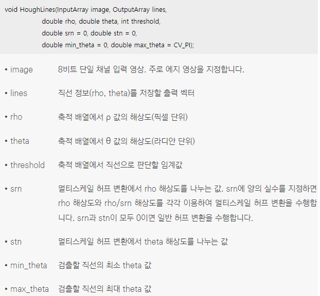

## 1. 허프 변환 직선 검출
* 영상에서 직선을 찾는 방법에는 여러가지가 있고 그 방법중 하나로 허프변환을 사용
* 2차원 영상 좌표에서의 직선의 방정식을 파라미터(parameter)공간으로 변환하여 직선을 찾는 알고리즘
   
* 허프 변환을 이용하여 직선의 방정식을 찾으려면 xy 공간에서 에지로 판별된 모든 점을 이용하여 ab 파라미터 공간에 직선을 표현하고, 직선이 많이 교차되는 좌표를 모두 찾아야 함
* 이때 직선이 많이 교차하는 점을 찾기 위해서 보통 축적 배열(accumulation array)을 사용
  축적 배열은 0으로 초기화된 2차원 배열에서 직선이 지나가는 위치의 배열 원소 값을 1씩 증가시켜 생성
   
* 직선의 방정식 y=ax+b를 사용할 때의 문제점은 y축과 평행한 수직선을 표현하지 못하기 때문에 허프 변환에서는 극좌표계 직선의 방정식을 사용
   
* 직선의 표현을 바꾼 xcosθ + ysinθ = ρ 방정식에 의한 파라미터 공간으로의 변환 
   
* OpenCV에서는 HoughLines() 함수를 사용하여 허프 변환 직선 검출을 수행
  ρ와 θ는 실수 값을 가지기 때문에 C/C++ 코드로 축적 배열을 구현하려면 ρ와 θ가 가질 수 있는 값의 범위를 적당한 크기로 나눠서 저장하는 양자화(quantization) 과정 처리
  θ는 0부터 π 사이의 실수를 가질 수 있는데, 이 구간을 180단계로 나눌 수도 있고 360단계로 나눌 수도 있음
  구간을 촘촘하게 나눌 경우 입력 영상에서 정밀한 직선 검출이 가능하지만 연산 시간이 늘어날 수 있음
  image에는 보통 Canny() 함수 등을 이용하여 구한 에지 영상을 지정
  lines 인자에는 보통 vector<Vec2f> 또는 vector<Vec3f> 자료형의 변수를 지정
  rho와 theta 인자는 ρ와 θ 값의 해상도를 조정하는 용도로 사용되는데 예를 들어 rho에 1을 지정하면 ρ 값을 1픽셀 단위로 설정하며, theta에 CV_PI / 180을 지정하면 θ를 1° 단위로 구분
  

