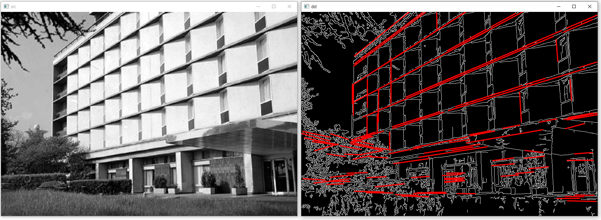

## 1. 허프 변환 직선 검출
### 허프 변환 이론
* 영상에서 직선을 찾는 방법에는 여러가지가 있고 그 방법중 하나로 허프변환을 사용
* 2차원 영상 좌표에서의 직선의 방정식을 파라미터(parameter)공간으로 변환하여 직선을 찾는 알고리즘
<br/>  
* 허프 변환을 이용하여 직선의 방정식을 찾으려면 xy 공간에서 에지로 판별된 모든 점을 이용하여 ab 파라미터 공간에 직선을 표현하고, 직선이 많이 교차되는 좌표를 모두 찾아야 함
* 이때 직선이 많이 교차하는 점을 찾기 위해서 보통 축적 배열(accumulation array)을 사용
<br/> 축적 배열은 0으로 초기화된 2차원 배열에서 직선이 지나가는 위치의 배열 원소 값을 1씩 증가시켜 생성
<br/>  
* 직선의 방정식 y=ax+b를 사용할 때의 문제점은 y축과 평행한 수직선을 표현하지 못하기 때문에 허프 변환에서는 극좌표계 직선의 방정식을 사용
<br/>  
* 직선의 표현을 바꾼 xcosθ + ysinθ = ρ 방정식에 의한 파라미터 공간으로의 변환 
<br/>  
### 허프 변환 직선 검출 함수
* OpenCV에서는 HoughLines() 함수를 사용하여 허프 변환 직선 검출을 수행
<br/> ρ와 θ는 실수 값을 가지기 때문에 C/C++ 코드로 축적 배열을 구현하려면 ρ와 θ가 가질 수 있는 값의 범위를 적당한 크기로 나눠서 저장하는 양자화(quantization) 과정 처리
<br/> θ는 0부터 π 사이의 실수를 가질 수 있는데, 이 구간을 180단계로 나눌 수도 있고 360단계로 나눌 수도 있음
<br/> 구간을 촘촘하게 나눌 경우 입력 영상에서 정밀한 직선 검출이 가능하지만 연산 시간이 늘어날 수 있음
<br/> image에는 보통 Canny() 함수 등을 이용하여 구한 에지 영상을 지정
<br/> lines 인자에는 보통 vector< Vec2f> 또는 vector< Vec3f> 자료형의 변수를 지정
<br/> rho와 theta 인자는 ρ와 θ 값의 해상도를 조정하는 용도로 사용되는데 예를 들어 rho에 1을 지정하면 ρ 값을 1픽셀 단위로 설정하며, theta에 CV_PI / 180을 지정하면 θ를 1° 단위로 구분
<br/> 
```cpp
// 허프 변환 직선 검출 예제
void hough_lines()
{
	Mat src = imread("building.jpg", IMREAD_GRAYSCALE);

	if (src.empty())
	{
		cerr << "Image load failed!" << endl;
		return;
	}

	// 캐니 에지 검출로 에지 영상 구하기
	Mat edge;
	Canny(src, edge, 50, 150);

	// 직선의 방정식 파라미터 ρ와 θ 정보를 lines에 저장
	// 축적 배열에서 ρ 간격은 1픽셀 단위로, θ는 1° 단위로 처리
	vector<Vec2f> lines;
	HoughLines(edge, lines, 1, CV_PI / 180, 250);

	Mat dst;
	// 빨간색 직선을 표현하기 위해 edge를 BGR 3채널 컬러 영상으로 변환하여 dst에 저장
	cvtColor(edge, dst, COLOR_GRAY2BGR);

	// HoughLines() 함수에 의해 구해진 직선의 개수만큼 for 반복문을 수행
	for (size_t i = 0; i < lines.size(); i++)
	{
		// 직선의 방정식 파라미터 중에서 ρ를 변수 r에, θ를 변수 t에 저장
		float r = lines[i][0], t = lines[i][1];
		double cos_t = cos(t), sin_t = sin(t);
		double x0 = r * cos_t, y0 = r * sin_t;
		double alpha = 1000;

		// pt1과 pt2에는 (x0, y0)에서 충분히 멀리 떨어져 있는 직선상의 두 점 좌표가 저장
		Point pt1(cvRound(x0 + alpha * (-sin_t)), cvRound(y0 + alpha * cos_t));
		Point pt2(cvRound(x0 - alpha * (-sin_t)), cvRound(y0 - alpha * cos_t));
		line(dst, pt1, pt2, Scalar(0, 0, 255), 2, LINE_AA);

	}

	imshow("src", src);
	imshow("dst", dst);

	waitKey(0);
	destroyAllWindows();
}
```
* 코드 결과
<br/> 변수 alpha 값을 충분히 크게 설정해야 pt1과 pt2가 영상 바깥쪽에 위치하며, 자연스러운 직선을 그릴 수 있음
<br/> HoughLines() 함수의 다섯 번째 인자로 지정한 직선 검출 임계값을 250보다 작게 설정하면 더 많은 직선을 확인할 수 있음
<br/> 
### 확률적 허프 변환 직선 검출 함수
* OpenCV는 기본적인 허프 변환 직선 검출 방법 외에 확률적 허프 변환(probabilistic Hough transform)에 의한 직선 검출 방법도 제공
<br/> 확률적 허프 변환 방법은 직선의 방정식 파라미터 ρ와 θ를 반환하는 것이 아니라 직선의 시작점과 끝점 좌표를 반환
<br/> lines 인자에는 보통 vector< Vec4i> 자료형의 변수를 지정
<br/> maxLineGap 인자는 일직선상의 직선이 잡음 등 영향으로 끊어져 있을 때, 두 직선을 하나의 직선으로 간주하고자 할 때 사용
<br/> 
```cpp 
// 확률적 허프 변환 선분 검출 예제
void hough_line_segments()
{
	Mat src = imread("building.jpg", IMREAD_GRAYSCALE);

	if (src.empty())
	{
		cerr << "Image load failed!" << endl;
		return;
	}

	Mat edge;
	Canny(src, edge, 50, 150);

	// HoughLinesP() 함수를 이용하여 모든 직선 성분의 시작점과 끝점 좌표를 구함
	vector<Vec4i> lines;
	HoughLinesP(edge, lines, 1, CV_PI / 180, 160, 50, 5);

	Mat dst;
	cvtColor(edge, dst, COLOR_GRAY2BGR);

	for (Vec4i l : lines)
		line(dst, Point(l[0], l[1]), Point(l[2], l[3]), Scalar(0, 0, 255), 2, LINE_AA);
	

	imshow("src", src);
	imshow("dst", dst);

	waitKey(0);
	destroyAllWindows();
}
```
* 코드 결과 
<br/> 

## 2. 허프 변환 원 검출
### 허프 변환을 이용하여 원을 검출하는 방법
* 중심 좌표가 (a, b)이고 반지름이 r인 원의 방정식
<br/> 
* 원의 방정식은 세 개의 파라미터를 가지고 있으므로, 허프 변환을 그대로 적용하려면 3차원 파라미터 공간에서 축적 배열을 정의하고 가장 누적이 많은 위치를 찾아야 하는데 3차원 파라미터 공간에서 축적 배열을 정의하고 사용하려면 너무 많은 메모리와 연산 시간을 필요로 하게 되는 문제점이 있음 
* OpenCV에서는 일반적인 허프 변환 대신 허프 그래디언트 방법(Hough gradient method)을 사용하여 원을 검출
* 허프 그래디언트 방법은 입력 영상의 모든 에지 픽셀에서 그래디언트를 구한 후 그래디언트 방향의 직선을 그리고 직선상의 축적 배열 값을 증가시키면 원의 중심 위치에서 축적 배열 값이 크게 나타나므로 그 위치를 원의 중심으로 하고 다양한 반지름의 원에 대해 원주상에 충분히 많은 에지 픽셀이 존재하는지 확인하여 적절한 반지름을 선택 
<br/> 다만 허프 그래디언트 방법에서 사용하는 축적 배열은 파라미터 공간에서 만드는 것이 아니라 입력 영상과 동일한 xy 좌표 공간에서 2차원 배열로 만듬
<br/> 
### 허프 변환 원 검출 함수 
* OpenCV에서는 HoughCircles() 함수를 사용하여 원을 검출
<br/> HoughCircles() 함수 내부에서 Sobel() 함수와 Canny() 함수를 이용하여 그래디언트와 에지 영상을 계산한 후, 허프 그래디언트 방법으로 원을 검출
<br/> circles 인자에 vector< Vec3f> 자료형을 사용하면 원의 중심 좌표가 (a, b)와 반지름 r이 차례대로 저장되고, vector< Vec4f> 자료형을 사용할 경우 추가적으로 축적 배열 누적 값이 저장
<br/> dp 인자를 1로 지정하면 입력 영상과 같은 크기의 축적 배열을 사용하고, 2를 지정하면 입력 영상의 가로와 세로 크기를 2로 나눈 크기의 축적 배열을 사용
<br/> minDist 인자에는 인접한 원의 최소 거리를 지정 즉, 두 원의 중심점 사이 거리가 minDist보다 작으면 두 원 중 하나는 검출하지 않음
<br/> param1 인자는 캐니 에지 검출기를 이용할 때 높은 임계값으로 사용하고, 낮은 임계값은 param1의 절반으로 설정
<br/> param2는 축적 배열에서 원의 중심을 찾을 때 사용하는 임계값
<br/> minRadius와 maxRadius 인자에는 검출할 원의 최소 반지름과 최대 반지름을 지정, 영상에서 검출할 원의 대략적인 크기를 알고 있다면 minRadius와 maxRadius를 적절하게 지정함으로써 연산 속도를 향상
<br/> 
```cpp
// 허프 변환 원 검출 예제
void hough_circles()
{
	Mat src = imread("coins.png", IMREAD_GRAYSCALE);

	if (src.empty())
	{
		cerr << "Image load failed!" << endl;
		return;
	}

	// 입력 영상 src의 잡음을 제거하는 용도로 blur() 함수를 적용
	Mat blurred;
	blur(src, blurred, Size(3, 3));

	// HoughCircles() 함수를 이용하여 원을 검출
	// 축적 배열 크기는 입력 영상과 같은 크기로 사용 
	// 두 원의 중심점 거리가 50픽셀보다 작으면 검출하지 않음
	// 캐니 에지 검출기의 높은 임계값은 150으로 지정
	// 축적 배열 원소 값이 30보다 크면 원의 중심점으로 선택
	vector<Vec3f> circles;
	HoughCircles(blurred, circles, HOUGH_GRADIENT, 1, 50, 150, 30);

	Mat dst;
	cvtColor(src, dst, COLOR_GRAY2BGR);

	for (Vec3f c : circles)
	{
		Point center(cvRound(c[0]), cvRound(c[1]));
		int radius = cvRound(c[2]);
		circle(dst, center, radius, Scalar(255, 0, 255), 2, LINE_AA);
	}

	imshow("src", src);
	imshow("dst", dst);

	waitKey(0);
	destroyAllWindows();
}
```
* 코드 결과 
<br/> 
