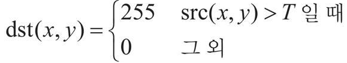
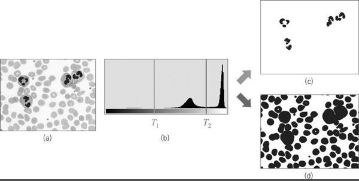
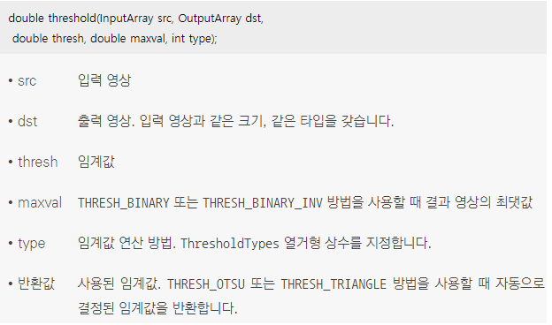
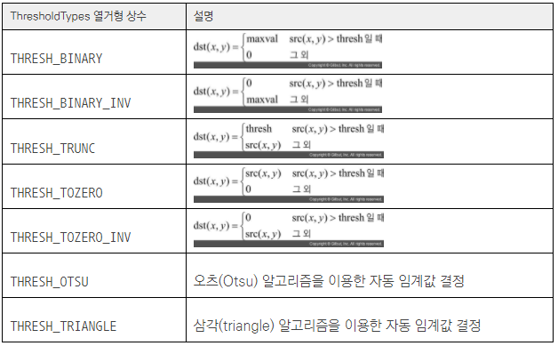
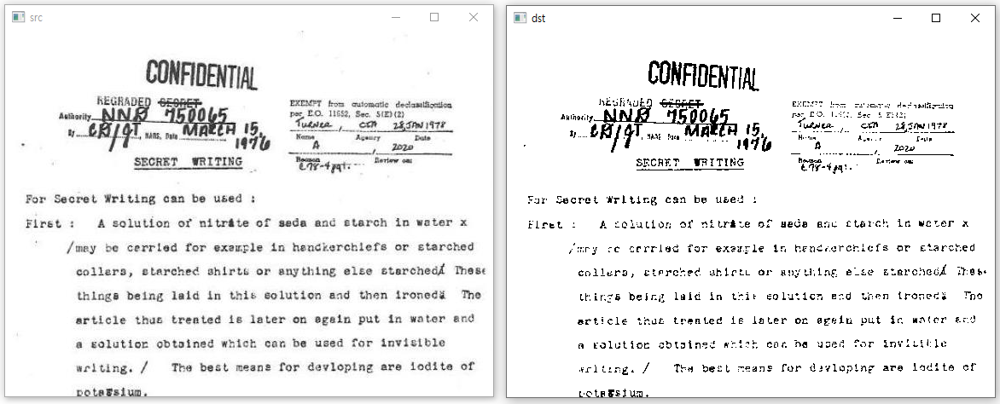
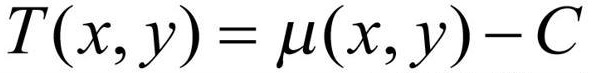
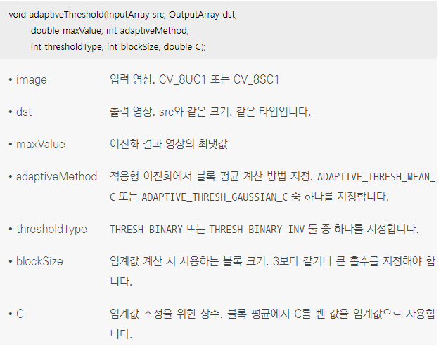
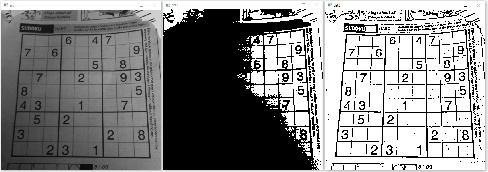

## 1. 이진화 
### 이진화의 개념
* 영상의 이진화(binarization)는 영상의 각 픽셀값을 0 또는 255로 설정해 두 개의 부류로 나누는 작업
* 입력 영상을 주요 객체 영역과 배경 영역으로 나누거나 또는 영상에서 중요도가 높은 관심 영역(ROI, Region Of Interest)과 그렇지 않은 비관심 영역으로 구분하는 용도로 이진화가 사용
* 그레이스케일 영상에 대해 이진화를 수행하려면 영상의 픽셀 값이 임계값(threshold)보다 크면 255로 설정하고, 작으면 0으로 설정
<br/>  
* 임계값은 영상의 이진화를 수행하는 목적에 따라 적절하게 결정
<br/> (a)는 혈액 속 세포를 촬영한 영상
<br/> (b)는 영상의 히스토그램 
<br/> (c)는 임계갑 T1을 사용하여 염색된 세포 영역만 검은색으로 나타나는 이진 영상
<br/> (d)는 임계값 T2를 사용하여 입력 영상에서 모든 세포 영역을 검출한 결과
<br/>  
### 이진화 함수 
* OpenCV에서 이진화는 threshold() 함수를 이용하여 수행
<br/> 
* ThresholdTypes 열거형 상수
<br/>  
```cpp
// 이진화 코드 예제
void binarization_func()
{
	Mat src = imread("document.jpg", IMREAD_GRAYSCALE);

	if (src.empty())
	{
		cerr << "Image load failed!" << endl;
		return;
	}

  // 문서 영상을 임계값 128을 이용하여 이진화 
  // Mat dst = src > 128; // OpenCV에서는 Mat 영상을 부등호 연산자 재정의를 이용하여 간단하게 이진화할 수도 있음
	Mat dst;
	threshold(src, dst, 128, 255, THRESH_BINARY); 

	imshow("src", src);
	imshow("dst", dst);

	waitKey(0);
	destroyAllWindows();
}
```
* 코드 결과 
<br/>  

## 2. 적응형 이진화 
### threshold() 함수의 문제점 
* 영상의 모든 픽셀에 같은 임계값을 적용하여 이진화를 수행하는 방식을 전역 이진화(global binarization)라고 하는데 threshold() 함수는 전역 이진화를 사용
* 전역 이진화는 균일하지 않은 조명 환경에서 촬영된 영상에 대해 전역 이진화를 수행하면 객체와 배경이 적절하게 분리되지 않는 경우가 발생하기 때문에 영상의 특성에 따라서 전역 이진화를 적용하기 어려운 경우가 있음
### 적응형 이진화 
* 불균일한 조명 성분을 가지고 있는 영상에 대해서는 하나의 임계값으로 객체와 배경을 제대로 구분하기 어렵기 때문에 각 픽셀마다 서로 다른 임계값을 사용하는 적응형 이진화(adaptive binarization) 기법을 사용하는 것이 효과적
* 적응형 이진화는 영상의 모든 픽셀에서 정해진 크기의 사각형 블록 영역을 설정하고, 블록 영역 내부의 픽셀 값 분포로부터 고유의 임계값을 결정하여 이진화하는 방식
<br/> μ(x, y)는 (x, y) 주변 블록 영역의 픽셀 값 평균이고, C는 임계값의 크기를 조정하는 상수
<br/> 블록 내부 픽셀 값의 평균 μ(x, y)는 일반적인 산술 평균을 사용하거나 또는 가우시안 함수 형태의 가중치를 적용한 가중 평균을 사용
<br/>  
### 적응형 이진화 함수
* OpenCV에서 적응형 이진화는 adaptiveThreshold() 함수를 이용하여 수행
<br/> 각 픽셀 주변의 blockSize×blockSize 영역에서 평균을 구하고, 평균에서 상수 C를 뺀 값을 해당 픽셀의 임계값으로 사용
<br/>  
```cpp
// 적응형 이진화 예제
void adaptive_binarization()
{
	Mat src = imread("sudoku.jpg", IMREAD_GRAYSCALE);

	if (src.empty())
	{
		cerr << "Image load failed!" << endl;
		return;
	}

	Mat dst1, dst2;
	// 전역 이진화를 통한 이진화
	threshold(src, dst1, 128, 255, THRESH_BINARY);
	// 적응형 이진화를 통한 이진화
	// 17 x 17 블록 크기를 이용해 적응형 이진화 수행
	// 가우시안 가중 평균을 사용하고, 블록 평균에서 5를 뺀 값을 임계값으로 사용
	adaptiveThreshold(src, dst2, 255, ADAPTIVE_THRESH_GAUSSIAN_C, THRESH_BINARY, 17, 5);

	imshow("src", src);
	imshow("dst1", dst1);
	imshow("dst2", dst2);

	waitKey(0);
	destroyAllWindows();
}
```
* 코드 결과 
<br/> 스도쿠 영상은 불균일한 조명 성분을 가지고 있는 영상
<br/> 전역 이진화를 사용하면 스도쿠 영상의 우측 상단 숫자는 제대로 이진화가 되어 분간이 가능하지만, 영상의 좌측 하단은 전반적으로 검은색으로 이진화되어 숫자를 읽을 수 없음
<br/> 적응형 이진화를 사용하면 스도쿠 영상이 전체적으로 이진화가 잘 수행된 것을 확인 가능
<br/> 
