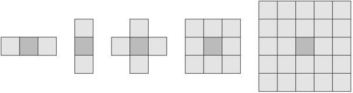
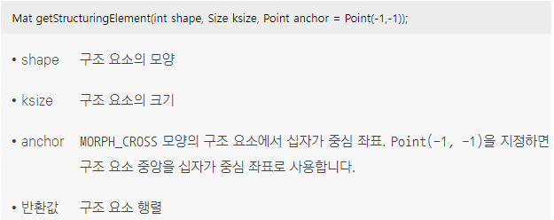
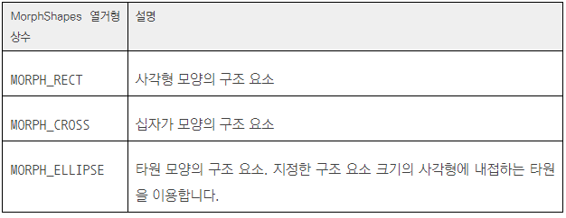
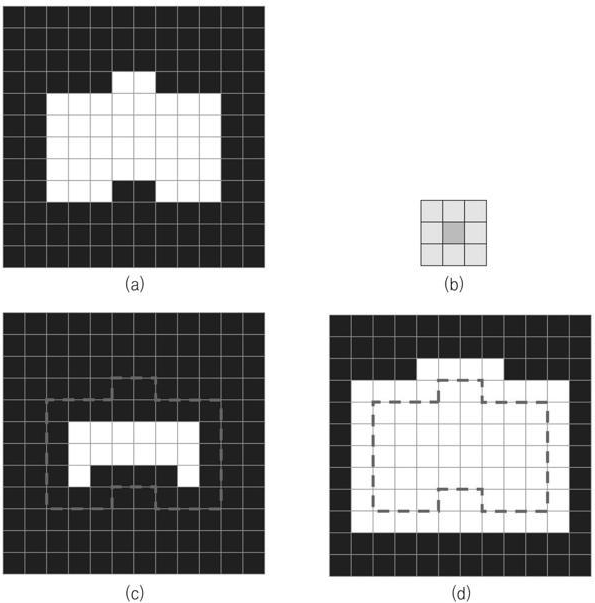
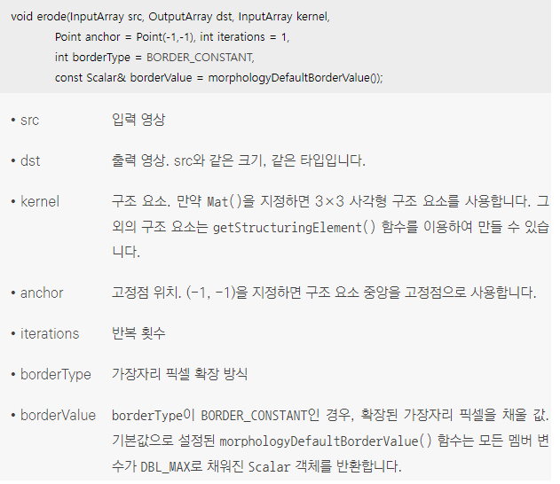
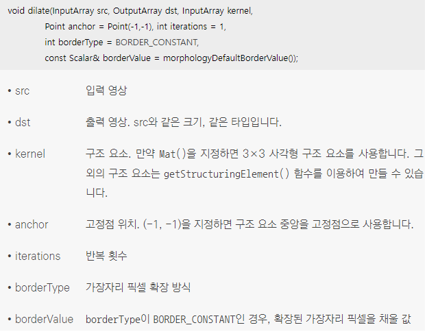
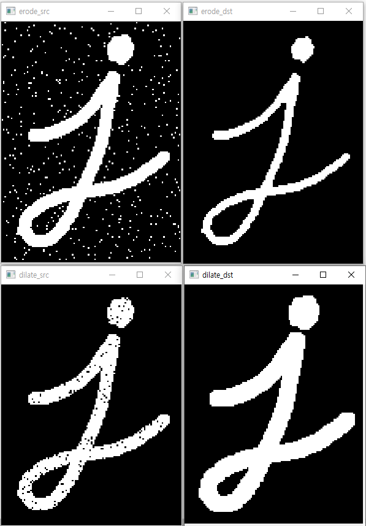

## 1. 이진 영상의 침식과 팽창
### 모폴로지의 개념
* 모폴로지(morphology)란 '형태학'이라는 뜻으로 영상 분야에서 노이즈 제거, 구멍 채우기, 끊어진 선 이어 붙이기 등에 쓰이는 형태학적 연산을 가르킴
* 모폴로지 기법은 그레이스케일 영상과 이진 영상에 대하여 모두 적용할 수 있지만, 주로 이진 영상에서 객체의 모양을 단순화시키거나 잡음을 제거하는 등 용도로 사용
### 구조 요소
* 모폴로지 연산을 정의하려면 먼저 구조 요소(structuring element) 정의가 필요 
* 구조 요소는 마치 필터링에서 사용되는 마스크처럼 모폴로지 연산의 동작을 결정하는 작은 크기의 행렬로서 구조 요소는 다양한 크기와 모양으로 정의할 수 있으며 주로 3×3 정방형 구조 요소를 사용
<br/> 구조 요소 행렬에서 진한 색으로 표시한 원소는 모폴로지 연산 결과가 저장될 위치를 나타내는 고정점(anchor point)이며, 대부분의 경우 구조 요소의 중심을 고정점으로 사용
<br/>  
* OpenCV는 널리 사용되는 모양의 구조 요소 행렬을 간단하게 생성할 수 있도록 getStructuringElement() 함수를 제공
<br/> OpenCV에서 구조 요소는 원소 값이 0 또는 1로 구성된 CV_8UC1 타입의 Mat 행렬로 표현하고 구조 요소 행렬에서 값이 1인 원소만을 이용하여 구조 요소의 모양을 결정
<br/> shape은 구조 요소의 모양을 결정하는 역할을 하며, MorphShapes 열거형 상수 중 하나를 지정
<br/>  
* MorphShapes 열거형 상수
<br/>  
### 침식 연산, 팽창 연산
* 영상의 모폴로지 기법 중에서 가장 기본이 되는 연산은 침식(erosion) 연산과 팽창(dilation) 연산
* 작은 크기의 영상에서 3×3 정방형 구조 요소를 사용하여 침식과 팽창 연산을 수행한 결과
<br/> (a)는 12×12 크기의 입력 이진 영상을 확대하여 나타낸 것이며, 이 영상에는 흰색으로 표시된 객체가 하나 있음
<br/> (b)는 3×3 정방형 구조 요소
<br/> (c)는 침식 연산을 수행한 결과로 구조 요소를 영상 전체에 대해 스캔하면서, 구조 요소가 객체 영역 내부에 완전히 포함될 경우 고정점 위치 픽셀을 255로 설정
<br/> (d)는 팽창 연산을 수행한 결과로 구조 요소를 영상 전체에 대해 이동시키면서, 구조 요소와 객체 영역이 한 픽셀이라도 만날 경우 고정점 위치 픽셀을 255로 설정
<br/>  
### 침식 연산, 팽창 연산 함수
* OpenCV에서 영상의 침식 연산은 erode() 함수를 이용하여 수행
<br/> 
* OpenCV에서 팽창 연산을 수행하려면 dilate() 함수를 사용
<br/> 
```cpp
// 이진 영상의 침식과 팽창 예제
void erode_dilate()
{
	// 이진화 영상
	Mat erode_src = imread("white_i.PNG", IMREAD_GRAYSCALE);
	Mat dilate_src = imread("black_i.PNG", IMREAD_GRAYSCALE);

	// 7x7 정방형 구조 요소 생성
	Mat k = getStructuringElement(MORPH_RECT, Size(7, 7));

	Mat erode_dst, dilate_dst;
	// 7×7 정방형 구조 요소를 이용하여 침식 연산을 수행
	erode(erode_src, erode_dst, k);
	// 7×7 정방형 구조 요소를 이용하여 팽창 연산을 수행
	dilate(dilate_src, dilate_dst, k);

	imshow("erode_src", erode_src);
	imshow("erode_dst", erode_dst);
	imshow("dilate_src", dilate_src);
	imshow("dilate_dst", dilate_dst);

	waitKey(0);
	destroyAllWindows();
}
```
* 코드 결과 
<br/> 상단은 침식 연산의 전 후 영상, 하단은 팽창 연산의 전 후 연산 
<br/> 객체부분이 깎이거나 부푸는 왜곡이 있지만 이진 영상에서 객체를 제외한 그 외 잡음을 제거할 수 있음
<br/>  

### 2. 이진 영상의 열기와 닫기
