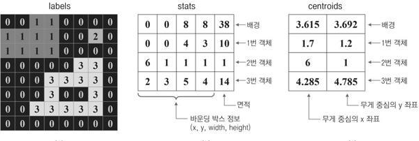

## 1. 레이블링의 이해
### 레이블링의 개념
* 레이블링은 각 객체에 번호를 매기고 위치와 크기 정보를 추출하는 작업으로 객체 인식을 위한 전처리 과정으로 자주 사용
<br/> 영상의 레이블링은 일반적으로 이진화된 영상에서 수행되는데 입력 영상의 픽셀 값이 0이면 배경, 0이 아니면 객체 픽셀로 인식
<br/> 하나의 객체는 한 개 이상의 인접한 픽셀로 이루어지며, 하나의 객체를 구성하는 모든 픽셀에는 같은 레이블 번호가 지정
<br/>   
* 특정 픽셀과 이웃한 픽셀의 연결 관계는 크게 두 가지 방식으로 정의
<br/> (a) 4-방향 연결성(4-way connectivity)은 특정 픽셀의 상하좌우로 붙어 있는 픽셀끼리 연결되어 있다고 정의
<br/> (b) 8-방향 연결성(8-way connectivity)은 상하좌우로 연결된 픽셀뿐만 아니라 대각선 방향으로 인접한 픽셀도 연결되어 있다고 정의
<br/>  
### 레이블링 함수 
* OpenCV는 레이블링을 수행하는 connectedComponents() 함수 제공
<br/> connectedComponents() 함수는 입력 영상 image에 대해 레이블링을 수행하여 구한 레이블 맵 labels를 반환
<br/>  
```cpp
// 영상의 레이블링 예제
void labeling_basic()
{
    // 8x8 의 이진 영상 데이터
    uchar data[] = {
        0, 0, 1, 1, 0, 0, 0, 0,
        1, 1, 1, 1, 0, 0, 1, 0,
        1, 1, 1, 1, 0, 0, 0, 0,
        0, 0, 0, 0, 0, 1, 1, 0,
        0, 0, 0, 1, 1, 1, 1, 0,
        0, 0, 0, 1, 0, 0, 1, 0,
        0, 0, 1, 1, 1, 1, 1, 0,
        0, 0, 0, 0, 0, 0, 0, 0,
    };

    Mat src = Mat(8, 8, CV_8UC1, data) * 255;

    Mat labels;
    int cnt = connectedComponents(src, labels);

    cout << "src:\n" << src << endl;
    cout << "labels:\n" << labels << endl;
    cout << "number of labels: " << cnt << endl;
}
```
* 코드 결과 
<br/> 입력 영상에는 세 개의 객체 영역이 존재하지만 connectedComponents() 함수가 반환하는 정수 값은 배경 영역까지 포함한 영역 개수인 4개
<br/>  

### 2. 레이블링 응용
* OpenCV는 레이블 맵과 각 객체 영역의 통계 정보를 한꺼번에 반환하는 connectedComponentsWithStats() 함수를 제공
<br/> 기본적인 레이블링 동작은 입력 영상으로부터 레이블 맵을 생성하는데 보통 레이블링을 수행한 후에는 각각의 객체 영역이 어느 위치에 어느 정도의 크기로 존재하는지 확인할 필요가 있음 
<br/>  
* 함수로부터 생성되는 labels, stats, centroids 행렬의 정보
<br/>  
```cpp
// 레이블링을 이용하여 객체의 바운딩 박스 그리기 예제
void labeling_stats()
{
    Mat src = imread("keyboard.bmp", IMREAD_GRAYSCALE);

    if (src.empty())
    {
        cerr << "Image load failed!" << endl;
        return;
    }

    // 영상의 이진화
    Mat bin;
    threshold(src, bin, 128, 255, THRESH_BINARY);

    Mat labels, stats, centroids;
    int cnt = connectedComponentsWithStats(bin, labels, stats, centroids);

    Mat dst;
    cvtColor(src, dst, COLOR_GRAY2BGR);

    // 배경 영역을 제외하고 흰색 객체 영역에 대해서만 for 반복문을 수행
    for (int i = 1; i < cnt; i++)
    {
        int* p = stats.ptr<int>(i);
        
        // 객체의 픽셀 개수가 20보다 작으면 잡음이라고 간주하고 무시
        if (p[4] < 20) continue;

        rectangle(dst, Rect(p[0], p[1], p[2], p[3]), Scalar(255, 0, 255), 2);
    }

    imshow("src", src);
    imshow("bin", bin);
    imshow("dst", dst);

    waitKey(0);
    destroyAllWindows();
}
```
* 코드 결과
<br/>  
