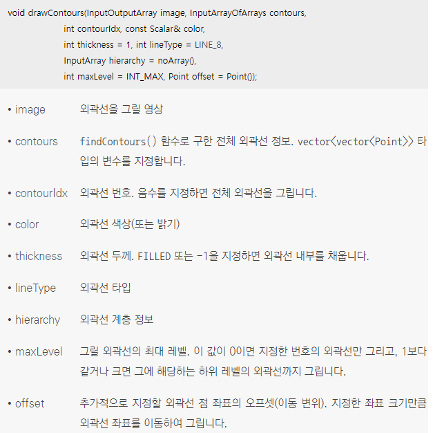

## 1. 외곽선 검출
### 외곽선 검출 설명
* 객체의 외곽선(contour)은 객체 영역 픽셀 중에서 배경 영역과 인접한 일련의 픽셀을 의미
* 객체의 외곽선은 검은색 배경 안에 있는 흰색 객체 영역에서 가장 최외곽에 있는 픽셀인 객체 바깥쪽 외곽선과 흰색 객체 영역 안에 검은색 배경 영역인 홀(hole)이 존재한다면 홀을 둘러싸고 있는 객체 픽셀인 안쪽 홀 외곽선으로 구분
* 객체 하나의 외곽선은 여러 개의 점으로 구성
<br/> 
<br/> 외곽선 점들의 좌표 
```cpp
contours[0] : [1, 1], [1, 2], [1, 3], [2, 4], [3, 3], [3, 2], [3, 1], [2, 1]
contours[1] : [6, 1]
contours[2] : [5, 4], [4, 5], [4, 6], [5, 6], [6, 6], [6, 5], [6, 4]
```
* 하나의 객체의 외곽선은 vector< Point> 타입에 저장할 수 있고, 여러개의 객체의 외곽선을 저장하려면 vector< vector< Point>> 타입 사용
```cpp 
vector<vector<Point>> contours;
```
### 외곽선 검출 함수 
* OpenCV에서 영상 내부 객체들의 외곽선을 검출하는 findContours() 함수 제공
<br/> 이 함수는 외곽선들의 계층 정보를 받아 오는 hierarchy 인자가 있는 형태와 없는 형태 두 가지로 정의
<br/> 입력 영상으로는 보통 threshold() 등 함수에 의해 만들어진 이진 영상을 사용
<br/> hierarchy 인자에는 vector<Vec4i> 타입의 변수를 지정하고 i번째 외곽선에 대해 hierarchy[i][0]에는 다음 외곽선 번호, hierarchy[i][1]에는 이전 외곽선 번호, hierarchy[i][2]에는 자식 외곽선 번호, hierarchy[i][3]에는 부모 외곽선 번호가 저장, 만약 계층 구조에서 해당 외곽선이 존재하지 않으면 -1이 저장
<br/> 
* RetrievalModes 열거형 상수
<br/> 
<br/>  
* ContourApproximationModes 열거형 상수
<br/>  
* 검출한 외곽선 정보를 이용하여 영상 위에 외곽선을 그리는 drawContours() 함수 제공
<br/> 
```cpp
// 외곽선 검출과 그리기 예제
void contours_basic()
{
    Mat src = imread("contours.bmp", IMREAD_GRAYSCALE);

    if (src.empty())
    {
        cerr << "Image load failed!" << endl;
        return;
    }

    // src 영상으로부터 모든 외곽선을 검출
    // 외곽선의 계층 정보는 추출하지 않음
    vector<vector<Point>> contours;
    findContours(src, contours, RETR_LIST, CHAIN_APPROX_NONE);

    Mat dst;
    cvtColor(src, dst, COLOR_GRAY2BGR);

    // contours.size는 검출된 전체 외곽선 개수 
    for (int i = 0; i < contours.size(); i++)
    {
        Scalar c(rand() & 255, rand() & 255, rand() & 255);
        drawContours(dst, contours, i, c, 2);
    }
        
    imshow("src", src);
    imshow("dst", dst);

    waitKey(0);
    destroyAllWindows();
}
```
* 코드 결과 
<br/> 
  
## 2. 외곽선 처리 함수
### 검출한 외곽선 좌표 정보로부터 객체의 위치와 크기 등 정보를 알아낼 수 있는 몇 가지 함수 설명
* 주어진 외곽선 점들을 감싸는 가장 작은 크기의 사각형, 즉 바운딩 박스를 구하고 싶다면 boundingRect() 함수를 사용
<br/> 
* 외곽선 또는 점들을 감싸는 최소 크기의 회전된 사각형을 구하고 싶을 때에는 minAreaRect() 함수를 사용
<br/> 
* 외곽선 또는 점들을 감싸는 최소 크기의 원을 구하고 싶을 때에는 minEnclosingCircle() 함수를 사용
<br/> 
* 그리스 문자 β 모양의 객체에 대해 바깥쪽 외곽선을 검출하고, 검출한 외곽선 정보를 boundingRect(), minAreaRect(), minEnclosingCircle() 함수에 전달하여 구한 바운딩 박스, 최소 크기 회전된 사각형, 최소 크기 원을 영상 위에 나타낸 결과
<br/> 
* 임의의 곡선을 형성하는 점들의 집합을 가지고 있을 때, 해당 곡선의 길이를 구하고 싶다면 arcLength() 함수를 사용
<br/> 입력 곡선 curve에는 보통 vector< Point> 또는 vector< Point2f> 자료형의 변수를 전달
<br/> 두 번째 인자 closed 값이 true이면 입력 곡선의 시작점과 끝점이 연결되어 있는 폐곡선이라고 간주하여 길이를 계산
<br/> 
* 임의의 외곽선 정보를 가지고 있을 때, 외곽선이 감싸는 영역의 면적을 알고 싶다면 contourArea() 함수를 사용
<br/> 
* 외곽선 또는 곡선을 근사화하는 approxPolyDP() 함수를 제공
<br/> approxPolyDP() 함수는 주어진 곡선의 형태를 단순화하여 작은 개수의 점으로 구성된 곡선을 생성
<br/> 
* approxPolyDP() 함수는 더글라스-포이커(Douglas-Peucker) 알고리즘을 사용하여 곡선 또는 다각형을 단순화
<br/> 더글라스-포이커 알고리즘은 입력 외곽선에서 가장 멀리 떨어져 있는 두 점을 찾아 직선으로 연결하고, 해당 직선에서 가장 멀리 떨어져 있는 외곽선상의 점을 찾아 근사화 점으로 추가하는 작업을 반복하다가 새로 추가할 외곽선상의 점과 근사화에 의한 직선과의 수직 거리가 epsilon 인자보다 작으면 근사화를 정지
* 보트 모양의 객체 외곽선에 대해 더글라스-포이커 알고리즘으로 외곽선 근사화를 수행하는 과정
<br/> 
```cpp
// 다각형 검출 및 인식 예제
#include "opencv2/opencv.hpp"
#include <iostream>

using namespace cv;
using namespace std;

// setLabel() 함수는 img 영상에서 pts 외곽선 주변에 바운딩 박스를 그리고 label 문자열을 출력
void setLabel(Mat& img, const vector<Point>& pts, const String& label)
{
	//	pts 외곽선을 감싸는 바운딩 박스를 구함
	Rect rc = boundingRect(pts);
	rectangle(img, rc, Scalar(0, 0, 255), 1);
	putText(img, label, rc.tl(), FONT_HERSHEY_PLAIN, 1, Scalar(0, 0, 255));
}

int main()
{
	// 	polygon.bmp 파일을 3채널 컬러 영상 형식으로 불러와 img에 저장
	Mat img = imread("polygon.bmp", IMREAD_COLOR);

	if (img.empty())
	{
		cerr << "Image load failed!" << endl;
		return -1;
	}

	// img 영상을 그레이스케일 형식으로 변환하여 gray에 저장
	Mat gray;
	cvtColor(img, gray, COLOR_BGR2GRAY);

	// gray 영상을 오츠 알고리즘으로 자동 이진화하여 bin에 저장
	Mat bin;
	threshold(gray, bin, 0, 255, THRESH_BINARY_INV | THRESH_OTSU);

	// bin 영상에서 모든 객체의 바깥쪽 외곽선을 검출
	vector<vector<Point>> contours;
	findContours(bin, contours, RETR_EXTERNAL, CHAIN_APPROX_NONE);

	// 검출된 각 객체의 외곽선 좌표를 pts 변수로 참조하면서 for 반복문을 수행
	for (vector<Point>& pts : contours)
	{
		// 외곽선이 감싸는 면적이 400보다 작으면 잡음으로 간주하여 무시
		if (contourArea(pts) < 400) continue;

		// pts 외곽선을 근사화하여 approx에 저장
		vector<Point> approx;
		approxPolyDP(pts, approx, arcLength(pts, true) * 0.02, true);

		// approx에 저장된 외곽선 점의 개수를 vtc에 저장
		int vtc = (int)approx.size();

		// 근사화된 외곽선의 꼭지점 개수가 3이면 외곽선 주변에 바운딩 박스를 그리고 "TRI" 문자열을 출력
		if (vtc == 3)
			setLabel(img, pts, "TRI");
		// 	근사화된 외곽선의 꼭지점 개수가 4이면 외곽선 주변에 바운딩 박스를 그리고 "RECT" 문자열을 출력
		else if (vtc == 4)
			setLabel(img, pts, "RECT");
		// 객체의 면적 대 길이 비율을 조사하여 원에 가까우면 외곽선 주변에 바운딩 박스를 그리고 "CIR" 문자열을 출력
		else if (vtc > 4)
		{
			double len = arcLength(pts, true);
			double area = contourArea(pts);
			// 외곽선 모양이 원에 가까운 형태인지를 판별하기 위한 수식
			double ratio = 4. * CV_PI * area / (len * len);

			if (ratio > 0.8)
				setLabel(img, pts, "CIR");
		}
	}

  imshow("bin", bin);
	imshow("img", img);

	waitKey(0);
	return 0;
}
```
* 외곽선 모양이 원에 가까운 형태인지를 판별하기 위한 수식
<br/> R: 외곽선 길이와 도형의 면적 비율, A: 객체의 면적이고, P: 객체의 외곽선 길이
<br/> 수식으로 구한 비율 R은 0에서 1 사이의 실수로 계산되며, 입력 도형이 원 모양에 가까울수록 1에 가까운 값이 나타남
<br/> 
* 코드 결과 
<br/> 
