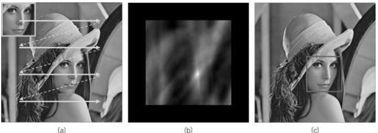
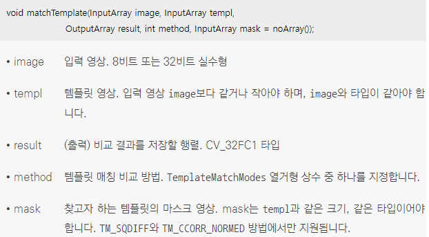
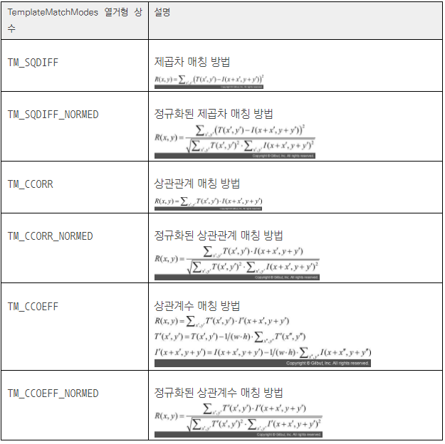
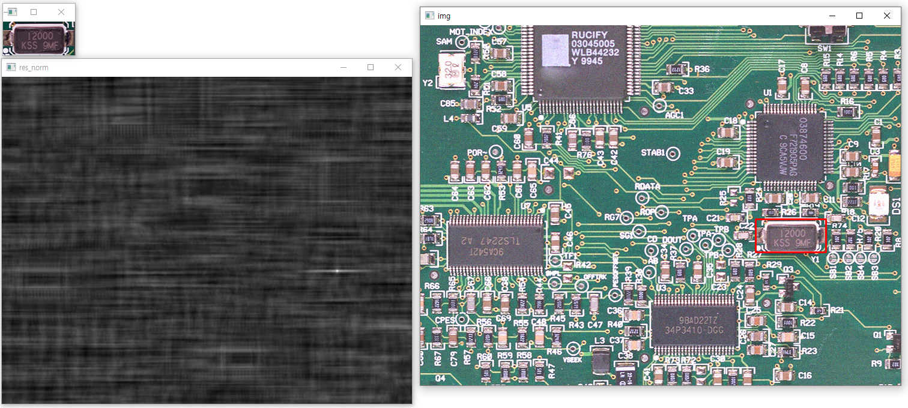

### 템플릿 매칭 설명
* 입력 영상에서 작은 크기의 부분 영상 위치를 찾아내고 싶은 경우에 주로 템플릿 매칭(template matching) 기법을 사용
* 템플릿(template)은 찾고자 하는 대상이 되는 작은 크기의 영상을 의미
* 템플릿 매칭은 작은 크기의 템플릿 영상을 입력 영상 전체 영역에 대해 이동하면서 가장 비슷한 위치를 수치적으로 찾아내는 방식
* 템플릿 매칭의 동작 방식
<br/> (a)와 같이 템플릿 영상을 입력 영상 전체 영역에 대해 이동하면서 템플릿 영상과 입력 영상 부분 영상과의 유사도(similarity) 또는 비유사도(dissimilarity)를 계산
<br/> 유사도를 계산할 경우에는 템플릿 영상과 비슷한 부분 영상 위치에서 값이 크게 나타나고, 반대로 비유사도를 계산할 경우에는 템플릿 영상과 비슷한 부분에서 값이 작게 나타남
<br/> (b)는 입력 영상의 모든 위치에서 템플릿 영상과의 유사도를 계산하고, 그 결과를 그레이스케일 영상 형태로 나타낸 것으로 가장 밝은 픽셀 위치가 템플릿 영상과 가장 유사한 부분
<br/> (c)는 이 위치를 빨간색 사각형으로 표시한 결과
<br/>  

### 템플릿 매칭 함수
* OpenCV에서는 matchTemplate() 함수를 사용하여 템플릿 매칭을 수행
<br/> 입력 영상 image에서 템플릿 영상 templ을 이용하여 템플릿 매칭을 수행하고, 그 결과로 생성되는 유사도 맵 또는 비유사도 맵은 result 인자로 반환
<br/> image 영상의 크기가 W×H이고 templ 영상 크기가 w×h인 경우, result 행렬의 크기는 (W - w + 1)×(H - h + 1)로 결정
<br/>  
* TemplateMatchModes 열거형 상수
<br/> TM_SQDIFF는 제곱차(squared difference) 매칭 방법을 의미하며, 이 경우 두 영상이 완벽하게 일치하면 0이 되고 서로 유사하지 않으면 0보다 큰 양수를 가짐
<br/> TM_CCORR은 상관관계(correlation) 매칭 방법을 의미하며, 이 경우 두 영상이 유사하면 큰 양수가 나오고 유사하지 않으면 작은 값이 나옴
<br/> TM_CCOEFF는 상관계수(correlation coefficient) 매칭 방법을 의미하며, 이는 비교할 두 영상을 미리 평균 밝기로 보정한 후 상관관계 매칭을 수행하는 방식으로 두 비교 영상이 유사하면 큰 양수가 나오고, 유사하지 않으면 0에 가까운 양수 또는 음수가 나옴
<br/> TM_SQDIFF, TM_CCORR, TM_CCOEFF 방법에 대해 각각 영상의 밝기 차이 영향을 줄여 주는 정규화 수식이 추가된 TM_SQDIFF_NORMED, TM_CCORR_NORMED, TM_CCOEFF_NORMED 방법으로 TM_CCORR_NORMED 방법은 매칭 결괏값이 0에서 1 사이의 실수로 나타나고, TM_CCOEFF_NORMED 방법은 매칭 결괏값이 -1에서 1 사이의 실수로 나타나는데 모두 결괏값이 1에 가까울수록 매칭이 잘 되었음을 의미
<br/> 수식에서 I(x, y)는 입력 영상, T(x, y)는 템플릿 영상, R(x, y)는 비교 결과 행렬을 의미
<br/>  
```cpp
// 템플릿 매칭 예제
void template_matching()
{
	// circuit.bmp 파일을 입력 영상 img로 사용
	Mat img = imread("circuit.bmp", IMREAD_COLOR);
	// crystal.bmp 파일을 템플릿 영상 templ로 사용
	Mat templ = imread("crystal.bmp", IMREAD_COLOR);

	if (img.empty() || templ.empty())
	{
		cerr << "Image load failed!" << endl;
		return;
	}

	// 실제 영상 획득 과정에서 발생할 수 있는 잡음과 조명의 영향을 시뮬레이션하기 위해 입력 영상의 밝기를 50만큼 증가시키고 표준 편차가 10인 가우시안 잡음을 추가한 후 템플릿 매칭을 수행
	img = img + Scalar(50, 50, 50);

	Mat noise(img.size(), CV_32SC3);
	randn(noise, 0, 10);
	add(img, noise, img, Mat(), CV_8UC3);

	Mat res, res_norm;
	// 정규화된 상관계수 매칭 방법을 사용하여 템플릿 매칭을 수행
	matchTemplate(img, templ, res, TM_CCOEFF_NORMED);
	// TM_CCOEFF_NORMED 방식으로 템플릿 매칭을 수행했으므로 템플릿 매칭 결과 행렬 res는 -1부터 1 사이의 실수이며, 이를 0부터 255 사이의 정수 범위로 정규화한 결과를 타입을 CV_8UC1로 변환한 뒤에 res_norm 영상에 저장
	normalize(res, res_norm, 0, 255, NORM_MINMAX, CV_8U);

	// res 행렬에서 최댓값 위치를 찾아 maxloc에 저장
	double maxv;
	Point maxloc;
	minMaxLoc(res, 0, &maxv, 0, &maxloc);

  // img 영상에 템플릿 매칭으로 찾은 위치를 빨간색 사각형으로 표시
	rectangle(img, Rect(maxloc.x, maxloc.y, templ.cols, templ.rows), Scalar(0, 0, 255), 2);

	imshow("templ", templ);
	imshow("res_norm", res_norm);
	imshow("img", img);

	waitKey(0);
	destroyAllWindows();
}
```
* 코드 결과
<br/> 

