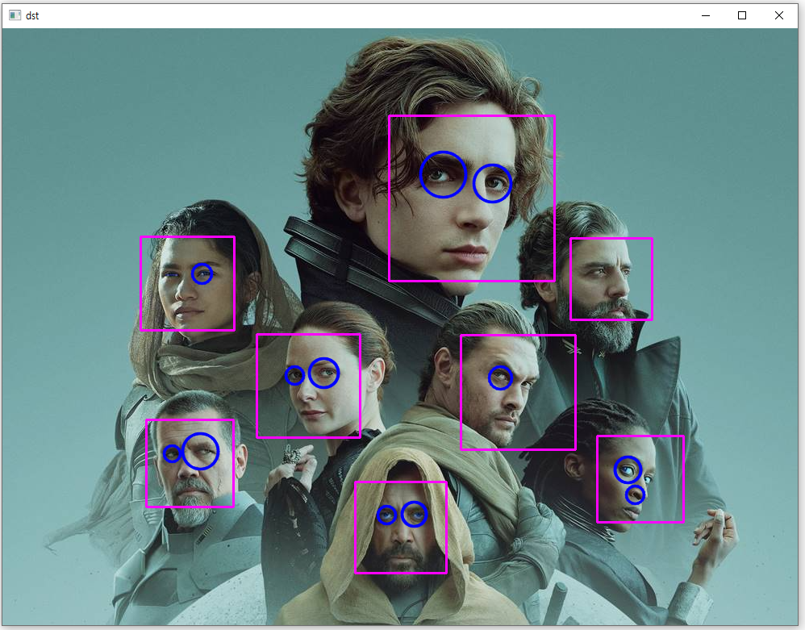

### 비올라-존스 얼굴 검출 알고리즘 설명
* 비올라와 존스가 개발한 객체 검출 알고리즘은 기본적으로 다양한 객체를 검출할 수 있지만, 특히 얼굴 검출에 적용되어 속도와 정확도를 인정받은 기술
* 비올라-존스 얼굴 검출 알고리즘은 기본적으로 영상을 24×24 크기로 정규화한 후, 유사-하르 필터(Haar-like filter) 집합으로부터 특징 정보를 추출하여 얼굴 여부를 판별
* 유사-하르 필터란 흑백 사각형이 서로 붙어 있는 형태로 구성된 필터이며 흰색 영역 픽셀 값은 모두 더하고, 검은색 영역 픽셀 값은 모두 빼서 하나의 특징 값을 얻을 수 있음
* 사람의 정면 얼굴 형태가 전형적으로 밝은 영역(이마, 미간, 볼 등)과 어두운 영역(눈썹, 입술 등)이 정해져 있기 때문에 유사-하르 필터로 구한 특징 값은 얼굴을 판별하는 용도로 사용
* 24×24 크기에서 다양한 크기의 유사-하르 필터를 대략 18만 개 생성 가능
<br/>  
* 픽셀 값의 합과 차를 계산하는 것이 복잡하지는 않지만 시간이 오래 걸린다는 점이 문제가 있는데 비올라와 존스는 에이다부스트(adaboost) 알고리즘과 적분 영상(integral image)을 이용하여 이 문제를 해결
* 에이다부스트 알고리즘은 수많은 유사-하르 필터 중에서 얼굴 검출에 효과적인 필터를 선별하는 역할을 수행하고 이 중 얼굴 검출에 가장 유용하다고 판별된 유사-하르 필터는 약 6000개를 선별 
* 얼굴 검출에 유용한 유사-하르 필터
<br/> 
* 에이다부스트 알고리즘에 의해 24×24 부분 영상에서 검사할 특징 개수가 약 6000개로 감소하였지만, 입력 영상 전체에서 부분 영상을 추출하여 검사해야 하기 때문에 여전히 연산량이 부담
* 비올라와 존스는 대부분의 영상에 얼굴이 한두 개 있을 뿐이고 나머지 대부분의 영역은 얼굴이 아니라는 점에 주목해 비올라-존스 알고리즘에서는 캐스케이드(cascade) 구조라는 새로운 방식을 도입하여 얼굴이 아닌 영역을 빠르게 걸러 내는 방식을 사용
* 얼굴이 아닌 영역을 걸러 내는 캐스케이드 구조
<br/> 1단계에서는 얼굴 검출에 가장 유용한 유사-하르 필터 하나를 사용하여, 얼굴이 아니라고 판단되면 이후의 유사-하르 필터 계산은 수행하지 않음
<br/> 2단계에서 유사-하르 필터 다섯 개를 사용하여 얼굴이 아닌지를 검사하고, 얼굴이 아니라고 판단되면 이후 단계의 검사는 수행하지 않음
<br/> 이러한 방식으로 얼굴이 아닌 영역을 빠르게 제거함으로써 비올라-존스 얼굴 검출 알고리즘은 동시대의 다른 얼굴 검출 방식보다 성능이 약 15배 빠르게 동작
<br/> 
### 비올라-존스 알고리즘을 구현한 클래스
* OpenCV는 비올라-존스 알고리즘을 구현하여 객체를 분류할 수 있는 CascadeClassifier 클래스를 제공
* CascadeClassifier 클래스를 이용하여 객체를 검출하려면 먼저 CascadeClassifier 객체를 생성
```cpp
CascadeClassifier classifier;
```
* 미리 훈련된 분류기 정보가 들어있는 XML 파일을 불러오는 CascadeClassifier::load() 멤버 함수
<br/>  
* OpenCV에서 제공하는 하르 기반 분류기 XML 파일
<br/> ...\opencv\sources\data\haarcascades 폴더에 파일 제공
<br/>  
* XML 파일을 불러오는 코드를 수행한 후에는 XML 분류기 파일이 정상적으로 불러졌는지를 확인하는 CascadeClassifier::empty() 멤버 함수
<br/>  
* XML 파일을 이용하여 객체 검출을 실행하는 CascadeClassifier::detectMultiScale() 멤버 함수
<br/> minNeighbors 인자에는 검출할 객체 영역에서 얼마나 많은 사각형이 중복되어 검출되어야 최종적으로 객체 영역으로 설정할지를 지정
<br/> 
```cpp
// 눈 검출 예제 프로그램
void detect_eyes()
{
	Mat src = imread("face.png");
	
	if (src.empty())
	{
		cerr << "Image load failed!" << endl;
		return;
	}

	Mat dst = src.clone();

	// CascadeClassifier 생성자 중 파일을 로드하면서 생성하는 생성자
	CascadeClassifier face_classifier("haarcascade_frontalface_default.xml");
	// 눈 검출을 위해 haarcascade_eye.xml 파일을 사용하는 CascadeClassifier 객체를 생성
	CascadeClassifier eye_classifier("haarcascade_eye.xml");

	if (face_classifier.empty() || eye_classifier.empty())
	{
		cerr << "XML load failed!" << endl;
		return;
	}

	// 정면 얼굴 검출기에서 입력 영상에 대해 얼굴 검출
	vector<Rect> faces;
	face_classifier.detectMultiScale(dst, faces);

	// 검출된 얼굴 개수를 for문을 통해 반복
	for (Rect face : faces)
	{
		rectangle(dst, face, Scalar(255, 0, 255), 2);

		// 입력 영상에서 검출한 사각형 얼굴 영역의 부분 영상을 추출하여 faceROI에 저장
		Mat faceROI = dst(face);
		// faceROI 영상에서 눈을 검출
		vector<Rect> eyes;
		eye_classifier.detectMultiScale(faceROI, eyes);

		for (Rect eye : eyes)
		{
			Point center(eye.x + eye.width / 2, eye.y + eye.height / 2);
			circle(faceROI, center, eye.width / 2, Scalar(255, 0, 0), 2, LINE_AA);
		}
	}

	imshow("src", src);
	imshow("dst", dst);

	waitKey(0);
	destroyAllWindows();
}
```
* 코드 결과 
<br/> 최근의 컴퓨터 비전 트렌드에서는 캐스케이드 분류기에 의한 객체 검출보다 더 좋은 성능을 보여 주는 딥러닝에 의한 객체 검출을 선호하는 편
<br/>  
