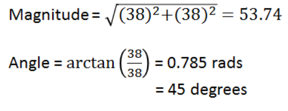
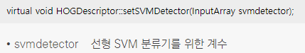

### 기울기 벡터(Gradient Vectors)
* 기울기 벡터란 영상 내 하나의 픽셀을 기준으로 주변 픽셀에 대한 기울기를 나타내는 벡터를 의미
* 펭귄 머리 부분을 확대한 예시 그림
<br/> 빨간 점으로 표시된 픽셀을 기준으로 왼쪽의 Gray Scale 값은 56이고, 오른쪽의 값은 94이므로 빨간 점으로 표시된 픽셀 입장에서 x축 방향의 기울기 변화량(gx)은 (94 - 56) = 38
<br/> 빨간 점을 기준으로 위쪽 Gray Scale 값은 93이고, 아래쪽 값은 55이므로 y축 방향의 기울기 변화량은 (93 - 55) = 38
<br/> 
<br/> 
<br/> x축 방향 기울기 변화량, y축 방향 기울기 변화량을 함께 표현한 값이 기울기 벡터(gradient vector)
<br/> 빨간점 기준으로 기울기 벡터
<br/> 
<br/> 빨간점의 기울기 벡터로부터 크기와 방향(각도) 계산
<br/> 
<br/> 빨간점의 크기와 방향을 벡터로 표시
<br/> 

### 픽셀(Pixels), 셀(Cells), 블록(Blocks)
* 픽셀은 말 그대로 영상 내 하나의 픽셀 값
* 픽셀들을 몇 개 묶어서 소그룹으로 만든 것이 셀
* 셀을 몇 개 묶어서 그룹으로 만든 것이 블록

### HOG 알고리즘과 보행자 검출 설명 
* 2005년에 다랄(N. Dalal)과 트릭스(B. Triggs)가 HOG 알고리즘을 이용한 보행자 검출 기능 발표
* 다랄과 트릭스는 수천 장의 보행자 영상과 보행자가 아닌 영상에서 HOG 특징 벡터를 추출하였고, 이 두 특징 벡터를 구분하기 위해 SVM 알고리즘을 사용
* HOG(Histograms of Oriented Gradients)는 보행자 검출을 위해 만들어진 특징 디스크립터로 이미지 경계의 기울기 벡터 크기(magnitude)와 방향(direction)을 히스토그램으로 나타내 계산
* HOG 디스크립터를 만들기 위해서는 영상 속에서 검출하고자 하는 영역을 잘라내야하는데 이렇게 잘라낸 영역을 윈도(window)라고 함
* SVM은 두 개의 클래스를 효과적으로 분리하는 능력을 가진 머신 러닝 알고리즘으로 다랄과 트릭스는 수천 개의 보행자 특징 벡터와 보행자가 아닌 특징 벡터를 이용하여 SVM을 훈련시켰고, 효과적인 보행자 검출 방법을 완성
* HOG와 SVM을 이용한 객체 검출 기술은 이후 보행자 검출뿐만 아니라 다양한 형태의 객체 검출에서도 응용

### HOG 알고리즘을 구현한 HOGDescriptor 클래스
* OpenCV는 HOG 알고리즘을 구현한 HOGDescriptor 클래스를 제공
* 보행자 검출이 목적이라면 보통 HOGDescriptor 클래스의 기본 생성자는 검색 윈도우 크기를 64×128로 설정하고, 셀 크기는 8×8, 블록 크기는 16×16, 그래디언트 방향 히스토그램 빈 개수는 9로 설정
* 기본 생성자에 의해 만들어지는 HOG 기술자 하나는 3780개의 float 실수로 구성
* 미리 계산된 보행자 검출을 위한 HOG 기술자 정보를 반환하는 HOGDescriptor::getDefaultPeopleDetector() 정적 멤버 함수 제공
<br/> 64×128 크기의 윈도우에서 똑바로 서 있는 사람을 검출하는 용도로 훈련된 분류기 계수를 반환
<br/> 정적 멤버 함수이기 때문에 소스 코드 작성 시에 클래스 이름과 함께 사용
<br/> 
* 원하는 객체를 검출하기위해 먼저 검출할 객체에 대해 훈련된 SVM 분류기 계수를 등록하는 HOGDescriptor::setSVMDetector() 함수 제공
<br/> 보행자 검출이 목적이라면 HOGDescriptor::getDefaultPeopleDetector() 함수가 반환한 분류기 계수를 HOGDescriptor::setSVMDetector() 함수 인자로 전달
<br/> 
* HOG 기술자를 이용하여 실제 입력 영상에서 객체 영역을 검출하려면 HOGDescriptor::detectMultiScale() 멤버 함수를 사용
<br/> 입력 영상 img에서 다양한 크기의 객체 사각형 영역을 검출하고, 그 결과를 std::vector<Rect> 타입의 인자 foundLocations에 저장
<br/> 
```cpp
// 보행자 검출 예제
#include "opencv2/opencv.hpp"
#include <iostream>

using namespace cv;
using namespace std;

int main()
{
	VideoCapture cap("vtest.avi");

	if (!cap.isOpened())
	{
		cerr << "Video open failed!" << endl;
		return -1;
	}

	// HOGDescriptor 객체 hog를 선언
	HOGDescriptor hog;
	// 보행자 검출을 위한 용도로 훈련된 SVM 분류기 계수를 등록
	hog.setSVMDetector(HOGDescriptor::getDefaultPeopleDetector());

	Mat frame;
	while (true)
	{
		cap >> frame;
		if (frame.empty())
			break;

		// 검출된 사각형 정보는 detected 변수에 저장
		vector<Rect> detected;
		hog.detectMultiScale(frame, detected);

		// 검출된 사각형 정보를 이용하여 사각형을 그림
		for (Rect r : detected)
		{
			Scalar c = Scalar(rand() % 256, rand() % 256, rand() % 256);
			rectangle(frame, r, c, 3);
		}

		imshow("frame", frame);

		if (waitKey(10) == 27)
			break;
	}

	return 0;
}
```
* 코드 결과 
<br/> HOG 알고리즘에 의한 보행자 검출은 꽤 많은 연산량을 필요로 하기 때문에 가급적 Debug 모드가 아닌 Release 모드로 실행해야 빠른 검출 결과를 확인 가능
<br/> 
* debug 모드는 코드 최적화를 하지 않기 때문에 실행 속도가 느린대신 컴파일 속도가 빠르고 release 모드는 코드 최적화를 하기 때문에 실행 속도가 빠른 대신 컴파일 속도가 느림 
