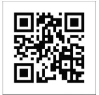
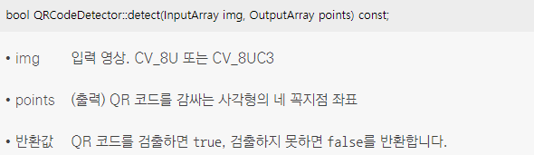
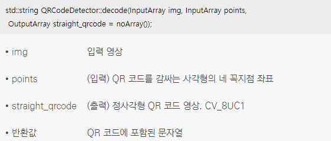
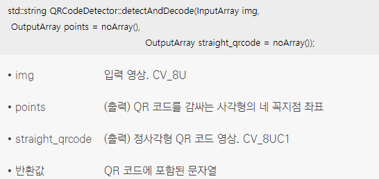
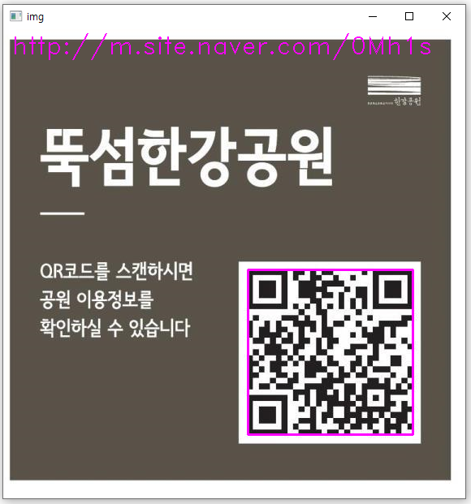

### QR 코드 처리 과정 설명
* QR 코드는 흑백 격자 무늬 모양의 2차원 바코드 일종으로 숫자, 영문자, 8비트 문자, 한자 등의 정보를 저장
* "https://opencv.org/" 문자열이 저장되어 있는 QR 코드의 예
<br/> 
* 입력 영상에서 QR 코드를 인식하려면 먼저 QR 코드 세 모서리에 포함된 흑백 정사각형 패턴을 찾아 QR 코드 전체 영역 위치를 알아냄
* 검출된 QR 코드를 정사각형 형태로 투시 변환한 후, QR 코드 내부에 포함된 흑백 격자 무늬를 해석하여 문자열을 추출
* OpenCV는 4.0.0 버전부터 QR 코드를 검출하고 QR 코드에 포함된 문자열을 해석하는 기능을 제공

### QR 코드 처리 클래스
* OpenCV에서 QR 코드를 검출하고 해석하는 기능은 QRCodeDetector 클래스에 구현
* QR 코드 영역을 검출하기 위해서는 QRCodeDetector::detect() 함수를 사용
<br/> 
* 검출된 QR 코드 영역에서 QR 코드에 저장된 문자열을 추출할 때에는 QRCodeDetector::decode() 함수를 사용
<br/> 
* 입력 영상에서 QR 코드 검출과 해석을 한꺼번에 수행하려면 QRCodeDetector::detectAndDecode() 멤버 함수를 사용
<br/> 
```cpp
// QR 코드 검출 및 해석 예제
void decode_qrcode()
{
	Mat img = imread("qr.png", IMREAD_COLOR);

	if (img.empty())
	{
		cerr << "Image load failed!" << endl;
		return;
	}

	// QRCodeDetector 객체 detector 변수를 선언
	QRCodeDetector detector;

	vector<Point> points;
	String info = detector.detectAndDecode(img, points);

	// R 코드를 검출하고 QR 코드 문자열이 제대로 info 변수에 저장되었다면 수행
	if (!info.empty())
	{
		// QR 코드에 사각형을 그리기 
		polylines(img, points, true, Scalar(255, 0, 255), 2);
		// 해석된 문자열을 화면 좌측 상단에 출력
		putText(img, info, Point(10, 30), FONT_HERSHEY_DUPLEX, 1, Scalar(255, 0, 255));
	}

	imshow("img", img);

	waitKey(0);
	destroyAllWindows();
}
```
* 코드 결과 
<br/> 
