## 1. 해리스 코너 검출 방법
### 코너 설명 
* 영상에 기하학적 변환(크기변환, 회전등)이 있어도 효과적으로 사용할 수 있는 지역 특징점 기반 매칭 방법 중 하나
* 영상에서 특징(feature)이란 영상으로부터 추출할 수 있는 유용한 정보를 의미하며 평균 밝기, 히스토그램, 에지, 직선 성분, 코너 등이 특징이 될 수 있음
* 영상의 특징 중에서 에지, 직선 성분, 코너처럼 영상 전체가 아닌 일부 영역에서 추출할 수 있는 특징을 지역 특징(local feature)이라고 함
* 영상의 지역 특징 중 코너(corner)는 에지의 방향이 급격하게 변하는 부분으로서 삼각형의 꼭지점이나 연필 심처럼 뾰족하게 튀어나와 있는 부분이 코너가 될 수 있음
* 코너는 에지나 직선 성분 등의 다른 지역 특징에 비해 분별력이 높고 대체로 영상 전 영역에 골고루 분포하기 때문에 영상을 분석하는 데 유용한 지역 특징으로 사용
* 코너처럼 한 점의 형태로 표현할 수 있는 특징을 특징점(feature point)이라고 하며, 특징점은 키포인트(keypoint) 또는 관심점(interest point)이라고 부르기도 함
* 평탄한 영역과 에지와 코너의 분별력 비교
<br/> A 부분 영상은 내부 픽셀 값 변화가 크지 않은 평탄한 영역
<br/> B 부분 영상은 하늘과 바다가 만나는 수평선 부근에서 추출되었다는 것을 쉽게 알아차릴 수 있지만, 정확한 x 좌표는 가늠하기 어려움
<br/> C 부분 영상에서 뾰족하게 튀어나와 있는 건물이 영상에서 코너 역할을 하며, 코너는 에지나 평탄한 영역에 비해 변별력이 높아서 그 위치를 파악하기 수월
<br/> 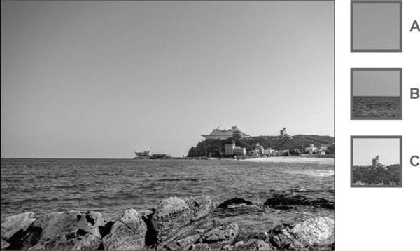

### 해리스 코너 검출 방법 설명
* 1988년 해리스(C. Harris)가 개발한 코너 검출 방법은 코너 점 구분을 위한 기본적인 아이디어를 수학적으로 잘 정의
1. 한 픽셀을 중심에 놓고 작은 윈도우(window)를 설정한 후에, 이 윈도우를 x축 방향으로 u만큼, y축 방향으로 v만큼 이동
<br/> 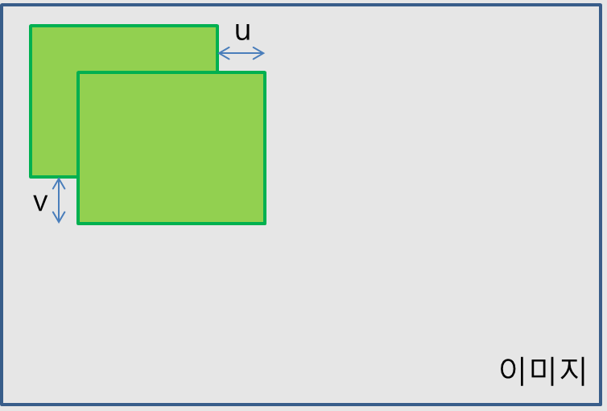
2. 픽셀값이 얼마나 변했는지 보기위해 윈도우 내의 픽셀 값들의 차이의 제곱의 합을 구함
<br/> 코너점이라면 x축, y축 방향 모두 많이 변화하여 E값이 큼
<br/> 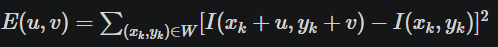
3. 테일러 확장에 의해 위 식을 근사할 수 있음
<br/> 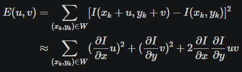
4. 위 식을 행렬로 나타낼 수 있음
<br/> 중간에 위치한 2 x 2행렬을 M 또는 structure tensor라고 부름
<br/> 행렬 M이 커야 E값도 커짐
<br/> 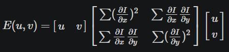
5. 이 행렬 M을 고유값 분해하면 2개의 고유값과 그에 상응하는 고유벡터들을 얻을 수 있음
<br/> 두 개 고유값 중에 더 큰 고유값과 연결된 고유벡터 방향으로 이미지의 변화가 가장 크고, 작은 고유값과 연결된 고유벡터 방향으로의 이미지 변화는 작음
<br/> 두 방향으로 변화가 크면 M의 두 고유값은 충분히 큰값을 가지게 되므로 코너, 하나의 고유값은 크고 다른 고유값은 작다면 엣지, 둘 다 0에 가까운 값을 가지면 flat으로 판별할 수 있음
<br/> 그런데 고유값을 계산하는 것은 계산적으로 복잡한 일이기 때문에, 다음과 같은 공식으로 대체해서 코너인지, 엣지인지, flat인지를 판정
<br/> 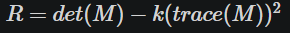
<br/> 두 고유값이 모두 크면, R은 0보다 크게 되고, 한 고유값은 크고 다른 한 고유값은 작으면 0보다 작게 되고, 둘다 작으면 0에 가까운 값이 산출
<br/> 즉, R이 0보다 크면 코너이고, R의 절대값이 0에 가까우면 flat이고, 0보다 작으면 엣지

### 해리스 코너 검출 함수
* OpenCV는 해리스 코너 R 값을 계산하는 cornerHarris() 함수를 제공
<br/> 입력 영상 src의 모든 픽셀 위치에서 해리스 코너 응답 함수 값을 계산하고, 그 결과를 dst 행렬로 반환
<br/> dst 행렬의 모든 원소는 float 자료형을 사용하며, 이 값이 사용자가 지정한 임계값보다 크면 코너 점으로 판단
<br/> k는 해리스 코너 검출 논문에서 나온 상수인자로 보통 0.04~0.06을 입력
<br/> 하나의 코너 위치에 사용자 지정 임계값보다 큰 픽셀이 여러 개 발생할 수 있으므로, 간단한 비최대 억제(non-maximum suppression)를 수행하여 지역 최댓값 위치만 코너로 판별하는 것을 권장
<br/> 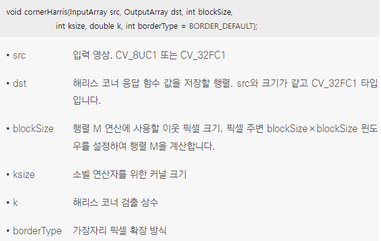
```cpp
// 해리스 코너 검출 예제
void corner_harris()
{
	Mat src = imread("building.jpg", IMREAD_GRAYSCALE);

	if (src.empty())
	{
		cerr << "Image load failed!" << endl;
		return;
	}

	// src 영상으로부터 해리스 코너 R 행렬을 구함
	Mat harris;
	cornerHarris(src, harris, 3, 3, 0.04);

	// harris 행렬 원소 값 범위를 0부터 255로 정규화하고, 타입을 CV_8UC1로 변환하여 harris_norm에 저장
	// harris_norm은 그레이스케일 영상 형식을 따르며, 해리스 코너 R 분포를 영상 형태로 화면에 표시하기 위해 만듬
	Mat harris_norm;
	normalize(harris, harris_norm, 0, 255, NORM_MINMAX, CV_8U);

	Mat dst;
	cvtColor(src, dst, COLOR_GRAY2BGR);

	for (int j = 1; j < harris.rows - 1; j++)
	{
		for (int i = 1; i < harris.cols - 1; i++)
		{
			// harris_norm 영상에서 임계값이 120보다 큰 픽셀을 코너로 간주
			if (harris_norm.at<uchar>(j, i) > 120)
			{
				// 간단한 비최대 억제를 수행
				// (i, j) 위치에서 주변 네 개의 픽셀을 비교하여 지역 최대인 경우에만 dst 영상에 원으로 코너를 표시
				if (harris.at<float>(j, i) > harris.at<float>(j - 1, i) &&
					harris.at<float>(j, i) > harris.at<float>(j + 1, i) &&
					harris.at<float>(j, i) > harris.at<float>(j, i - 1) &&
					harris.at<float>(j, i) > harris.at<float>(j, i + 1))
					circle(dst, Point(i, j), 5, Scalar(0, 0, 255), 2);
			}
		}
	}

	imshow("src", src);
	imshow("harris_norm", harris_norm);
	imshow("dst", dst);

	waitKey(0);
	destroyAllWindows();
}
```
* 코드 결과
<br/> 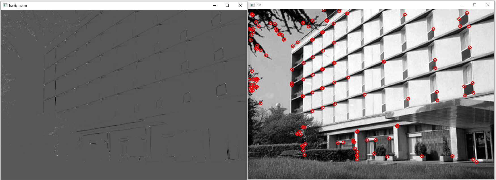

## 2. FAST 코너 검출 방법
### FAST 코너 검출 방법 설명
* 2006년에 발표된 FAST 코너 검출 방법은 단순한 픽셀 값 비교 방법을 통해 코너를 검출
* FAST는 Features from Accelerated Segment Test의 약자이며, 그 이름에 걸맞게 매우 빠르게 동작하는 코너 검출 방법
* 특정 픽셀 주변 16개 픽셀 값들을 조사해서 그 픽셀값이 가운데 픽셀보다 충분히 어둡거나 충분히 밝은 픽셀이 9개 이상 나타나면 코너라고 판단
<br/> 그림에서 가운데에 p점이 있고 주변 픽셀을 1번부터 16번까지 번호를 지정
<br/> p점보다 밝거나 어두운 것들이 9개 이상이면 코너로 판단
<br/> 연산이 간단해 속도가 빨라 가장 효율적인 코너 검출 방법
<br/> 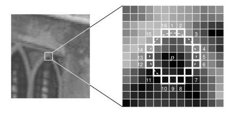

### FAST 코너 검출 함수
* OpenCV는 FAST 코너 검출 방법을 구현한 FAST() 함수를 제공
<br/> 입력 영상에 대해서 기준점 픽셀값 p보다 주변 픽셀 16개의 값이 +-threshold 만큼 크거나 작은 픽셀값이 9개 이상 나타나면 코너라고 판단
<br/> 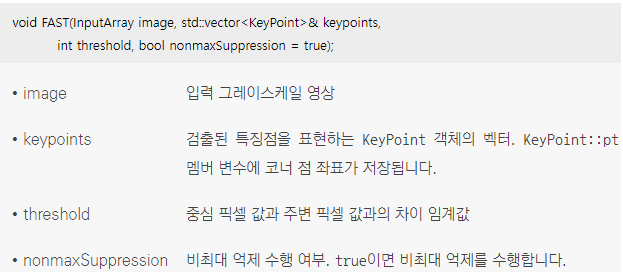
```cpp
// FAST 코너 검출 예제
void coner_fast()
{
	Mat src = imread("building.jpg", IMREAD_GRAYSCALE);

	if (src.empty())
	{
		cerr << "Image load failed!" << endl;
		return;
	}

	// src 영상에서 FAST 방법으로 코너 점을 검출
	// 밝기 차이 임계값으로 60을 지정하였고, 비최대 억제를 수행하도록 설정
	// 검출된 모든 코너 점 좌표는 keypoints 변수에 저장
	vector<KeyPoint> keypoints;
	FAST(src, keypoints, 60, true);

	Mat dst;
	cvtColor(src, dst, COLOR_GRAY2BGR);

	for (KeyPoint kp : keypoints)
	{
		Point pt(cvRound(kp.pt.x), cvRound(kp.pt.y));
		circle(dst, pt, 5, Scalar(0, 0, 255), 2);
	}

	imshow("src", src);
	imshow("dst", dst);

	waitKey(0);
	destroyAllWindows();
}
```
* 코너 검출 
<br/> 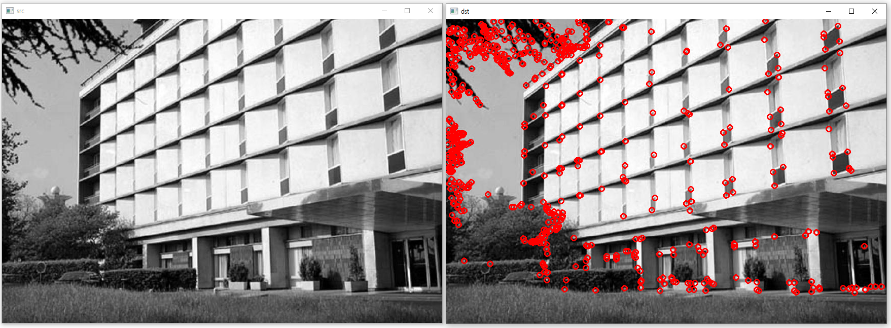
