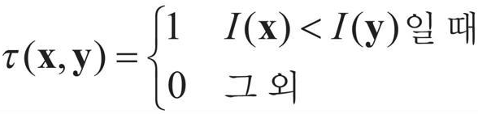

## 1. 크기 불변 특징점 알고리즘
### 코너 특징점의 문제점
* 코너는 영상이 회전되어도 여전히 코너로 검출되지만 영상의 크기가 변경될 경우 코너는 더 이상 코너로 검출되지 않을 수 있음
<br/> 영상의 크기가 변경되면 같은 크기의 사각형 안에서 코너보다는 에지에 가까운 형태로 관측
<br/> 따라서 크기가 다른 두 객체 영상에서 단순한 코너 점을 이용하여 서로 같은 위치를 찾는 것에는 한계가 있음
<br/> 

### SIFT 알고리즘
* 크기가 다른 영상에서도 지속적으로 검출될 수 있는 크기 불변 특징에 대해 연구하였고, 그 중 대표적인 SIFT 알고리즘이 있음 
* SIFT는 크기 불변 특징 변환(Scale Invariant Feature Transform)의 약자이며, 2004년 캐나다의 브리티시 컬럼비아 대학교 로우(D. Lowe) 교수가 발표한 논문에 소개된 방법
* 영상의 크기 변화와 무관하게 특징점을 추출하기 위해 스케일 스페이스(Scale Space)를 구성
* 스케일 스페이스란 영상에 다양한 표준 편차를 이용한 가우시안 블러링을 적용하여 구성한 영상 집합을 의미
<br/> 맨 윗 줄에 나타난 여섯 개의 블러링된 영상이 스케일 스페이스를 구성한 결과이며, 이렇게 구성한 영상 집합을 옥타브(octave)라고 부름
<br/> 이후 입력 영상의 크기를 가로, 세로 반으로 줄여 가면서 여러 옥타브를 구성
<br/> SIFT 알고리즘에서 크기에 불변한 특징점을 검출할 때에는 인접한 가우시안 블러링 영상끼리의 차영상을 사용하며, 이를 DoG(Difference of Gaussian) 영상이라고 합
<br/> SIFT알고리즘은 DoG 영상 집합에서 인접한 DoG영상을 고려한 지역 극값 위치를 특징접으로 사용, 에지 성분이 강하거나 명암비가 낮은 지점은 특징점에서 제외
<br/> 
* SIFT 알고리즘은 특징점을 검출하는 기능뿐만 아니라 특징점 주변의 픽셀 값을 이용한 기술자(descriptor) 계산 방법도 포함
* 특징점 기술자는 특징점 주변 영상의 특성을 여러 개의 실수 값으로 표현한 것을 의미하며, 특징 벡터(feature vector)라고도 함
* 특징점 근방으로부터 특징점의 주된 방향 성분을 계산하고, 이 방향만큼 회전한 부분 영상으로부터 128개의 빈으로 구성된 그래디언트 방향 히스토그램을 계산하고 추출하여 기술자로 사용
* SIFT에서 성능을 개선시킨 SURF, KAZE 알고리즘이 있음 
* SIFT, SURF, KAZE 방법은 스케일 스페이스를 구성하는 등의 복잡한 연산을 수행해야 하기 때문에 실시간 응용에서 사용하기 어렵다는 단점이 있음 

### ORB 알고리즘 
* 2011년 발표된 ORB(Oriented FAST and Rotated BRIEF) 알고리즘은 당시 OpenCV를 관리하던 연구소에서 개발한 방법으로서, SIFT와 SURF를 대체하기에 좋은 알고리즘
* FAST 코너 검출 방법을 사용해서 특징점을 추출하지만 FAST는 영상의 크기 변화에 취약하기 때문에 ORB는 입력 영상의 크기를 점진적으로 축소한 피라미드 영상을 구축해서 특징점을 추출
* 추출된 특징점에서 주된 방향 성분을 계산하고 방향을 고려한 BRIEF으로 이진 기술자를 계산
* ORB에서 사용한 BRIEF(Binary Robust Independent Elementary Features)는 순수하게 특징점 기술자만을 생성하는 알고리즘
<br/> BRIEF는 특징점 주변의 픽셀 쌍을 미리 정하고, 해당 픽셀 값 크기를 비교하여 0 또는 1로 특징을 기술
<br/> 두 점 x와 y에서의 픽셀 값 크기 비교 테스트 τ
<br/> 
* 특징점 주변 정보를 이진수 형태로 표현하는 기술자를 이진 기술자(binary descriptor)라고 합
<br/> 특징점 p 주변에 a, b, c 점을 미리 정의하고, τ(a, b), τ(b, c), τ(c, a)를 구하면 이진수 110(2)을 얻을 수 있는데 이진수 110(2)은 b 점이 a보다 밝고, c 점이 b보다 밝고, a 점은 c 점보다 어둡다는 정보를 표현한 것
<br/> 
* 이처럼 ORB 알고리즘은 FAST 기반의 방법으로 특징점을 구한 후, 각 특징점에서 픽셀 밝기 값 분포를 고려한 코너 방향 성분을 계산하고 이 방향 성분을 이용하여 BRIEF 계산에 필요한 점들의 위치를 보정함으로써 회전에 불변한 BRIEF 기술자를 계산
* ORB 알고리즘에서는 기본적으로 256개의 크기 비교 픽셀 쌍을 사용하여 이진 기술자를 구성하며, 결과적으로 하나의 특징점은 256비트로 표현
* SIFT와 SURF 기술자가 각각 512바이트, 256바이트를 사용하는 것에 비해 ORB는 32바이트의 크기로 특징점을 기술할 수 있어서 효율적임
* 이진 기술자로 표현된 특징점 사이의 거리 계산은 주로 해밍 거리(Hamming distance) 방법을 사용
* 해밍 거리는 이진수로 표현된 두 기술자에서 서로 값이 다른 비트의 개수를 세는 방식으로 계산
* 해밍 거리 계산은 두 기술자의 비트 단위 배타적 논리합(XOR) 연산 후, 비트 값이 1인 개수를 세는 방식으로 빠르게 계산 가능

### 2. OpenCV 특징점 검출과 기술
### KeyPoint 클래스
* OpenCV에서 특징점 정보를 저장할 때 사용
```cpp
// 간략화한 KeyPoint 클래스 정의
 class KeyPoint
{
public:
  KeyPoint();
  KeyPoint(Point2f _pt, float _size, float _angle = -1, float _response = 0,
            int _octave = 0, int _class_id = -1);
  // …(생략)

  // 특징점 좌표
  Point2f pt;
  // 특징점 크기(지름)
  float   size;
  // 특징점의 주된 방향(각도)
  float   angle;
  // 특징점 반응성을 나타내며, 좋은 특징점을 선별하는 용도
  float   response;
  // 특징점이 추출된 옥타브(피라미드 단계)
  int     octave;
  // 특징점이 포함된 객체 번호
  int     class_id;
};
```
