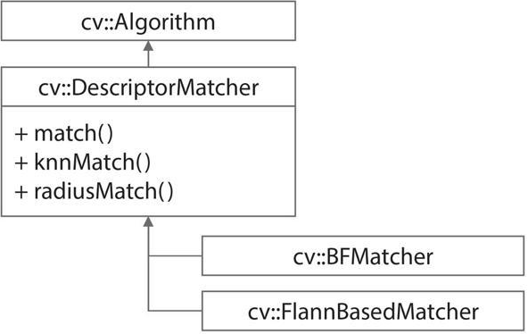
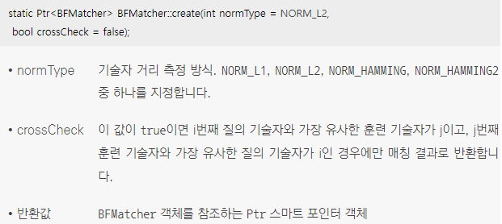
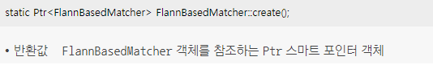
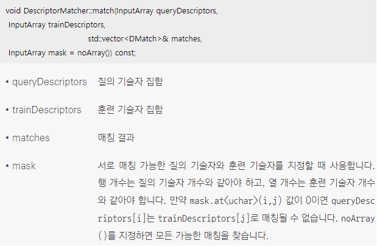
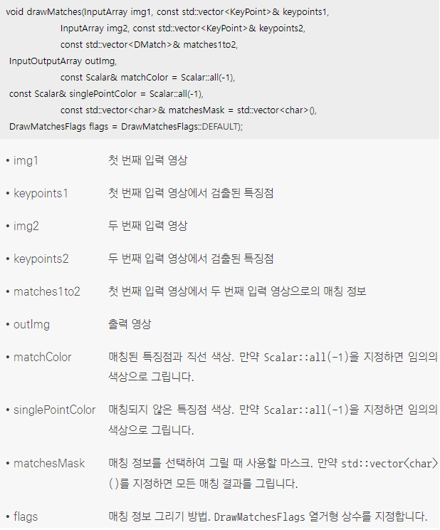
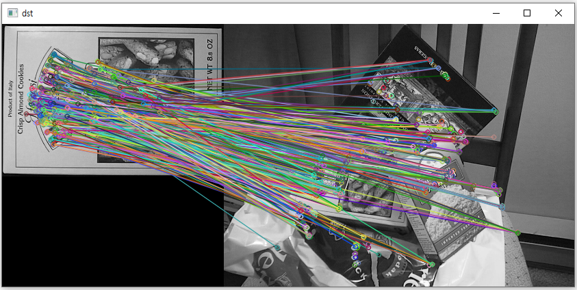
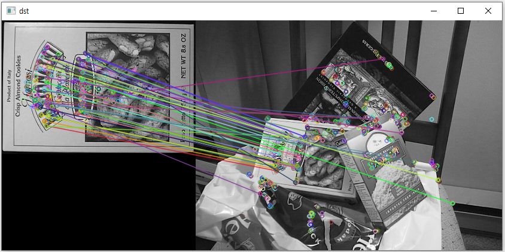

## 1. OpenCV 특징점 매칭
### 특징점 매칭 설명
* 특징점 매칭(matching)이란 두 영상에서 추출한 특징점 기술자를 비교하여 서로 비슷한 특징점을 찾는 작업을 의미
* 크기 불변 특징점으로부터 구한 기술자를 매칭하면 크기와 회전에 강인한 영상 매칭을 수행 가능

### DMatch 클래스
* OpenCV에서 특징점 매칭 정보를 저장할 때 사용
* DMatch 클래스는 한 장의 영상에서 추출한 특징점과 다른 한 장의 영상, 또는 여러 영상에서 추출한 특징점 사이의 매칭 정보를 표현
```cpp
// 간략한 DMatch 클래스 정의
 class DMatch
{
public:
  DMatch();
  DMatch(int _queryIdx, int _trainIdx, float _distance);
  DMatch(int _queryIdx, int _trainIdx, int _imgIdx, float _distance);
  
  // DMatch::queryIdx 멤버 변수는 질의 기술자 번호
  int queryIdx;
  // DMatch::trainIdx 멤버 변수는 훈련 기술자 번호
  int trainIdx;
  // DMatch::imgIdx 멤버 변수는 훈련 영상 번호
  int imgIdx;

  // DMatch::distance 멤버 변수는 두 기술자 사이의 거리
  float distance;

  // DMatch 클래스에 대한 크기 비교 연산자 재정의이며, DMatch::distance 멤버 변수 값을 이용하여 크기를 비교
  bool operator<(const DMatch &m) const;
};
```
* distance 멤버 변수는 두 키포인트 기술자가 얼마나 차이가 나는지를 나타내는 매칭 척도의 역할로서 두 특징점이 서로 유사하면 distance 값이 0에 가깝고, 서로 다른 특징점이면 distance 값이 크게 나타남
* distance 계산 방식은 다차원 벡터의 유클리드 거리(Euclidean distance)로 주로 계산하며, 다만 이진 기술자끼리 비교하는 경우에는 해밍 거리를 사용
* DMatch 클래스 객체는 보통 사용자가 직접 생성하지 않고, 특징점 매칭 알고리즘 내부에서 생성하여 사용자에게 반환

### 특징점 매칭 클래스
* OpenCV에서 제공하는 특징점 매칭 클래스 상속 관계
<br/> OpenCV의 특징점 매칭 클래스는 DescriptorMatcher 클래스를 상속받아 만들어짐
<br/> DescriptorMatcher 클래스는 match(), knnMatch(), radiusMatch() 등의 가상 멤버 함수를 가지고 있는 추상 클래스
<br/> match() 함수는 가장 비슷한 기술자 쌍을 하나 찾고, knnMatch() 함수는 비슷한 기술자 쌍 k개를 찾음
<br/> radiusMatch() 함수는 지정한 거리 반경 안에 있는 기술자 쌍을 모두 찾아 반환
<br/>  

### BFMatcher 클래스 
* BFMatcher 클래스는 전수 조사(Brute-Force) 매칭을 수행
* BFMatcher 클래스는 질의 기술자 집합에 있는 모든 기술자와 훈련 기술자 집합에 있는 모든 기술자 사이의 거리를 계산하고, 이 중 가장 거리가 작은 기술자를 찾아 매칭하는 방식
* BFMatcher 클래스의 매칭 결정 방법은 매우 직관적이지만 특징점 개수가 늘어날수록 거리 계산 횟수가 급격하게 늘어날 수 있다는 단점이 있음
* 매칭을 수행하는 BFMatcher 클래스에 정의되어 있는 create() 정적 멤버 함수를 사용해 클래스 객체를 생성
<br/> 두 개의 인자를 받을 수 있지만, 모두 기본값이 지정되어 있기 때문에 생략 가능
<br/>  

### FlannBasedMatcher 클래스 
* Flann(Fast Library approximate nearest neighbors)은 근사화된 최근방 이웃(ANN, Approximate Nearest Neighbors) 알고리즘을 빠르게 구현한 라이브러리로서 FlannBasedMatcher 클래스는 Flann 라이브러리를 이용하여 빠르게 매칭을 수행하는 클래스
* FlannBasedMatcher 클래스는 근사화된 거리 계산 방법을 사용하므로 가장 거리가 작은 특징점을 찾지 못할 수 있고, 매우 빠르게 동작하지만 기본적으로 L2 노름 거리 측정 방식을 사용하므로 해밍 거리를 사용하는 이진 기술자에 대해서는 사용할 수 없음
* 이진 기술자에 대해서도 지역성 의존 해싱(LSH, Locality Sensitive Hashing) 기법을 이용하여 FlannBasedMatcher 클래스를 사용할 수는 있지만 사용법이 까다로운 편
* FlannBasedMatcher 객체를 생성하는 FlannBasedMatcher::create() 함수
<br/> 
  
### 특징점 매칭 함수 
* 첫 번째 영상에서 추출한 특징점 기술자 행렬이 desc1이고 두 번째 영상에서 추출한 특징점 기술자 행렬이 desc2인 경우 DescriptorMatcher::match() 함수는 desc1에 포함된 각각의 기술자와 가장 유사한 기술자를 desc2에서 찾고, 그 결과를 vector<DMatch> 타입의 변수 matches에 저장
<br/> 
* OpenCV는 두 영상에서 추출한 특징점의 매칭 결과를 한눈에 확인할 수 있도록 drawMatches() 함수는 두 매칭 입력 영상을 가로로 이어 붙이고, 각 영상에서 추출한 특징점과 매칭 결과를 다양한 색상으로 표시한 결과 영상을 생성
<br/> 
```cpp
// 키포인트 매칭 예제
void keypoint_matching()
{
	Mat src1 = imread("box.png", IMREAD_GRAYSCALE);
	Mat src2 = imread("box_in_scene.png", IMREAD_GRAYSCALE);

	if (src1.empty() || src2.empty())
	{
		cerr << "Image load failed!" << endl;
		return;
	}

	// ORB 클래스 객체를 생성
	Ptr<Feature2D> feature = ORB::create();

	// src1과 src2 영상에서 각각 특징점을 검출하고 기술자를 계산
	// 각 영상의 기술자는 desc1과 desc2 행렬에 저장
	vector<KeyPoint> keypoints1, keypoints2;
	Mat desc1, desc2;
	feature->detectAndCompute(src1, Mat(), keypoints1, desc1);
	feature->detectAndCompute(src2, Mat(), keypoints2, desc2);

	// BFMatcher 클래스 객체를 생성
	// 기술자 거리 계산 방식은 해밍 거리를 사용
	Ptr<DescriptorMatcher> matcher = BFMatcher::create(NORM_HAMMING);

	// desc1과 desc2 기술자를 서로 매칭하여 그 결과를 matches에 저장
	vector<DMatch> matches;
	matcher->match(desc1, desc2, matches);

	// matches 정보를 이용하여 매칭 결과 영상 dst를 생성
	Mat dst;
	drawMatches(src1, keypoints1, src2, keypoints2, matches, dst);

	imshow("dst", dst);

	waitKey(0);
	destroyAllWindows();
}
```
* 코드 결과 
<br/> box.png 영상에서 추출한 모든 특징점 기술자에 대해 가장 유사한 box_in_scene.png 영상의 특징점 기술자를 찾아 직선을 그렸기 때문에 매칭 결과가 매우 복잡하게 나타남
<br/> box_in_scene.png 영상에서는 box.png 스낵 상자 영상 일부가 가려져 있기 때문에 box.png 영상에서 추출한 특징점이 모두 제대로 매칭되기는 어렵고, 일부 영역이 가려져 있지 않더라도 기하학적 변형과 조명 변화로 인하여 완벽한 매칭은 거의 불가능하며, 매칭 결과 중 상당수는 완전히 다른 특징점으로 잘못 매칭
<br/> 
* 전체 매칭 결과에서 잘못 매칭된 결과는 제외하고, 제대로 매칭되었다고 판단되는 결과만 선별하여 사용
* 그러므로 distance 값이 너무 큰 매칭 결과는 무시하고 distance 값이 작은 결과만 사용하는 것이 좋음
* DMatch 클래스는 부등호 연산자에 대한 재정의가 되어 있고, 이 연산자 재정의에서는 distance 멤버 변수 크기를 비교하기 때문에 DMatch 객체를 std::sort() 함수로 정렬하면 자동으로 distance 값을 기준으로 정렬
```cpp
// 키포인트 매칭 후 좋은 매칭 선별 예제
void good_matching()
{
	Mat src1 = imread("box.png", IMREAD_GRAYSCALE);
	Mat src2 = imread("box_in_scene.png", IMREAD_GRAYSCALE);

	if (src1.empty() || src2.empty())
	{
		cerr << "Image load failed!" << endl;
		return;
	}

	// ORB 클래스 객체를 생성
	Ptr<Feature2D> feature = ORB::create();

	// src1과 src2 영상에서 각각 특징점을 검출하고 기술자를 계산
	// 각 영상의 기술자는 desc1과 desc2 행렬에 저장
	vector<KeyPoint> keypoints1, keypoints2;
	Mat desc1, desc2;
	feature->detectAndCompute(src1, Mat(), keypoints1, desc1);
	feature->detectAndCompute(src2, Mat(), keypoints2, desc2);

	// BFMatcher 클래스 객체를 생성
	// 기술자 거리 계산 방식은 해밍 거리를 사용
	Ptr<DescriptorMatcher> matcher = BFMatcher::create(NORM_HAMMING);

	// desc1과 desc2 기술자를 서로 매칭하여 그 결과를 matches에 저장
	vector<DMatch> matches;
	matcher->match(desc1, desc2, matches);

	// 두 영상의 특징점 매칭 결과를 정렬
	std::sort(matches.begin(), matches.end());
	// 정렬된 매칭 결과에서 상위 50개 매칭 결과를 good_matches에 저장
	vector<DMatch> good_matches(matches.begin(), matches.begin() + 50);

	// matches 정보를 이용하여 매칭 결과 영상 dst를 생성
	Mat dst;
	drawMatches(src1, keypoints1, src2, keypoints2, good_matches, dst);

	imshow("dst", dst);

	waitKey(0);
	destroyAllWindows();
}  
```
* 코드 결과
<br/> box.png 스낵 상자 글자 부분에서 추출된 많은 특징점이 box_in_scene.png 영상으로 제대로 매칭된 것을 확인할 수 있으나 여전히 몇몇 특징점은 box_in_scene.png 영상에서 스낵 박스 위치가 아닌 다른 지점으로 매칭된 것을 볼 수 있음
<br/> 
