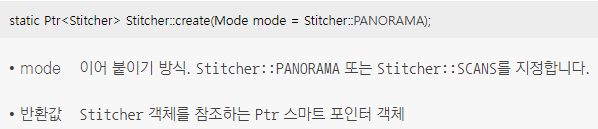
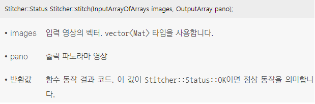
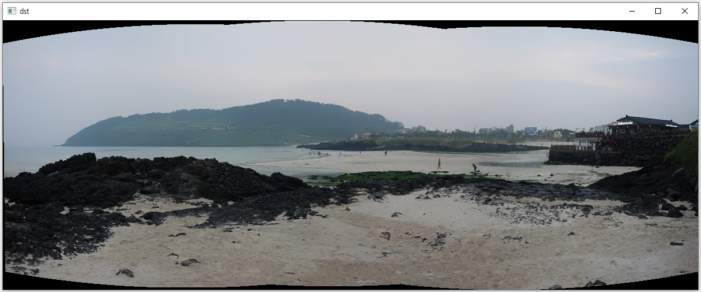

### 영상 이어 붙이기 처리 과정
* 영상 이어 붙이기(image stitching)는 여러 장의 영상을 서로 이어 붙여서 하나의 큰 영상을 만드는 기법
* 영상 이어 붙이기에서 입력으로 사용할 영상은 서로 일정 비율 이상으로 겹치는 영역이 존재해야 하며, 서로 같은 위치를 분간할 수 있도록 유효한 특징점이 많이 있어야 함
1. 영상 이어 붙이기를 수행하려면 입력 영상에서 특징점을 검출하고, 서로 매칭을 수행하여 호모그래피를 구함
2. 구해진 호모그래피 행렬을 기반으로 입력 영상을 변형하여 서로 이어 붙이는 작업을 수행
3. 영상을 이어 붙인 결과가 자연스럽게 보이도록 이어 붙인 영상의 밝기를 적절하게 보정하는 블렌딩(blending) 처리

### 이미지 스티칭 클래스
* OpenCV는 이러한 일련의 영상 이어 붙이기 작업을 수행하는 Stitcher 클래스를 제공
* Stitcher 클래스 객체를 생성하려면 Stitcher 클래스에서 제공하는 Stitcher::create() 정적 멤버 함수를 사용
<br/> Stitcher::PANORAMA 모드는 입력 영상들이 서로 투시 변환(또는 호모그래피) 관계에 있다고 가정하고, Stitcher::SCANS 모드는 입력 영상들이 서로 어파인 변환 관계라고 간주
<br/>  
* Stitcher::stitch() 함수는 영상을 실제로 이어 붙이는 작업을 수행
<br/> Stitcher::stitch() 함수는 다수의 영상을 입력으로 받고, 이어 붙인 결과 영상을 반환
<br/> Stitcher::stitch() 함수는 images에 포함된 입력 영상에서 ORB 특징점을 찾아 서로 매칭하고 호모그래피 행렬을 계산한 뒤에 호모그래피 행렬을 이용하여 인접한 영상을 적절하게 투시 변환하고, 서로 이어 붙인 부분의 밝기를 적절하게 보정한 결과 영상 pano를 반환
<br/> 
```cpp
// 영상 이어 붙이기 예제
#include "opencv2/opencv.hpp"
#include <iostream>

using namespace cv;
using namespace std;

int main()
{
	// img1.jpg ~ img3.jpg 영상을 vector<Mat> 타입의 변수 imgs에 저장
	vector<Mat> imgs;
	for (int i = 0; i < 3; i++)
	{
		String img_name = format("img%d.jpg", i + 1);
		
		Mat img = imread(img_name);

		if (img.empty())
		{
			cerr << "Image load failed!" << endl;
			return -1;
		}

		imgs.push_back(img);
	}

	// Stitcher 객체를 생성
	Ptr<Stitcher> stitcher = Stitcher::create();

	// imgs에 저장된 입력 영상을 이어 붙여서 결과 영상 dst를 생성
	Mat dst;
	Stitcher::Status status = stitcher->stitch(imgs, dst);

	// 영상 이어 붙이기가 실패하면 에러 메시지를 출력하고 프로그램을 종료
	if (status != Stitcher::Status::OK)
	{
		cerr << "Error on stitching!" << endl;
		return -1;
	}

	// 결과 영상을 result.jpg 파일로 저장하고 dst 창에 띄움
	imwrite("result.jpg", dst);
	imshow("dst", dst);

	waitKey(0);

	return 0;
}
```
* 코드 결과
<br/> 영상을 이어 붙이는 과정에서 입력 영상이 변형되면서 결과 영상 주변부에 검은색으로 채워지는 영역이 발생할 수 있음
<br/> 
